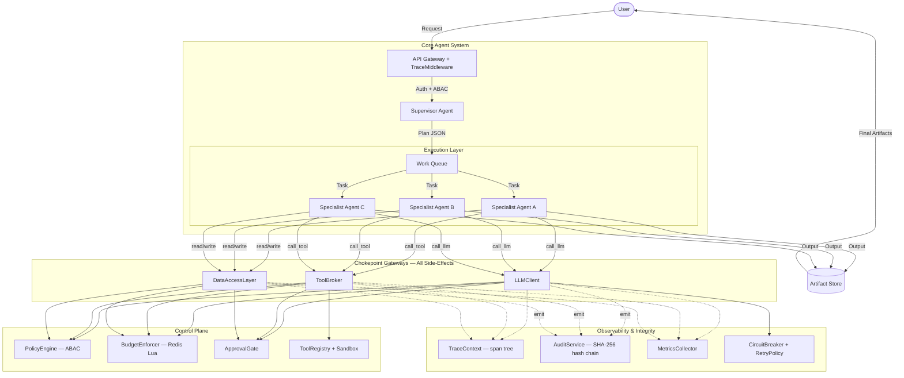
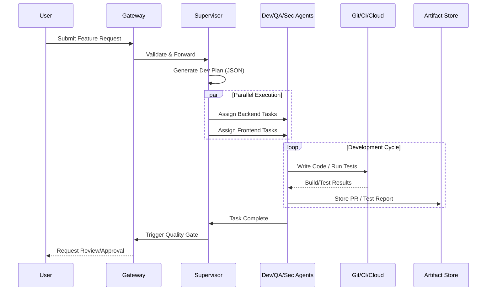
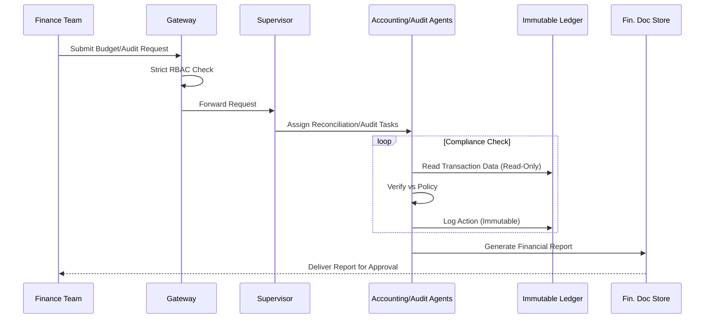
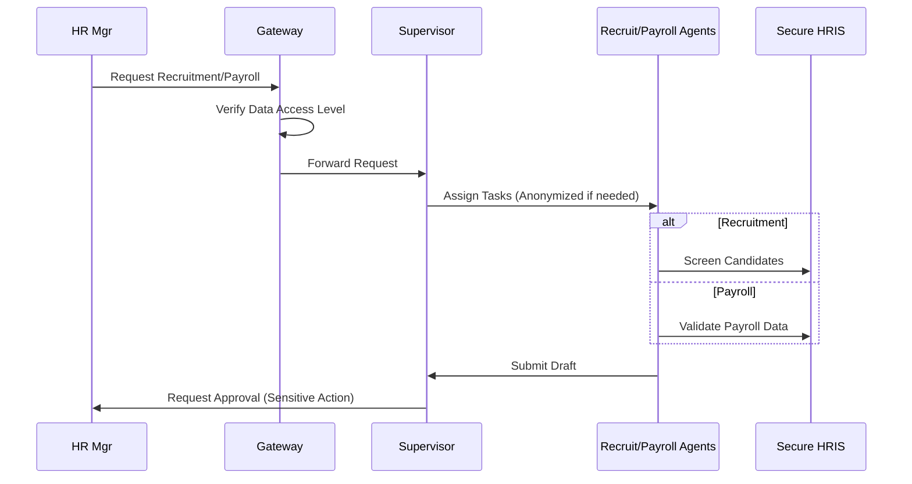
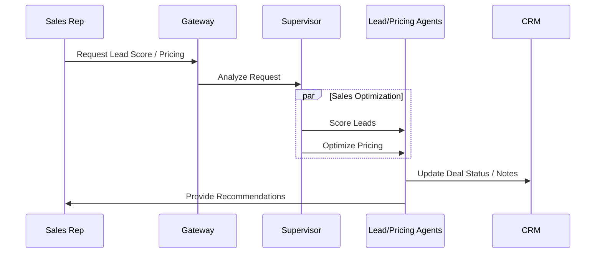
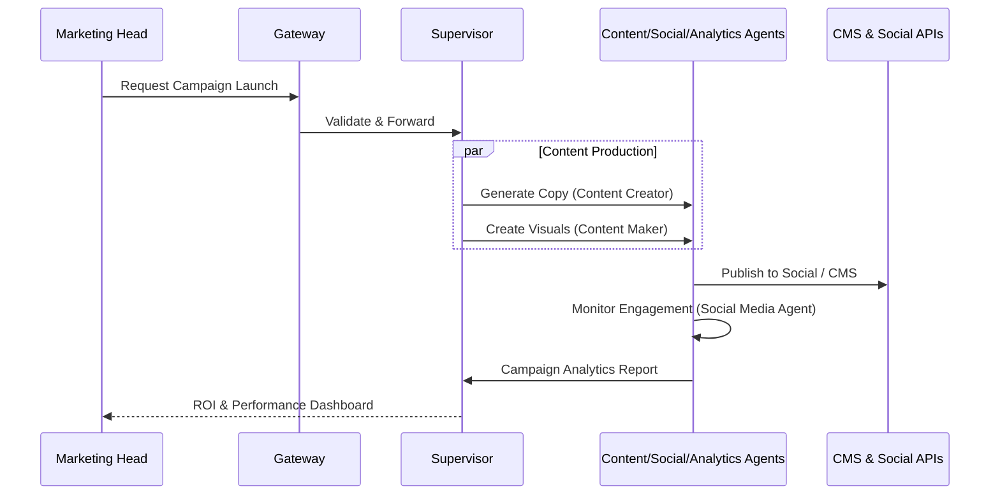
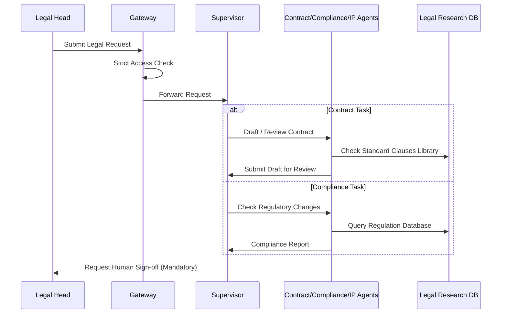
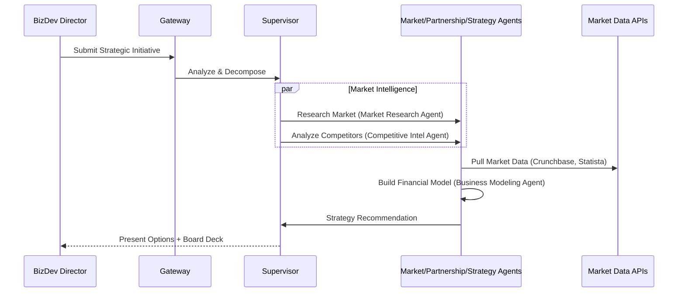
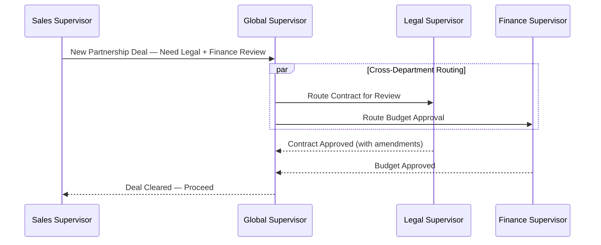

# Company Agent Workflows

## High-Level System Architecture

> **Updated Feb 2026**: Reflects the **Single Chokepoint** architecture (Modules 0-7). All agent side-effects flow through mandatory gateways with ABAC policy, budget enforcement, tamper-evident audit, and resilience built in.

### Key Architectural Principles (Implemented ✅)

| Principle | Enforcement | Module |
|-----------|------------|--------|
| **No Direct External Calls** | Agents use only `LLMClient`, `ToolBroker`, `DataAccessLayer` | Module 0 |
| **Static Tool Registration** | Tools must be pre-registered in `ToolRegistry` at startup | Module 1 |
| **ABAC Policy** | Every action evaluated: allow / deny / require_approval | Module 2 |
| **Rigid I/O Contracts** | `AgentInputSchema` → `AgentOutputSchema` with server-derived risk | Module 3 |
| **Tamper-Evident Audit** | SHA-256 hash chain per trace, `verify_chain_integrity()` | Module 4 |
| **End-to-End Tracing** | `trace_id` + `span_id` in every request, log, and audit event | Module 5 |
| **Atomic Budget** | Redis Lua reserve → call → finalize (soft + hard limits) | Module 6 |
| **Resilience** | RetryPolicy (taxonomy-based), DLQ, CircuitBreaker | Module 7 |

## Department Specific Workflows

### 1. Tech Development Workflow
Focus: Feature Delivery & Quality Gates

### 2. Finance Workflow
Focus: Accuracy, Compliance & Audit Trails

### 3. HR Workflow
Focus: Privacy & Data Segregation

### 4. Sales Workflow
Focus: Revenue & Speed

### 5. Digital Marketing Workflow
Focus: Brand Presence, Content & ROI

### 6. Legal Workflow
Focus: Compliance, Contracts & Risk Mitigation

### 7. Strategic & Business Development Workflow
Focus: Market Intelligence & Growth Strategy

### 8. Cross-Department Coordination
Focus: Multi-Department Task Resolution

