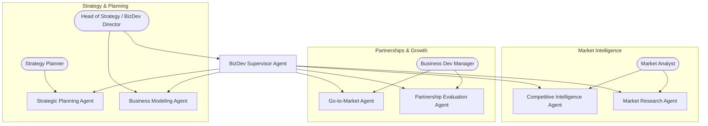

# Multi-Agentic AI Framework — Strategic & Business Development Department

## Unified AI-Assisted Business Strategy Workflow

### Department Overview

The Strategic & Business Development Department leverages AI Agents to drive market expansion, partnership development, competitive intelligence, and long-term strategic planning — ensuring the company makes data-driven decisions for sustainable growth.

------------------------------------------------------------------------

# 1. Executive Summary

This framework defines the Multi-Agent AI system for Strategic & Business Development operations. Each agent assists strategy professionals in market analysis, partnership evaluation, business modeling, and growth planning while humans retain final authority on all strategic decisions and commitments.

------------------------------------------------------------------------

# 2. Architecture Overview

## 2.1 High-Level Flow

```
Strategy Request → BizDev Supervisor Agent → Specialist Agent(s) → Tool Sandbox → Artifact Store → Human Review
```

## 2.2 Core Components

### Orchestration
-   BizDev Supervisor Agent (department-level coordinator)
-   Plan JSON (structured task definition)
-   Approval Gate (all strategic recommendations require human sign-off)

### Tools
-   Market data APIs (Crunchbase, PitchBook, Statista)
-   Competitive intelligence tools (SimilarWeb, SEMrush)
-   Financial modeling tools (Excel API, Google Sheets)
-   CRM integration (HubSpot, Salesforce — partnership pipeline)
-   News & trend aggregation (RSS, Google News API)
-   Presentation generation (Google Slides API, PowerPoint)

### Storage
-   Strategy documents repository (S3/MinIO)
-   Partnership pipeline database (PostgreSQL)
-   Market research data warehouse

------------------------------------------------------------------------

# 3. Department Agent Map



------------------------------------------------------------------------

# 4. Plan JSON Contract

``` json
{
  "goal": "Strategic objective",
  "department_id": "bizdev",
  "constraints": {
    "market_scope": "Indonesia / Southeast Asia",
    "timeline": "Q1 2026",
    "budget_limit": 0,
    "risk_appetite": "moderate",
    "compliance_mode": "standard"
  },
  "tasks": [
    {
      "id": "BD1",
      "owner_agent": "AgentName",
      "input": "market data reference or strategic brief",
      "tools_allowed": [],
      "output_artifact": "artifact name",
      "definition_of_done": "strategic deliverable criteria"
    }
  ],
  "risk": [],
  "approval_required": []
}
```

------------------------------------------------------------------------

# 5. Business Development Agent Roles

## BizDev Supervisor Agent

-   Triage and decompose strategic initiatives into agent tasks
-   Generate Plan JSON for strategy workflows
-   Assign agents based on initiative type (market entry, partnership, M&A)
-   Coordinate cross-department strategic projects
-   No direct commitment or signing authority

## Market Research Agent

-   Market sizing and TAM/SAM/SOM analysis
-   Industry trend reports and forecasting
-   Customer segment profiling
-   Demand analysis and market gap identification
-   Regional market comparisons (Indonesia, SEA, global)

## Competitive Intelligence Agent

-   Competitor profiling (products, pricing, positioning)
-   SWOT analysis generation
-   Feature comparison matrices
-   Competitor news monitoring and alerts
-   Market share estimation and tracking

## Partnership Evaluation Agent

-   Partner screening and due diligence reports
-   Synergy analysis and compatibility scoring
-   Term sheet comparison and negotiation prep
-   Partnership ROI projection
-   Vendor evaluation scorecards

## Go-to-Market Agent

-   GTM strategy drafting for new products/markets
-   Launch timeline and checklist generation
-   Channel strategy recommendations
-   Pricing strategy analysis (competitive, value-based, penetration)
-   Launch KPI definition and tracking setup

## Business Modeling Agent

-   Business model canvas generation (Lean Canvas, BMC)
-   Financial scenario modeling (best/base/worst case)
-   Revenue model analysis (SaaS, marketplace, B2B)
-   Unit economics calculation (CAC, LTV, payback period)
-   Investment readiness assessment

## Strategic Planning Agent

-   OKR definition and cascading across departments
-   Strategic roadmap generation (quarterly/annual)
-   Resource allocation recommendations
-   Risk assessment and mitigation planning
-   Board presentation and strategy deck preparation

------------------------------------------------------------------------

# 6. BizDev RBAC Matrix

  -----------------------------------------------------------------------
  Role                Market Data   CRM Access   Financial    Presentations
  ------------------- ------------- ------------ ------------ -------------
  Supervisor          Full Read     Pipeline     View         Generate

  Market Research     Full Read     No           View         Draft Only

  Competitive Intel   Full Read     No           No           Draft Only

  Partnership Eval    Limited       Full Read    View         Draft Only

  Go-to-Market        Limited       Limited      View         Draft Only

  Business Modeling   Full Read     No           Full Read    Draft Only

  Strategic Planning  Full Read     View         Full Read    Generate
  -----------------------------------------------------------------------

All strategic recommendations require human review before execution.

------------------------------------------------------------------------

# 7. Quality & Compliance Gates

1.  **Data Accuracy Gate** — All market data cross-referenced with minimum 2 sources before presenting
2.  **Confidentiality Gate** — M&A and partnership evaluations classified as confidential with restricted access
3.  **Financial Validation Gate** — All financial models reviewed against actual financials before presentation
4.  **Conflict of Interest Gate** — Partner evaluations checked for existing relationships or conflicts
5.  **Board-Ready Gate** — All executive presentations must pass formatting and accuracy standards

------------------------------------------------------------------------

# 8. Audit Log Structure

``` json
{
  "event_id": "uuid",
  "timestamp": "ISO 8601",
  "agent": "market_research_agent",
  "action": "market_analysis",
  "market": "Indonesia_fintech",
  "input": "market_brief_ref",
  "output": "tam_sam_som_report_v1.pdf",
  "status": "pending_review",
  "reviewed_by": "human_id | null",
  "data_sources": ["statista", "crunchbase"],
  "department": "bizdev"
}
```

------------------------------------------------------------------------

# 9. Deployment Roadmap

| Phase | Weeks | Deliverables |
|-------|-------|-------------|
| **Phase 1** | 1-2 | BizDev Supervisor + Market Research Agent |
| **Phase 2** | 3-4 | Competitive Intelligence + Partnership Evaluation |
| **Phase 3** | 5-6 | Go-to-Market + Business Modeling Agents |
| **Phase 4** | 7-8 | Strategic Planning Agent + board deck integration |

------------------------------------------------------------------------

# 10. Operating Principles

1.  **Human Decides, Agent Analyzes** — Agents provide data-driven recommendations. All strategic commitments are made by humans.
2.  **Multi-Source Validation** — No market insight is presented from a single source. Minimum 2 cross-references required.
3.  **Confidentiality by Default** — All partnership and M&A analysis is encrypted and access-restricted.
4.  **Audit Everything** — Every analysis, model, and recommendation is logged with source attribution.
5.  **Cross-Department Coordination** — Strategy agents coordinate with Finance (budget), Legal (contracts), and Sales (partnerships) via Global Supervisor.
6.  **Bias Awareness** — Agents flag when data may be incomplete or biased toward a specific outcome.
