# Analisa Fitur Dashboard & Backend — Company AI

## Ringkasan

| Area | Backend | Dashboard (FE) | Status |
|------|---------|----------------|--------|
| **User Management** | ✅ Full CRUD + invite | ✅ Full UI | ✅ Production-ready |
| **Agent Monitoring** | ✅ CRUD + prompt config | ✅ Full UI + test | ✅ Production-ready |
| **Task Monitoring** | ✅ CRUD + status | ❌ Tidak ada page | 🔴 Gap |
| **Trace Monitoring** | ✅ List + timeline detail | ✅ Full UI + drilldown | ✅ Production-ready |
| **Approval Workflow** | ✅ Queue + decide | ✅ Full UI | ✅ Production-ready |
| **Policy Events** | ✅ Filter + list | ✅ Full UI | ✅ Production-ready |
| **Integrations/Config** | ✅ Credential CRUD + test | ✅ Full UI | ✅ Production-ready |
| **LLM Settings** | ✅ Get/Update (Redis) | ✅ Settings page | ✅ Production-ready |
| **SOUL Personality** | ✅ Templates + CRUD | ❌ Tidak ada page | 🔴 Gap |
| **Knowledge Base** | ✅ Ingest + search | ❌ Tidak ada page | 🔴 Gap |
| **Execution/Chat** | ✅ Execute + chat | ⚠️ Playground only | 🟡 Partial |
| **Workflows** | ✅ Invoice workflow | ❌ Tidak ada page | 🔴 Gap |
| **Cost Tracking** | ✅ Cost summary API | ⚠️ Di overview saja | 🟡 Partial |

---

## 1. User Management

### Backend — [auth.py](file:///c:/Users/sarif/Documents/project_antigravity/company_AI/backend/app/api/v1/auth.py) + [admin.py](file:///c:/Users/sarif/Documents/project_antigravity/company_AI/backend/app/api/v1/admin.py)

| Endpoint | Method | Auth | Fungsi |
|----------|--------|------|--------|
| `/auth/register` | POST | Public | Self-registration |
| `/auth/login` | POST | Public | Login → JWT token |
| `/auth/invite-info` | GET | Public | Validate invite token |
| `/auth/set-password` | POST | Public | Set password via invite |
| `/admin/users` | GET | Manager+ | List users (filter dept/role) |
| `/admin/users` | POST | Admin only | Create user + generate invite link |
| `/admin/users/{id}` | DELETE | Admin only | Soft deactivate |

### Model — [user.py](file:///c:/Users/sarif/Documents/project_antigravity/company_AI/backend/app/models/user.py)

```
User: id, email, name, hashed_password, department, role (admin|manager|lead|contributor),
      is_active, invite_token_hash, invite_expires_at,
      phone_whatsapp, telegram_chat_id, notification_channels,
      active_soul_id (FK → user_souls)
```

**Fitur:**
- ✅ 4-level role hierarchy (`admin > manager > lead > contributor`)
- ✅ Invite-based onboarding (SHA-256 hashed token, 7-day expiry)
- ✅ Multi-channel notifications (email, whatsapp, telegram)
- ✅ SOUL personality per user
- ✅ Status labels (active, pending_invite, invite_expired, inactive)

### Dashboard — [users/page.tsx](file:///c:/Users/sarif/Documents/project_antigravity/company_AI/frontend/src/app/(admin)/users/page.tsx)

- ✅ Table view with filter by department/role
- ✅ Create user dialog + invite link generation
- ✅ Deactivate user
- ✅ Role-based access (manager+ only)

---

## 2. Agent Monitoring

### Backend — [agents.py](file:///c:/Users/sarif/Documents/project_antigravity/company_AI/backend/app/api/v1/agents.py) + [admin.py](file:///c:/Users/sarif/Documents/project_antigravity/company_AI/backend/app/api/v1/admin.py)

| Endpoint | Method | Fungsi |
|----------|--------|--------|
| `/agents` | GET | List all agents (filter dept) |
| `/agents/{id}` | GET | Get specific agent |
| `/agents` | POST | Register new agent |
| `/agents/{id}` | PATCH | Update agent config |
| `/agents/stats/summary` | GET | Stats by dept/tier |
| `/admin/agents` | GET | List agents with prompt info |
| `/admin/agents/{id}/prompt` | GET | Current prompt + version history |
| `/admin/agents/{id}/prompt` | PUT | Update system prompt override |
| `/admin/agents/{id}/prompt/rollback` | POST | Rollback to specific version |
| `/admin/agents/{id}/test` | POST | Test agent with a message |
| `/admin/agents/sync-prompts` | POST | Sync code → DB defaults |

### Model — [agent.py](file:///c:/Users/sarif/Documents/project_antigravity/company_AI/backend/app/models/agent.py)

```
Agent: id, name, department, tier (nano|standard|advanced|code|vision), status (idle|busy),
       description, system_prompt, tools_config (JSON),
       paired_user_id (FK → users),
       system_prompt_override, prompt_version, prompt_updated_at, prompt_updated_by
```

**Fitur:**
- ✅ Prompt hot-swap (edit via dashboard, no restart needed)
- ✅ Version history + rollback
- ✅ Admin can test agent directly from dashboard
- ✅ Sync mechanism (code → DB)

### Dashboard — [agents/page.tsx](file:///c:/Users/sarif/Documents/project_antigravity/company_AI/frontend/src/app/(admin)/agents/page.tsx) + [agents/[agentId]/page.tsx](file:///c:/Users/sarif/Documents/project_antigravity/company_AI/frontend/src/app/(admin)/agents/[agentId]/page.tsx)

- ✅ Agent list with department filter
- ✅ Agent detail: prompt editor (monaco-like), version history, rollback
- ✅ Test agent with message directly
- ✅ Prompt sync button

---

## 3. Task Monitoring

### Backend — [tasks.py](file:///c:/Users/sarif/Documents/project_antigravity/company_AI/backend/app/api/v1/tasks.py)

| Endpoint | Method | Fungsi |
|----------|--------|--------|
| `/tasks` | GET | List tasks (filter dept/status) |
| `/tasks/{id}` | GET | Get specific task |
| `/tasks` | POST | Submit new task |
| `/tasks/{id}/status` | PATCH | Update status (pending→running→completed→failed) |

### Model — [task.py](file:///c:/Users/sarif/Documents/project_antigravity/company_AI/backend/app/models/task.py)

```
Task: id, title, description, department, status, priority (P1-P5),
      plan_json (JSON), result_json (JSON),
      assigned_agent_id (FK → agents), submitted_by (FK → users)
```

### Dashboard

> [!WARNING]
> **Gap**: Tidak ada halaman `/tasks` di dashboard. API sudah ada tapi UI belum dibuat.

**Yang seharusnya ada:**
- Task list view (filter status, department, priority)
- Task detail (plan JSON viewer, result viewer)
- Submit new task form
- Status update buttons
- Task timeline linked to traces

---

## 4. Trace Monitoring (Observability)

### Backend — [admin.py](file:///c:/Users/sarif/Documents/project_antigravity/company_AI/backend/app/api/v1/admin.py)

| Endpoint | Method | Fungsi |
|----------|--------|--------|
| `/admin/dashboard` | GET | Overview stats (status, cost, errors, approvals) |
| `/admin/traces` | GET | Filterable trace list (status, dept, risk, search) |
| `/admin/traces/{id}` | GET | Full event timeline drilldown |

### Models

```
TraceIndex: trace_id, department, status, started_at, ended_at, total_cost_usd,
            risk_level, data_sensitivity, current_step, current_agent_id,
            last_error_code, approval_pending, summary

AuditEvent: id, trace_id, event_type, agent_id, decision, tool_name,
            model, cost_usd, latency_ms, tokens_in, tokens_out,
            risk_level, error_code, artifact_ids

MetricsRollupHourly: aggregate stats per hour
```

### Dashboard — [traces/page.tsx](file:///c:/Users/sarif/Documents/project_antigravity/company_AI/frontend/src/app/(admin)/traces/page.tsx) + [traces/[traceId]/page.tsx](file:///c:/Users/sarif/Documents/project_antigravity/company_AI/frontend/src/app/(admin)/traces/[traceId]/page.tsx)

- ✅ Filterable trace table (status, dept, risk, search)
- ✅ Drilldown: full event timeline per trace
- ✅ Cost, latency, token usage per event
- ✅ Department scoping (admin sees all, lead/contributor sees own dept)

---

## 5. Approval Workflow

### Backend — [admin.py](file:///c:/Users/sarif/Documents/project_antigravity/company_AI/backend/app/api/v1/admin.py)

| Endpoint | Method | Fungsi |
|----------|--------|--------|
| `/admin/approvals` | GET | Pending approval queue |
| `/admin/approvals/{trace_id}/decide` | POST | Approve/Reject with reason |

### Dashboard — [approvals/page.tsx](file:///c:/Users/sarif/Documents/project_antigravity/company_AI/frontend/src/app/(admin)/approvals/page.tsx)

- ✅ Approval queue with waiting time indicators
- ✅ Approve/reject buttons with reason modal

---

## 6. Policy Events (Security)

### Backend — [admin.py](file:///c:/Users/sarif/Documents/project_antigravity/company_AI/backend/app/api/v1/admin.py)

| Endpoint | Method | Fungsi |
|----------|--------|--------|
| `/admin/policies` | GET | Policy violations, denies, egress blocks (filter by days, decision, event_type, dept, tool) |

### Dashboard — [policies/page.tsx](file:///c:/Users/sarif/Documents/project_antigravity/company_AI/frontend/src/app/(admin)/policies/page.tsx)

- ✅ Table with filters
- ✅ Color-coded decisions (deny, allow, require_approval)

---

## 7. Integrations & Configuration

### Backend — [integrations.py](file:///c:/Users/sarif/Documents/project_antigravity/company_AI/backend/app/api/v1/integrations.py)

| Endpoint | Method | Fungsi |
|----------|--------|--------|
| `/integrations/status` | GET | Service configuration status |
| `/integrations/credentials` | GET | List credentials (masked) |
| `/integrations/credentials` | POST | Set/update credential |
| `/integrations/credentials/{key}` | DELETE | Remove credential |
| `/integrations/test-connection` | POST | Test connectivity (SMTP, Google, Twilio, Telegram) |

### Dashboard — [configurations/page.tsx](file:///c:/Users/sarif/Documents/project_antigravity/company_AI/frontend/src/app/(admin)/configurations/page.tsx) + [settings/page.tsx](file:///c:/Users/sarif/Documents/project_antigravity/company_AI/frontend/src/app/(admin)/settings/page.tsx)

- ✅ Configuration page: credential management
- ✅ Settings page: LLM provider + API key
- ✅ Test connection buttons per service
- ✅ Admin-only access

---

## 8. SOUL Personality Management

### Backend — [souls.py](file:///c:/Users/sarif/Documents/project_antigravity/company_AI/backend/app/api/v1/souls.py)

| Endpoint | Method | Fungsi |
|----------|--------|--------|
| `/souls/templates` | GET | List available templates |
| `/souls/my` | GET | User's souls |
| `/souls` | POST | Create soul (custom or clone from template) |
| `/souls/{id}` | PUT | Update soul |
| `/souls/{id}/activate` | POST | Activate (deactivates others) |
| `/souls/{id}` | DELETE | Delete soul |

### Dashboard

> [!WARNING]
> **Gap**: Tidak ada halaman `/souls` di dashboard. Backend sudah support full CRUD tapi UI belum dibuat.

---

## 9. Knowledge Base (RAG)

### Backend — [knowledge.py](file:///c:/Users/sarif/Documents/project_antigravity/company_AI/backend/app/api/v1/knowledge.py)

| Endpoint | Method | Fungsi |
|----------|--------|--------|
| `/knowledge/ingest` | POST | Ingest document (chunk + embed + pgvector) |
| `/knowledge/search` | POST | Semantic search |
| `/knowledge/documents` | GET | List documents (filter dept/type) |
| `/knowledge/{doc_id}` | DELETE | Delete document + chunks |

### Dashboard

> [!WARNING]
> **Gap**: Tidak ada halaman knowledge management di dashboard.

---

## 10. Execution & Playground

### Backend — [execution.py](file:///c:/Users/sarif/Documents/project_antigravity/company_AI/backend/app/api/v1/execution.py)

| Endpoint | Method | Fungsi |
|----------|--------|--------|
| `/execution/execute` | POST | Execute task via LangGraph pipeline |
| `/execution/chat` | POST | Chat with specific agent |
| `/execution/audit/{agent}` | GET | Agent audit trail |
| `/execution/audit/department/{dept}` | GET | Department audit trail |
| `/execution/costs` | GET | Cost summary |

### Dashboard — [playground/page.tsx](file:///c:/Users/sarif/Documents/project_antigravity/company_AI/frontend/src/app/(admin)/playground/page.tsx)

- ✅ Chat with agent
- ⚠️ Hanya playground — tidak ada dedicated task execution page

---

## 11. Workflows

### Backend — [workflows.py](file:///c:/Users/sarif/Documents/project_antigravity/company_AI/backend/app/api/v1/workflows.py)

| Endpoint | Method | Fungsi |
|----------|--------|--------|
| `/workflows/invoice` | POST | Create & process invoice (full pipeline) |
| `/workflows/invoice/{id}/approve` | POST | Approve invoice |
| `/workflows/invoice/{id}/reject` | POST | Reject invoice |

### Dashboard

> [!WARNING]
> **Gap**: Tidak ada halaman workflow management di dashboard.

---

## 12. Architecture Diagram

```mermaid
graph TB
    subgraph Dashboard["Frontend Dashboard (Next.js)"]
        P1[Overview Page]
        P2[Traces Page]
        P3[Approvals Page]
        P4[Policies Page]
        P5[Agents Page]
        P6[Playground Page]
        P7[Users Page]
        P8[Configurations Page]
        P9[Settings Page]
    end

    subgraph Missing["❌ Halaman Belum Ada"]
        M1[Tasks Page]
        M2[SOUL Page]
        M3[Knowledge Page]
        M4[Workflows Page]
    end

    subgraph Backend["Backend API (FastAPI)"]
        A1["/admin/*"]
        A2["/auth/*"]
        A3["/tasks/*"]
        A4["/agents/*"]
        A5["/execution/*"]
        A6["/integrations/*"]
        A7["/souls/*"]
        A8["/knowledge/*"]
        A9["/workflows/*"]
    end

    subgraph DB["Database Models"]
        D1[User]
        D2[Agent]
        D3[Task]
        D4[AuditEvent]
        D5[TraceIndex]
        D6[MetricsRollupHourly]
        D7[KnowledgeDocument]
        D8[IntegrationCredential]
        D9[SoulTemplate / UserSoul]
        D10[PromptHistory]
        D11[NotificationLog]
    end

    P1 & P2 & P3 & P4 & P5 --> A1
    P7 --> A1 & A2
    P6 --> A5
    P8 --> A6
    P9 --> A1

    M1 -.->|API ready, UI missing| A3
    M2 -.->|API ready, UI missing| A7
    M3 -.->|API ready, UI missing| A8
    M4 -.->|API ready, UI missing| A9

    A1 --> D4 & D5 & D6 & D2 & D1 & D10
    A2 --> D1
    A3 --> D3
    A4 --> D2
    A5 --> D4
    A6 --> D8
    A7 --> D9
    A8 --> D7
```



---

## 13. Role-Based Access Control (Dashboard)

| Page | Min Role | |
|------|----------|---|
| Overview | contributor | Semua user |
| Traces | contributor | Scoped per department |
| Approvals | contributor | Semua user |
| Policies | contributor | Semua user |
| Agents | contributor | Semua user |
| Playground | contributor | Semua user |
| **Users** | **manager** | Manager+ only |
| **Configurations** | **admin** | Admin only |
| **Settings** | **admin** | Admin only |

---

## 14. Gap Summary & Rekomendasi

### 🔴 Gap Kritis (Backend ready, Dashboard missing)

| # | Feature | Backend Route | Effort FE |
|---|---------|--------------|-----------|
| 1 | **Task Management Page** | `/tasks/*` (4 endpoints) | 2 hari |
| 2 | **SOUL Management Page** | `/souls/*` (6 endpoints) | 2 hari |
| 3 | **Knowledge Base Page** | `/knowledge/*` (4 endpoints) | 2 hari |
| 4 | **Workflow Page** | `/workflows/*` (3 endpoints) | 1 hari |

### 🟡 Partial (Bisa diperkuat)

| # | Feature | Status | Improvement |
|---|---------|--------|-------------|
| 5 | Cost tracking | Di overview saja | Halaman dedicated cost breakdown |
| 6 | Execution | Playground only | Dedicated task execution + audit page |
| 7 | Notifications | Model ada (NotificationLog) | History page + real-time alerts |

### 🟢 Production-Ready

- User Management (CRUD + invite + role hierarchy)
- Agent Monitoring (CRUD + prompt config + test + rollback)
- Trace Monitoring (list + timeline drilldown)
- Approval Workflow (queue + decide)
- Policy Events (filterable violations)
- Integrations/Config (credential CRUD + test connectivity)
- LLM Settings (provider + API key management)
