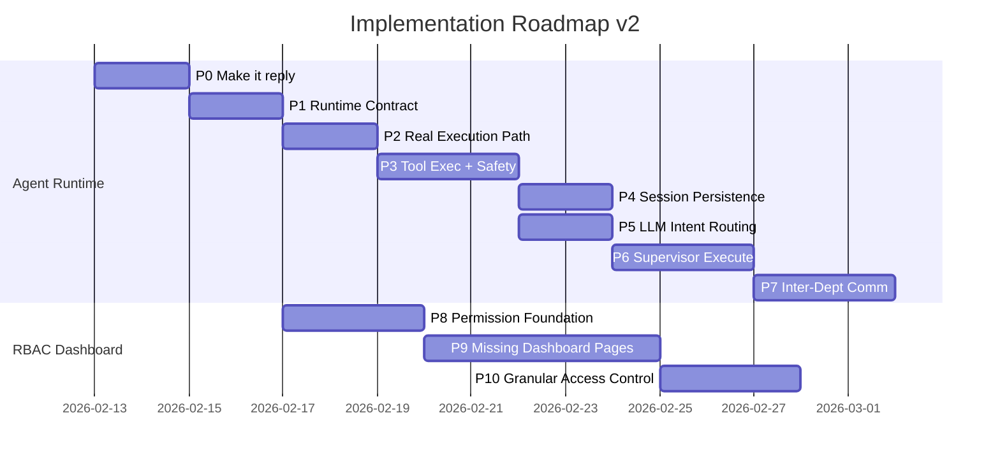
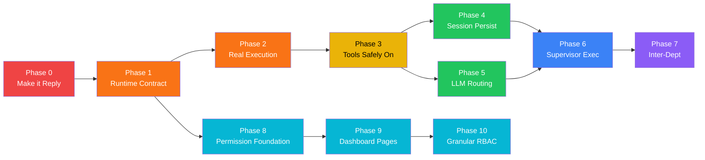

# Plan Perbaikan Agent System v2 (Repo-Driven)

> Update dari v1 — restruktur berdasarkan dependency nyata. Phase 0 ditambahkan untuk memastikan Telegram **benar-benar bisa reply** sebelum fitur lain dibangun. Phase 8-10 adalah track paralel untuk RBAC Dashboard.



---

## Phase 0 — "Make it Reply" (Closed-loop Telegram)

**Tujuan**: Setiap inbound Telegram update → outbound reply (minimal text). User menerima jawaban.

> [!IMPORTANT]
> Ini HARUS jalan dulu sebelum apapun — membuat sistem "terlihat bekerja" oleh user.

### Deliverables

- [ ] Webhook handler memanggil orchestrator real (bukan placeholder)
- [ ] Orchestrator mengembalikan `ResponseEnvelope` standar
- [ ] `NotificationDispatcher` mengirim `sendMessage` ke Telegram

### File Touch

| File | Perubahan |
|------|-----------|
| [gateway.py](file:///c:/Users/sarif/Documents/project_antigravity/company_AI/backend/app/api/v1/gateway.py) | Parse update → `UnifiedMessage` → `TaskOrchestrator.handle_message()` → ACK cepat (≤1-2 detik) |
| [task_orchestrator.py](file:///c:/Users/sarif/Documents/project_antigravity/company_AI/backend/app/services/orchestration/task_orchestrator.py) | Implement `handle_message()` yang memanggil executor |
| [notification_dispatcher.py](file:///c:/Users/sarif/Documents/project_antigravity/company_AI/backend/app/services/orchestration/notification_dispatcher.py) | Pastikan `_send_telegram` dipakai dari orchestrator |

### Test Gates

- [ ] **Unit test**: Telegram payload → `sendMessage(chat_id, text)` dipanggil (mock HTTP)
- [ ] **Integration smoke**: 1 update → 1 reply (tidak duplicate)

---

## Phase 1 — Standardize Runtime Contract

**Tujuan**: Bentuk "bahasa internal" agar semua modul konsisten — sebelum tools dan multi-agent.

### Deliverables

- [ ] `UnifiedMessage` schema final (channel, peer, sender, content, metadata)
- [ ] `ResponseEnvelope` schema final:
  ```python
  @dataclass
  class ResponseEnvelope:
      trace_id: str
      run_id: str
      reply_text: str
      artifacts: list[dict] = field(default_factory=list)
      control: dict = field(default_factory=dict)  # stop_reason, needs_approval
      telemetry: dict = field(default_factory=dict)  # latency, tokens
  ```
- [ ] Trace propagation end-to-end

### File Touch

| File | Perubahan |
|------|-----------|
| [message_gateway.py](file:///c:/Users/sarif/Documents/project_antigravity/company_AI/backend/app/services/orchestration/message_gateway.py) | Finalize `UnifiedMessage` schema |
| [task_orchestrator.py](file:///c:/Users/sarif/Documents/project_antigravity/company_AI/backend/app/services/orchestration/task_orchestrator.py) | Return `ResponseEnvelope` |
| [notification_dispatcher.py](file:///c:/Users/sarif/Documents/project_antigravity/company_AI/backend/app/services/orchestration/notification_dispatcher.py) | Consume `ResponseEnvelope` |

### Test Gates

- [ ] **Contract test**: Orchestrator output selalu valid schema
- [ ] **Logging test**: `trace_id` selalu muncul di log penting (route, execute, send)

---

## Phase 2 — "Real Execution Path"

**Tujuan**: Orchestrator berhenti "compose text" sendiri — memanggil `AgentExecutorService` betulan.

### Deliverables

- [ ] `TaskOrchestrator` → `AgentExecutorService.chat()` atau `execute_task()`
- [ ] Task record persisted (minimal) + `run_id`

### File Touch

| File | Perubahan |
|------|-----------|
| [agent_executor.py](file:///c:/Users/sarif/Documents/project_antigravity/company_AI/backend/app/services/agent_executor.py) | Wire ke orchestrator |
| [task.py](file:///c:/Users/sarif/Documents/project_antigravity/company_AI/backend/app/models/task.py) | Model usage (jika dipakai) |
| [agents/*](file:///c:/Users/sarif/Documents/project_antigravity/company_AI/backend/app/agents/) | Adapt contract — bukan refactor besar |

### Test Gates

- [ ] **Integration**: Inbound Telegram → agent executor dipanggil → reply terkirim
- [ ] **Failure handling**: Executor error → fallback reply (graceful)

---

## Phase 3 — Tools "Safely On"

**Tujuan**: Agent mulai "bertindak", tapi TIDAK merusak (double side effects, bypass approval, loop tak berhenti).

> [!CAUTION]
> **Non-Negotiables (wajib SEBELUM enable side-effect tools):**
> 1. Strict tool-call contract (JSON)
> 2. Idempotency receipts (per `run_id` + `idem_key`)
> 3. ApprovalGate integrated (pending → stop loop)
> 4. Budget control: max iterations + total timeout + max tool calls
> 5. Audit events minimal untuk dashboard

### Deliverables

- [ ] Tool execution loop:
  ```
  LLM → tool_calls[] → policy check → tool exec → observation → repeat → final
  ```
- [ ] Tool receipt store (Redis/Postgres) untuk dedupe
- [ ] Approval workflow:
  ```
  tool returns REQUIRES_APPROVAL → persist state → notify operator/user
  ```

### File Touch

| File | Perubahan |
|------|-----------|
| [tool_broker.py](file:///c:/Users/sarif/Documents/project_antigravity/company_AI/backend/app/core/tool_broker.py) | Tool exec + receipt store |
| [policy_engine.py](file:///c:/Users/sarif/Documents/project_antigravity/company_AI/backend/app/core/policy_engine.py) | Policy integration |
| [approval_gate.py](file:///c:/Users/sarif/Documents/project_antigravity/company_AI/backend/app/core/approval_gate.py) | Approval workflow |
| [task_orchestrator.py](file:///c:/Users/sarif/Documents/project_antigravity/company_AI/backend/app/services/orchestration/task_orchestrator.py) | Tool execution loop |

### Test Gates (Penyelamat Produksi)

- [ ] **Idempotency**: Tool side-effect TIDAK bisa dieksekusi 2x
- [ ] **Loop stop**: Model panggil tool terus → stop di budget
- [ ] **Approval**: Tool high-risk → pending approval, TIDAK execute
- [ ] **Replay**: Restart → receipts tetap mencegah duplicate

---

## Phase 4 — Session Persistence + Run State Recovery

**Tujuan**: Restart TIDAK menghapus context dan TIDAK memicu tool execution ulang.

### Deliverables

- [ ] Redis session backend:
  - Chat history ringkas
  - Run state: `active_run_id`, pending approvals, last tool receipts, route lock
  - TTL policy + cleanup

### File Touch

| File | Perubahan |
|------|-----------|
| [session_manager.py](file:///c:/Users/sarif/Documents/project_antigravity/company_AI/backend/app/services/channels/session_manager.py) | Redis backend |
| Redis client + config | Wiring |

### Test Gates

- [ ] **Restart simulation**: Before restart (pending approval + tool receipt), after restart (state konsisten, no duplicate tool)

---

## Phase 5 — Routing Phase 2 (LLM Classifier)

**Tujuan**: Routing dari keyword-only → LLM classifier dengan confidence + fallback.

### Deliverables

- [ ] `_llm_classify()` output strict JSON:
  ```json
  {"department": "tech", "agentId": "devops-01", "confidence": 0.87, "reason": "...", "required_tools": []}
  ```
- [ ] Cache routing per (peer/session + normalized text) — mencegah route flapping
- [ ] Fallback low confidence → supervisor (bukan default dept)

### File Touch

| File | Perubahan |
|------|-----------|
| [intent_router.py](file:///c:/Users/sarif/Documents/project_antigravity/company_AI/backend/app/services/orchestration/intent_router.py) | LLM classifier |
| [department_guard.py](file:///c:/Users/sarif/Documents/project_antigravity/company_AI/backend/app/services/channels/department_guard.py) | Relax blocking |

### Test Gates

- [ ] **Golden set**: 20-50 contoh chat → routing benar
- [ ] **Consistency**: Input sama → route sama (dalam cache window)

---

## Phase 6 — Supervisor Plan Execution

**Tujuan**: Supervisor bukan sekadar "menghasilkan plan" — ia menjalankan subtask sesuai dependency.

### Deliverables

- [ ] `TaskExecutor`:
  - Topological sort + cycle detect
  - Parallelism cap
  - Partial failure policy (fail-fast / continue-with-warning)
- [ ] Artifacts per subtask + final aggregated output

### File Touch

| File | Perubahan |
|------|-----------|
| [supervisor.py](file:///c:/Users/sarif/Documents/project_antigravity/company_AI/backend/app/agents/supervisor.py) | Wire to TaskExecutor |
| [task_executor.py](file:///c:/Users/sarif/Documents/project_antigravity/company_AI/backend/app/services/task_executor.py) | **NEW** |
| [agent_executor.py](file:///c:/Users/sarif/Documents/project_antigravity/company_AI/backend/app/services/agent_executor.py) | Execute subtasks |

### Test Gates

- [ ] **DAG execution**: `depends_on` ordering correct
- [ ] **Partial failure**: behavior test (fail-fast vs continue)

---

## Phase 7 — Inter-Department Communication

**Tujuan**: Unlock use-case lintas departemen dengan kontrol ketat.

### Deliverables

- [ ] `sessions_spawn` (async) → enqueue job ke queue departemen
- [ ] `sessions_send` (sync) → enqueue + wait (RPC style, bukan direct call)
- [ ] Guardrails:
  - `allowlist subagents.allowAgents`
  - Max pingpong turns
  - Call-chain guard (A→B→A deadlock prevention)
  - Lane queue per `session_key` (serial execution)

### File Touch

| File | Perubahan |
|------|-----------|
| [agent_dispatcher.py](file:///c:/Users/sarif/Documents/project_antigravity/company_AI/backend/app/services/agent_dispatcher.py) | **NEW** / extend |
| [tool_registry.py](file:///c:/Users/sarif/Documents/project_antigravity/company_AI/backend/app/core/tool_registry.py) | Register `spawn_subagent`, `send_to_agent` |
| Queue service / Celery | Integration |

### Test Gates

- [ ] **Deadlock**: A→B→A detected and blocked
- [ ] **Lane serial**: 2 message bersamaan → deterministik
- [ ] **Policy deny**: Spawn agent non-allowlisted → rejected

---

## Phase 8 — Permission Foundation (RBAC Backend)

**Tujuan**: Bangun infrastruktur permission yang scope-aware — fondasi agar dashboard bisa enforce akses granular per role.

> [!NOTE]
> Track **RBAC Dashboard** bisa jalan paralel dengan Agent Runtime (P3-P7) setelah P1 selesai, karena hanya butuh runtime contract.

### Deliverables

- [ ] `PermissionResolver` service:
  ```python
  def has_permission(user, action: str, scope: str) -> bool:
      """
      has_permission(user, "agents.edit", "department:tech")
      has_permission(user, "traces.read", "global")
      has_permission(user, "agents.edit_privileged", "department:tech")
      """
  ```
- [ ] Permission definitions registry (module → action → scope level):
  ```
  channels.configure.global          # Admin
  users.invite.department            # Manager
  agents.edit.department             # Lead + Manager
  agents.edit_privileged.department  # Admin (atau via approval)
  traces.read.department             # Lead + Manager
  traces.read.global                 # Admin + Auditor
  approvals.decide.department        # Lead + Manager
  ```
- [ ] Extended JWT claims: `roles[]`, `departments[]`, `agent_scopes[]`
- [ ] API middleware: `require_permission(action, scope)` decorator
- [ ] Opsional: role `viewer` / `auditor` (read-only)

### File Touch

| File | Perubahan |
|------|-----------|
| [permission_resolver.py](file:///c:/Users/sarif/Documents/project_antigravity/company_AI/backend/app/core/permission_resolver.py) | **NEW** — `has_permission()`, permission registry |
| [security.py](file:///c:/Users/sarif/Documents/project_antigravity/company_AI/backend/app/core/security.py) | Extend JWT claims (`agent_scopes`) |
| [deps.py](file:///c:/Users/sarif/Documents/project_antigravity/company_AI/backend/app/core/deps.py) | `require_permission()` decorator/dependency |
| [user.py](file:///c:/Users/sarif/Documents/project_antigravity/company_AI/backend/app/models/user.py) | Opsional: tambah `viewer`/`auditor` ke role enum |
| [admin.py](file:///c:/Users/sarif/Documents/project_antigravity/company_AI/backend/app/api/v1/admin.py) | Migrate `AdminOnly`/`ManagerUp` → `require_permission()` |

### Test Gates

- [ ] **Permission check**: Admin has `global`, Manager has `department`, Contributor denied `edit_privileged`
- [ ] **JWT round-trip**: Claims di-encode → decode → `has_permission()` works
- [ ] **API guard**: Unauthorized request → 403 with clear reason

---

## Phase 9 — Missing Dashboard Pages

**Tujuan**: Tutup 4 gap kritis — backend API sudah ada tapi halaman dashboard belum dibuat.

> Referensi: [ANALISA_DASHBOARD_BACKEND.md](file:///c:/Users/sarif/Documents/project_antigravity/company_AI/Development/ANALISA_DASHBOARD_BACKEND.md) Section 14.

### Deliverables

- [ ] **Task Management Page** (`/tasks`)
  - Table view: filter status, department, priority
  - Task detail: plan JSON viewer, result viewer
  - Submit new task form
  - Status update buttons (pending → running → completed → failed)
  - Link to related traces

- [ ] **SOUL Management Page** (`/souls`)
  - Template gallery (list available SOULs)
  - Create soul (custom / clone from template)
  - Activate/deactivate per user
  - Edit soul (tone, language_style, personality, boundaries, greeting)

- [ ] **Knowledge Base Page** (`/knowledge`)
  - Document list (filter dept/type)
  - Ingest document form (title, content, department, doc_type)
  - Semantic search interface
  - Delete document

- [ ] **Workflow Page** (`/workflows`)
  - Invoice workflow trigger (vendor, amount, description, dept, requester)
  - Pending approvals for workflows
  - Workflow result viewer

### File Touch

| File | Perubahan |
|------|-----------|
| `frontend/src/app/(admin)/tasks/page.tsx` | **NEW** |
| `frontend/src/app/(admin)/souls/page.tsx` | **NEW** |
| `frontend/src/app/(admin)/knowledge/page.tsx` | **NEW** |
| `frontend/src/app/(admin)/workflows/page.tsx` | **NEW** |
| [api.ts](file:///c:/Users/sarif/Documents/project_antigravity/company_AI/frontend/src/lib/api.ts) | Add `tasks.*`, `souls.*`, `knowledge.*`, `workflows.*` API functions |
| [layout.tsx](file:///c:/Users/sarif/Documents/project_antigravity/company_AI/frontend/src/app/(admin)/layout.tsx) | Add nav items for new pages |

### Test Gates

- [ ] **Smoke test**: Setiap halaman baru load tanpa error
- [ ] **CRUD test**: Create → Read → Update → Delete per halaman
- [ ] **API integration**: FE calls → BE returns correct data

---

## Phase 10 — Granular Access Control (Dashboard)

**Tujuan**: Implement rekomendasi RBAC per halaman — scope-filtered data, safe/privileged separation, redaction.

> Referensi: [REKOMENDASI_RBAC_DASHBOARD.md](file:///c:/Users/sarif/Documents/project_antigravity/company_AI/Development/REKOMENDASI_RBAC_DASHBOARD.md)

### Deliverables

- [ ] **Scope-filtered data per role** (satu halaman, visibility berbeda):
  - Admin: global
  - Manager: department-scoped
  - Lead: department + agent-level detail
  - Contributor: agent-scoped + redacted

- [ ] **Safe/Privileged layer separation** (Agent Configurator):
  - Safe: SOUL, prompt, safe tools → Lead+
  - Privileged: dangerous tools, sandbox, egress → Admin / Lead via approval
  - Contributor: draft-only → submit untuk approval

- [ ] **Trace redaction**:
  - Mask PII (WA number, email, token, secrets) per role
  - Manager: tanpa secret payload
  - Contributor: redaction ketat

- [ ] **Frontend permission guard**:
  ```tsx
  <PermissionGuard action="agents.edit_privileged" scope="department">
    <DangerousToolsPanel />
  </PermissionGuard>
  ```

- [ ] **Configuration change workflow**:
  - Contributor buat draft → Lead/Manager approve → apply
  - Audit record untuk setiap mutation

### File Touch

| File | Perubahan |
|------|-----------|
| `frontend/src/components/PermissionGuard.tsx` | **NEW** — FE permission check component |
| `frontend/src/lib/permissions.ts` | **NEW** — FE permission utilities |
| `frontend/src/app/(admin)/agents/[agentId]/page.tsx` | Safe/privileged layer split |
| `frontend/src/app/(admin)/traces/*` | Redaction per role |
| `frontend/src/app/(admin)/configurations/page.tsx` | Draft→approval flow |
| BE: semua admin API routes | `require_permission()` enforcement |

### Test Gates

- [ ] **Scope test**: Manager sees only dept data, Contributor sees only agent data
- [ ] **Redaction test**: PII masked correctly per role level
- [ ] **Privilege escalation test**: Contributor cannot access privileged config
- [ ] **Draft flow test**: Contributor draft → Lead approve → config applied

---

## Dependency Chain



> **2 track paralel**: Agent Runtime (P0→P7, merah→ungu) dan RBAC Dashboard (P8→P10, cyan). Track RBAC bisa dimulai setelah P1 selesai.

---

## Effort Summary

| Phase | Track | Effort | Risk | Prerequisite |
|-------|-------|--------|------|-------------|
| **P0: Make it Reply** | Agent | 2 hari | 🟢 Low | None |
| **P1: Runtime Contract** | Agent | 2 hari | 🟢 Low | P0 |
| **P2: Real Execution** | Agent | 2 hari | 🟡 Medium | P1 |
| **P3: Tools Safely On** | Agent | 3 hari | 🔴 High | P2 |
| **P4: Session Persist** | Agent | 2 hari | 🟢 Low | P3 |
| **P5: LLM Routing** | Agent | 2 hari | 🟢 Low | P3 |
| **P6: Supervisor Exec** | Agent | 3 hari | 🟡 Medium | P4 + P5 |
| **P7: Inter-Dept** | Agent | 3 hari | 🟡 Medium | P6 |
| **P8: Permission Foundation** | RBAC | 3 hari | 🟡 Medium | P1 |
| **P9: Dashboard Pages** | RBAC | 5 hari | 🟢 Low | P8 |
| **P10: Granular Access** | RBAC | 3 hari | 🟡 Medium | P9 |
| | | | | |
| **Agent Runtime** | | **19 hari** | | Sequential |
| **RBAC Dashboard** | | **11 hari** | | Starts after P1 |
| **Total (paralel)** | | **~22 hari** | | P8-P10 overlap P3-P7 |
