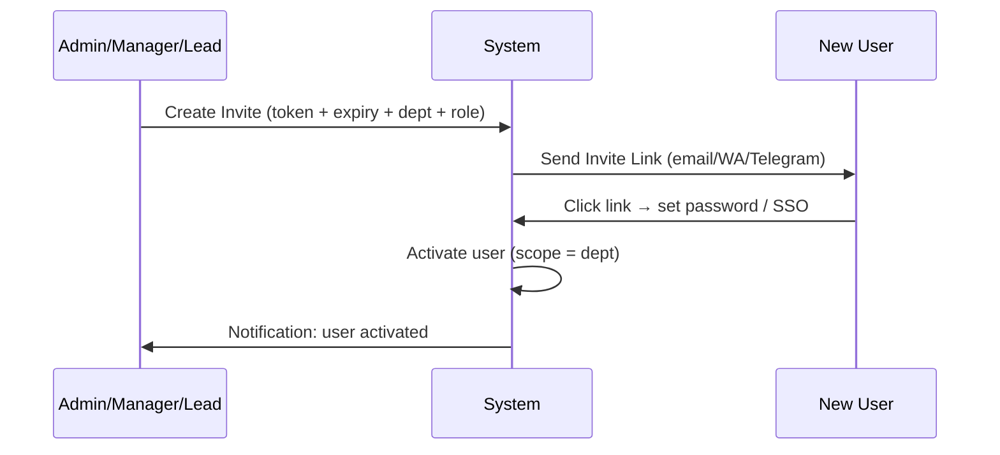

# Rekomendasi RBAC Dashboard — Company AI

## 1. Definisi Role & Tujuan

| Role | Tujuan | Scope Default |
|------|--------|---------------|
| **Admin** | Platform owner, security owner, global configuration | `global` |
| **Manager** | Owner departemen / product owner; KPI, policy dept, user dept | `department:<dept_id>` |
| **Lead** | Tech/team lead; operasi harian agent, tuning, approve aksi berisiko | `department:<dept_id>` + `agent:<agent_id>` |
| **Contributor** | Operator/engineer/analyst; run & monitor, tidak ubah policy kritikal | `agent:<agent_id>` + `user:<user_id>` |

### Opsional (Recommended)

| Role | Tujuan |
|------|--------|
| **Viewer/Auditor** | Read-only (compliance, security audit) — `traces.read.global` |
| **Operator** | Bisa approve tapi tidak ubah konfigurasi (separation-of-duties) |

---

## 2. Permission Scope System

Setiap permission HARUS punya scope:

```
<module>.<action>.<scope>
```

| Scope | Contoh | Siapa |
|-------|--------|-------|
| `global` | `channels.configure.global` | Admin only |
| `department:<dept_id>` | `agents.edit.department` | Manager / Lead |
| `agent:<agent_id>` | `traces.read.agent` | Lead / Contributor |
| `user:<user_id>` | `profile.edit.self` | Self only |

### Contoh Permission Strings

```
channels.configure.global          # Admin
users.invite.department            # Manager
agents.edit.department             # Lead + Manager
policies.edit.department           # Manager
traces.read.department             # Lead + Manager
traces.read.global                 # Admin + Auditor
approvals.decide.department        # Lead + Manager
agents.edit_privileged.department  # Admin (atau via approval)
```

---

## 3. Matriks Akses Per Halaman

### A) Dashboard Overview

> Satu halaman, data difilter oleh scope — bukan halaman terpisah per role.

| Role | Visibility |
|------|-----------|
| **Admin** | Global + semua dept + system health |
| **Manager** | Dept + KPI bisnis + approval backlog dept |
| **Lead** | Dept + agent health + error hotspots |
| **Contributor** | Agent/team yang dia punya akses + ringkasan eksekusi (tanpa data sensitif) |

---

### B) System Channel Setup (WhatsApp / Telegram / Email)

> ⚠️ High-risk: credential, token, webhook, phone pairing

| Role | Access |
|------|--------|
| **Admin** | FULL (set token, pairing, webhook, routing) |
| **Manager** | Read-only / "request change" |
| **Lead** | Read-only (health, last reconnect, rate limit) |
| **Contributor** | Minimal read-only (status up/down) |

> [!IMPORTANT]
> **Keamanan Channel:**
> - Semua perubahan channel → **Approval (2-man rule)** atau minimal require Admin
> - Credential secret **tidak pernah ditampilkan** (hanya status "connected", "last rotated")

---

### C) User Management

**Pisah menjadi 2 sub-halaman:**
1. **Invitations / Registration**
2. **Users & Roles**

| Role | Access |
|------|--------|
| **Admin** | Create user global, assign role global, reset password, lock user |
| **Manager** | Invite user dalam dept, assign role ≤ Manager dalam dept (tidak bisa bikin Admin) |
| **Lead** | Invite Contributor dalam dept (opsional), tidak bisa assign Manager |
| **Contributor** | Hanya manage profil sendiri |

**Flow Registrasi Aman:**



---

### D) Agent Playground

| Role | Access |
|------|--------|
| **Admin** | Semua dept + impersonate debug (dengan audit log) |
| **Manager** | Semua agent dalam dept |
| **Lead** | Semua agent dept + mode debug (toolcalls, intermediate reasoning, traces) |
| **Contributor** | Agent yang dia member/owner + mode tes standar (tanpa edit policy) |

> [!WARNING]
> **Guardrail Playground:**
> - Side-effect actions (send message, exec, write DB) harus **dry-run default**
> - Require approval jika high-risk
> - Dibatasi untuk Lead/Admin

---

### E) Policy Monitoring

| Role | Access |
|------|--------|
| **Admin** | Global |
| **Manager** | Dept |
| **Lead** | Dept + agent-level detail |
| **Contributor** | Read-only agent scope (tanpa secret scope) |

---

### F) Agent Configurator

> ⚠️ Paling berbahaya setelah channel setup — bisa ubah tools, sandbox, memory, routing.

**2 Mode:**

| Mode | Apa yang bisa diubah |
|------|---------------------|
| **Safe Layer** | Persona (SOUL), prompt, guardrails wording, enable safe tools (read/web_fetch), routing within dept |
| **Privileged Layer** | Enable dangerous tools (exec/browser/write), sandbox mode, network egress, policy obligations, attach secrets/credentials |

| Role | Safe | Privileged |
|------|------|-----------|
| **Admin** | ✅ Global | ✅ Global |
| **Manager** | ✅ Dept | ⚠️ Sebagian, dalam dept (opsional) |
| **Lead** | ✅ Dept | ⚠️ Hanya dengan approval + limit |
| **Contributor** | ❌ | ❌ (atau "draft changes" → submit untuk approval) |

> [!TIP]
> **Best Practice:** Contributor buat draft config change → Lead/Manager approve → apply.

---

### G) Agent Monitoring

| Role | Access |
|------|--------|
| **Admin** | Global |
| **Manager** | Dept |
| **Lead** | Dept + action "restart agent session / clear queue" (opsional) |
| **Contributor** | Agent-level read + rerun dry-run (opsional) |

---

### H) Traces — All Execution Traces

> ⚠️ Sensitif: input user, tool arguments, output, policy decisions, mungkin PII / financial info.

| Role | Access |
|------|--------|
| **Admin** | Semua traces |
| **Manager** | Traces dept (tanpa secret payload, token, raw credentials) |
| **Lead** | Traces dept + debug detail (tool call timeline, policy evaluation) |
| **Contributor** | Traces untuk agent yang dia own/assigned, **redaction ketat** |

> [!IMPORTANT]
> **Traces Wajib:**
> - **Redaction** — mask WA number, email, token, secrets
> - **Data retention** — 30/90 hari policy
> - **Export** — hanya Admin/Auditor

---

## 4. Halaman Tambahan yang Dibutuhkan

| # | Halaman | Fungsi | Akses |
|---|---------|--------|-------|
| 1 | **Approvals (Queue)** | Pending approval: tool side-effect, config changes, channel changes | Admin: approve semua. Manager: dept policy/config. Lead: dept tool ops. Contributor: submit + lihat status |
| 2 | **Secrets & Integrations** | Credential management (API keys, tokens) | Admin only. Role lain hanya lihat "connected: yes/no" |
| 3 | **Audit Log** | Full audit trail | Admin + Auditor: full. Manager: dept. Lead/Contributor: minimal |

---

## 5. Ringkasan Matrix Izin

| Module | Admin | Manager | Lead | Contributor |
|--------|:-----:|:-------:|:----:|:-----------:|
| **Dashboard Overview** | 🌐 global | 🏢 dept | 🏢 dept | 🔒 scoped |
| **Channel Setup** | ✏️ full | 👁️ view/request | 👁️ view | 👁️ minimal |
| **User Management** | 🌐 global full | 🏢 dept full | 📨 invite contributor | 👤 self only |
| **Agent Playground** | 🌐 global | 🏢 dept | 🏢 dept debug | 🔒 scoped basic |
| **Policy Monitoring** | 🌐 global | 🏢 dept | 🏢 dept+detail | 🔒 scoped read |
| **Agent Configurator** | ✏️ full | 🏢 dept safe+priv | 🏢 safe, priv→approval | 📝 draft-only |
| **Agent Monitoring** | 🌐 global | 🏢 dept | 🏢 dept+ops | 🔒 scoped read |
| **Traces** | 🌐 global | 🏢 dept redacted | 🏢 dept debug | 🔒 scoped redacted |
| **Approvals** | 🌐 global | 🏢 dept | 🏢 dept ops | 📨 submit+status |
| **Secrets** | ✏️ full | ❌ | ❌ | ❌ |
| **Audit Log** | 🌐 full | 🏢 dept | 🔒 minimal | 🔒 minimal |

---

## 6. Implementasi Praktis

### JWT Claims

```json
{
  "sub": "user-001",
  "roles": ["lead"],
  "departments": ["tech"],
  "agent_scopes": ["agent-devops-01", "agent-sre-01"]
}
```

### Permission Resolver

```python
def has_permission(user, action: str, scope: str) -> bool:
    """
    Examples:
        has_permission(user, "agents.edit", "department:tech")
        has_permission(user, "traces.read", "global")
        has_permission(user, "agents.edit_privileged", "department:tech")
    """
```

### API Pattern

```python
# Semua API dashboard:
@router.get("/traces")
async def list_traces(user: CurrentUser, dept_id: str = None):
    # Server enforce scope
    query = enforce_scope(query, user)
    ...

@router.post("/agents/{id}/config")
async def update_agent_config(agent_id: str, user: CurrentUser):
    # Butuh: agents.edit.department (safe)
    # atau  agents.edit_privileged.department (privileged)
    require_permission(user, "agents.edit", f"department:{user.department}")
```

### Privileged Mutation → Audit + Approval

```python
# Semua privileged mutation HARUS:
# 1. Create audit record
# 2. Optional: trigger approval workflow
audit_log.record(user, action, target, changes)
if is_privileged(action):
    approval = await ApprovalGate.request(trace_id, action)
```

---

## 7. Default Aman (Recommended)

| Role | Default Access |
|------|---------------|
| **Admin** | Semua (platform) |
| **Manager** | Manage users + agents + policies dalam dept, **NOT** channel secrets |
| **Lead** | Operasional agent + approve tool actions dalam dept, edit safe config |
| **Contributor** | Run, monitor, debug terbatas (traces redacted), buat draft perubahan |

---

## 8. Mapping ke Sistem Existing

| Rekomendasi | Status di Codebase |
|-------------|-------------------|
| 4-level role hierarchy | ✅ Sudah ada di `User.ROLE_HIERARCHY` |
| Permission scope system | ❌ Belum ada — perlu `has_permission()` resolver |
| JWT claims extended | ⚠️ Partial — punya `sub`, `department`, `role`, belum ada `agent_scopes` |
| Dept scoping di API | ✅ `_scope_department()` sudah ada di `admin.py` |
| Privileged layer separation | ❌ Belum ada — semua config satu level |
| Redaction di traces | ❌ Belum ada — perlu field-level redaction |
| Draft + approval config changes | ❌ Belum ada — perlu config change workflow |
| Audit log halaman | ⚠️ Partial — data ada (AuditEvent), UI belum |
| Data retention | ❌ Belum ada |
| Viewer/Auditor role | ❌ Belum ada |

### File Referensi

| Komponen | File |
|----------|------|
| User model + role | [user.py](file:///c:/Users/sarif/Documents/project_antigravity/company_AI/backend/app/models/user.py) |
| JWT creation | [security.py](file:///c:/Users/sarif/Documents/project_antigravity/company_AI/backend/app/core/security.py) |
| Dept scoping | [admin.py](file:///c:/Users/sarif/Documents/project_antigravity/company_AI/backend/app/api/v1/admin.py) (`_scope_department`) |
| PolicyEngine | [policy_engine.py](file:///c:/Users/sarif/Documents/project_antigravity/company_AI/backend/app/core/policy_engine.py) |
| ApprovalGate | [approval_gate.py](file:///c:/Users/sarif/Documents/project_antigravity/company_AI/backend/app/core/approval_gate.py) |
| AuditEvent model | [audit.py](file:///c:/Users/sarif/Documents/project_antigravity/company_AI/backend/app/models/audit.py) |
| FE role filter | [layout.tsx](file:///c:/Users/sarif/Documents/project_antigravity/company_AI/frontend/src/app/(admin)/layout.tsx) (`ROLE_LEVEL`) |
