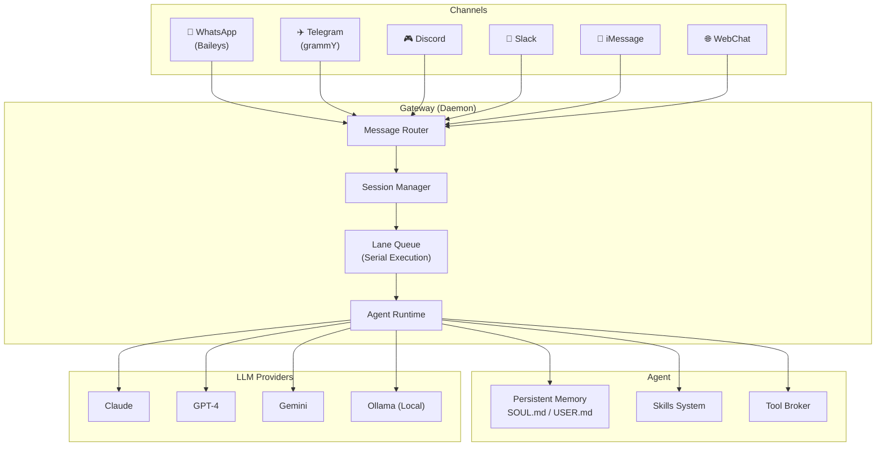
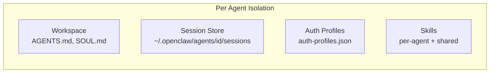
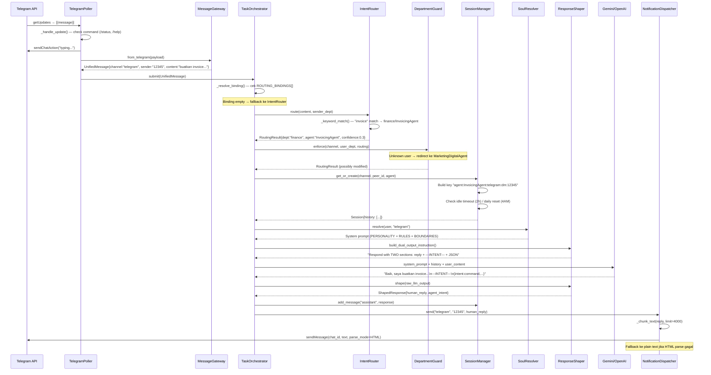
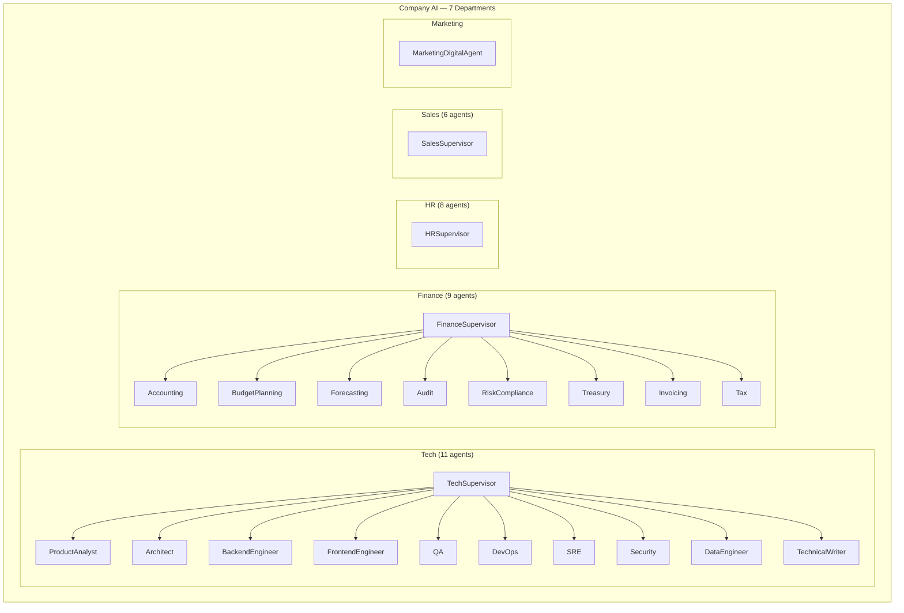
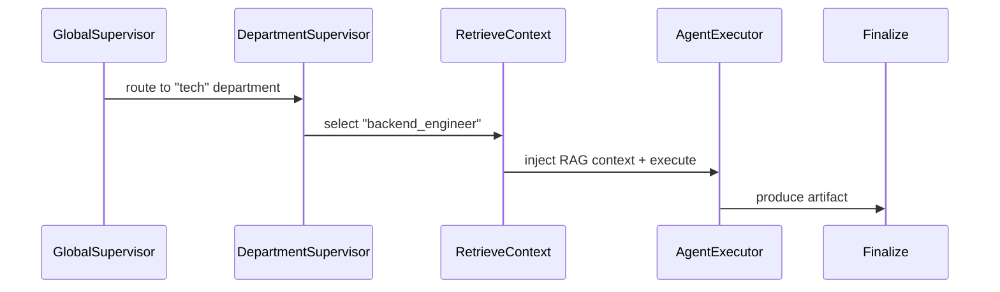
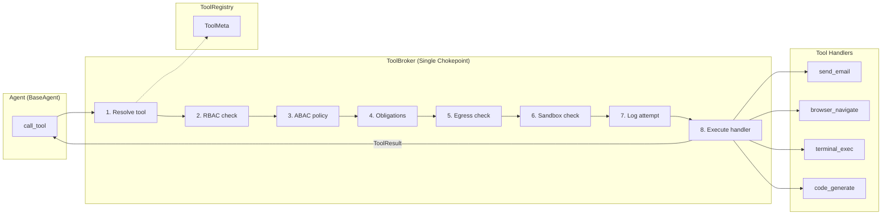
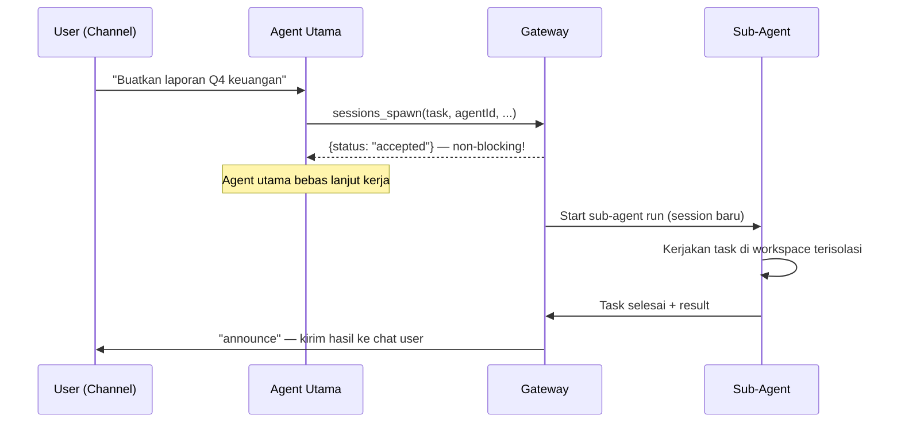
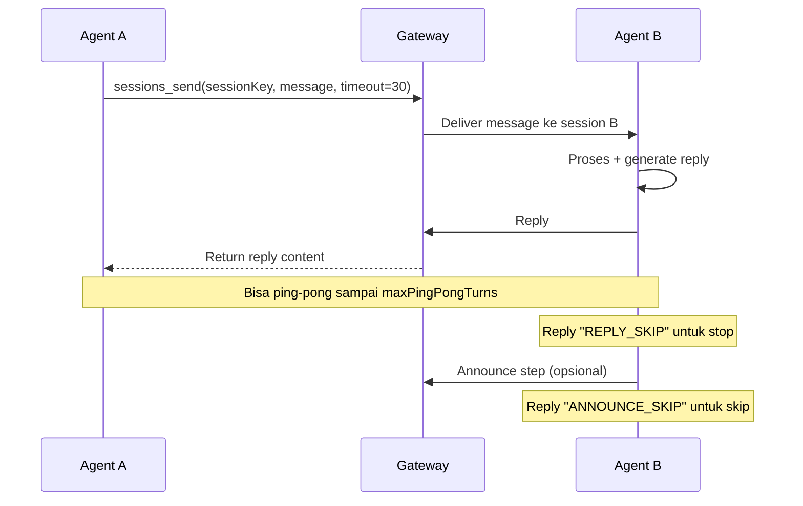

# 🦞 OpenClaw — Deep Research & Enhancement Plan for Company AI

## Apa itu OpenClaw?

OpenClaw adalah **open-source AI agent gateway** (TypeScript/Node.js, MIT license) yang menjadi "otak operasional" di antara LLM dan dunia nyata. Bukan chatbot biasa — ini adalah **execution framework** yang membuat agent bisa *bertindak*, bukan hanya *bicara*.

> **Tagline:** "Any OS gateway for AI agents across WhatsApp, Telegram, Discord, iMessage, and more."

---

## 1. Architecture



### Komponen Utama

| Komponen | Fungsi | Protokol |
|----------|--------|----------|
| **Gateway** | Control plane — daemon yang mengelola semua koneksi, session, routing | WebSocket + JSON frames |
| **Agent Runtime** | Interpret intent, plan actions, orchestrate reasoning | JSON-RPC style WS API |
| **Skills System** | Modular capabilities (script Python/Node) | File-based contracts |
| **Lane Queue** | Serial execution — cegah race conditions | System-level concurrency |
| **Memory** | Persistent state via Markdown files | File-based, editable |
| **Sandbox** | Docker container per-agent untuk isolasi | Docker API |

### Wire Protocol
```
Request:  {type: "req",   id, method, params}
Response: {type: "res",   id, ok, payload|error}
Event:    {type: "event", event, payload, seq?, stateVersion?}
```

---

## 2. Multi-Agent Routing

OpenClaw punya **routing system yang sangat mature** — setiap agent adalah entitas terisolasi:



### Routing Rules (prioritas tinggi → rendah)
1. **Peer match** — exact DM/group/channel ID
2. **Guild ID** — Discord server
3. **Team ID** — Slack workspace
4. **Account ID** — channel account match
5. **Channel-level** — wildcard `accountId: "*"`
6. **Default agent** — first in list / marked `.default`

### Contoh: Satu WhatsApp, Multi-Agent
```json
{
  "agents": {
    "list": [
      { "id": "finance-agent", "workspace": "~/.openclaw/workspace-finance" },
      { "id": "hr-agent", "workspace": "~/.openclaw/workspace-hr" }
    ]
  },
  "bindings": [
    { "agentId": "finance-agent", "match": { "channel": "whatsapp", "peer": { "kind": "direct", "id": "+628xxx001" } } },
    { "agentId": "hr-agent", "match": { "channel": "whatsapp", "peer": { "kind": "direct", "id": "+628xxx002" } } }
  ]
}
```

---

## 3. Tools System

### Built-in Tools

| Tool | Fungsi |
|------|--------|
| `exec` | Run shell commands (sandbox/gateway/node) |
| `process` | Manage background processes (poll, log, kill) |
| `apply_patch` | Edit files |
| `web_search` | Search web (Brave API) |
| `web_fetch` | Fetch & parse URLs |
| `browser` | Full browser automation (Playwright-style) |
| `canvas` | Agent-editable HTML surface |
| `cron` | Scheduled tasks |
| `message` | Send messages to channels |
| `image` | Generate/process images |
| `sessions_spawn` | Spawn sub-agent tasks |
| `sessions_send` | Inter-agent communication |
| `agents_list` | List available agents |
| `gateway` | Config management + restart |
| `nodes` | Control mobile/headless devices |

### Per-Agent Tool Control
```json
{
  "id": "restricted-agent",
  "tools": {
    "allow": ["read", "web_search"],
    "deny": ["exec", "write", "apply_patch"]
  },
  "sandbox": { "mode": "all", "scope": "agent" }
}
```

### Skills (ClawHub)
- Community registry: ribuan skills siap pakai
- Install: `npx clawhub@latest install <skill-slug>`
- Skills = text prompts + contracts (inputs/outputs)
- Per-agent atau shared

---

## 4. Persistent Memory

OpenClaw menggunakan **Markdown-based memory** yang persistent dan editable:

| File | Konten |
|------|--------|
| `SOUL.md` | Personality, behavior rules, tone |
| `USER.md` | User preferences, context |
| `IDENTITY.md` | Agent identity definition |
| `AGENTS.md` | Agent capabilities & team composition |
| `HEARTBEAT.md` | Recurring tasks, health checks |
| `TOOLS.md` | Available tools documentation |

---

## 5. Channel Integration

| Channel | Library | Fitur |
|---------|---------|-------|
| **WhatsApp** | Baileys | DM + groups, media, voice transcription |
| **Telegram** | grammY | Bot API, inline, media |
| **Discord** | discord.js | Guilds, channels, threads |
| **Slack** | Slack SDK | Workspaces, channels, threads |
| **iMessage** | imsg CLI | macOS only, local |
| **Mattermost** | Plugin | Self-hosted teams |
| **WebChat** | Built-in | Browser-based chat UI |

---

## 6. Perbandingan: Company AI vs OpenClaw

| Aspek | Company AI (Sekarang) | OpenClaw |
|-------|----------------------|----------|
| **Language** | Python (FastAPI) | TypeScript (Node.js) |
| **Agent Count** | 63 agents, 7 departments | Multi-agent, configurable |
| **Channels** | Telegram poller + Email poller | WhatsApp, Telegram, Discord, Slack, iMessage, WebChat |
| **Tool System** | ToolBroker + ABAC policies | Per-agent allow/deny + sandbox |
| **Memory** | PostgreSQL + Redis | Markdown files (SOUL.md, USER.md) |
| **Orchestration** | LangGraph + Celery workers | Lane Queue (serial exec) |
| **LLM** | Gemini/OpenAI via LiteLLM | Claude/GPT/Gemini/Ollama via API |
| **Dashboard** | Next.js admin panel | Built-in WebChat + Control UI |
| **SOUL/Persona** | UserSOUL model | SOUL.md + IDENTITY.md |
| **Skills** | Python tool modules | ClawHub registry (community) |
| **Sandbox** | Architecture policy (static) | Docker per-agent container |
| **Deployment** | Docker Compose | npm global + daemon |

---

## 7. Enhancement Plan — Yang Bisa Diadopsi dari OpenClaw

### 🔵 Quick Wins (bisa diterapkan tanpa refactor besar)

#### A. WhatsApp Channel Integration
Company AI sudah punya Telegram & Email. Tambahkan WhatsApp pakai Baileys library pattern yang sama dengan OpenClaw.

#### B. Persistent SOUL Memory Files
Extend UserSOUL model menjadi file-based memory yang editable, mirip `SOUL.md` + `USER.md`.

#### C. Scheduled Tasks (Cron)
Tambahkan cron-based task scheduler ke Celery workers — agent bisa menjadwalkan tugas recurring.

#### D. Sub-Agent Spawning
Implement `sessions_spawn` pattern — agent bisa mendelegasikan tugas ke agent lain dan menunggu hasilnya.

---

### 🟡 Medium Effort (perlu desain baru)

#### E. Per-Agent Sandbox & Tool Control
Upgrade ToolBroker dengan per-agent `allow/deny` tool lists, bukan hanya ABAC policies global.

#### F. Multi-Channel Unified Gateway
Buat gateway layer yang meng-abstract semua channels (WhatsApp, Telegram, Discord, Email) ke format message internal yang seragam.

#### G. Lane Queue for Serial Execution
Replace atau augment Celery dengan serial execution queue per-agent/per-user untuk mencegah race conditions.

---

### 🔴 Major Enhancement (refactor signifikan)

#### H. Agent-to-Agent Communication
Implement ping-pong inter-agent messaging pattern seperti `sessions_send`.

#### I. Browser Automation Tool
Tambahkan browser tool (Playwright-based) ke shared tools untuk web scraping & form filling.


#### J. Skills Registry / Plugin System
Buat skill registry internal — agent skills bisa di-register, discover, dan reuse.

---

## 9. Company AI Agent Flow — Telegram Example

Contoh lengkap: user mengirim "buatkan invoice untuk PT ABC" via Telegram.

### Sequence Diagram



### Per-Component Detail

| # | Stage | File | Fungsi |
|---|-------|------|--------|
| 1 | **Polling** | [telegram_poller.py](file:///c:/Users/sarif/Documents/project_antigravity/company_AI/backend/app/services/channels/telegram_poller.py) | Long-poll `getUpdates`, handle `/commands`, kirim typing indicator |
| 2 | **Normalize** | [message_gateway.py](file:///c:/Users/sarif/Documents/project_antigravity/company_AI/backend/app/services/orchestration/message_gateway.py) | Convert Telegram payload → `UnifiedMessage` (channel-agnostic) |
| 3 | **Route** | [intent_router.py](file:///c:/Users/sarif/Documents/project_antigravity/company_AI/backend/app/services/orchestration/intent_router.py) | Keyword match (30+ rules, 7 dept) → `RoutingResult{dept, agent}` |
| 4 | **Guard** | [department_guard.py](file:///c:/Users/sarif/Documents/project_antigravity/company_AI/backend/app/services/channels/department_guard.py) | Enforce dept isolation: unknown→Marketing, cross-dept→blocked |
| 5 | **Session** | [session_manager.py](file:///c:/Users/sarif/Documents/project_antigravity/company_AI/backend/app/services/channels/session_manager.py) | OpenClaw-style session keys, sliding window 20 msg, idle/daily reset |
| 6 | **SOUL** | [soul_resolver.py](file:///c:/Users/sarif/Documents/project_antigravity/company_AI/backend/app/services/channels/soul_resolver.py) | Compile personality + rules + boundaries → system prompt |
| 7 | **LLM Call** | [task_orchestrator.py](file:///c:/Users/sarif/Documents/project_antigravity/company_AI/backend/app/services/orchestration/task_orchestrator.py) | Google Gemini (primary) / OpenAI (fallback), 3x retry on 429 |
| 8 | **Dispatch** | [notification_dispatcher.py](file:///c:/Users/sarif/Documents/project_antigravity/company_AI/backend/app/services/orchestration/notification_dispatcher.py) | Chunking (4000 char), HTML→plaintext fallback, multi-channel |

### Key Observations

- **No real agent execution** — saat ini LLM hanya generate text, bukan menjalankan tools/actions
- **IntentRouter Phase 2 (LLM classification)** masih TODO — hanya keyword matching yang aktif
- **DepartmentGuard** sangat strict — unknown user selalu masuk ke Marketing
- **Session** in-memory — restart server = hilang semua context
- **Dual-output** (`---INTENT---`) bagus untuk passive intent logging, tapi belum dipakai untuk dispatching ke agent lain
- **Tidak ada tool execution** — routing ke "InvoicingAgent" hanya menentukan system prompt, bukan menjalankan invoice tool

---

## 10. Komunikasi Intra-Department & Inter-Department

### Struktur Department



### A. Intra-Department (dalam 1 department)

**Pattern: Supervisor → Specialist Plan (LangGraph)**



| Stage | File | Apa yang terjadi |
|-------|------|------------------|
| `route_to_department` | [supervisor.py](file:///c:/Users/sarif/Documents/project_antigravity/company_AI/backend/app/agents/supervisor.py) | Validate department, prepare state |
| `department_supervisor` | [supervisor.py](file:///c:/Users/sarif/Documents/project_antigravity/company_AI/backend/app/agents/supervisor.py) | Select best agent, set status="running" |
| `retrieve_context` | [supervisor.py](file:///c:/Users/sarif/Documents/project_antigravity/company_AI/backend/app/agents/supervisor.py) | RAG context injection (placeholder) |
| `agent_executor` | Per-dept supervisor (e.g. [tech/supervisor.py](file:///c:/Users/sarif/Documents/project_antigravity/company_AI/backend/app/agents/departments/tech/supervisor.py)) | LLM call → produce plan artifact |

**Contoh output TechSupervisor:**
```json
{
  "tasks": [
    {"task_id": "t1", "assigned_to": "backend_engineer", "description": "Build REST API", "priority": "high", "depends_on": []},
    {"task_id": "t2", "assigned_to": "qa", "description": "Write integration tests", "depends_on": ["t1"]}
  ],
  "summary": "Decomposed into 2 sub-tasks",
  "estimated_steps": 2
}
```

> [!WARNING]
> **Gap**: Supervisor menghasilkan plan (JSON artifact) tapi **sub-tasks TIDAK DIEKSEKUSI**. Tidak ada loop yang mengirim `t1` ke `BackendEngineerAgent.process()` lalu `t2` ke `QA.process()`. Plan hanya disimpan sebagai artifact untuk dashboard.

### B. Inter-Department (antar department)

**Saat ini: TIDAK ADA mekanisme inter-department communication.**

| Aspek | Status | Detail |
|-------|--------|--------|
| **GlobalSupervisor routing** | ✅ One-way | Route ke 1 department saja, tidak bisa multi-dept |
| **DepartmentGuard** | 🚫 Blocking | Aktif memblokir cross-department routing di chat channels |
| **Agent-to-Agent** | ❌ Tidak ada | Tidak ada mekanisme Finance agent memanggil Tech agent |
| **Dual-output intent** | 🟡 Passive | `---INTENT---` JSON di-log tapi tidak di-dispatch |
| **Tool-based delegation** | ❌ Tidak ada | Tidak ada tool `spawn_subagent` atau `send_to_dept` |

**Contoh skenario yang TIDAK bisa dilakukan:**
1. User minta "audit keamanan sistem keuangan" → butuh **Tech (Security)** + **Finance (Audit)** — saat ini hanya masuk ke SATU department
2. HR agent butuh info budget dari Finance → tidak ada channel komunikasi
3. Sales agent butuh status deployment dari Tech → harus minta user forward pesan manual

### C. Gap Analysis vs OpenClaw

| Fitur | OpenClaw | Company AI |
|-------|----------|-----------|
| Agent spawn sub-agent | ✅ `sessions_spawn` | ❌ Tidak ada |
| Agent kirim pesan ke agent lain | ✅ `sessions_send` | ❌ Tidak ada |
| Multi-department task | ✅ Via sub-agent spawning | ❌ Single department only |
| Supervisor execute sub-tasks | ✅ Gateway mengeksekusi | ⚠️ Plan only, no execution |
| Cross-dept isolation control | ✅ `allowAgents` whitelist | ⚠️ `DepartmentGuard` blocks all |

---

## 11. Hubungan Komunikasi Agent ↔ Tool

### Architecture: Single Chokepoint



### Execution Flow Detail

| Step | Component | File | Apa yang terjadi |
|------|-----------|------|------------------|
| 0 | `BaseAgent.call_tool()` | [base_agent.py](file:///c:/Users/sarif/Documents/project_antigravity/company_AI/backend/app/agents/base_agent.py) | Agent panggil tool via chokepoint |
| 1 | `ToolRegistry.resolve()` | [tool_registry.py](file:///c:/Users/sarif/Documents/project_antigravity/company_AI/backend/app/core/tool_registry.py) | Lookup `ToolMeta` → `ToolNotFound` jika tidak ada |
| 2 | `ToolMeta.is_allowed_for()` | [tool_registry.py](file:///c:/Users/sarif/Documents/project_antigravity/company_AI/backend/app/core/tool_registry.py) | Cek role + department → `ToolAccessDenied` |
| 3 | `PolicyEngine.evaluate()` | [policy_engine.py](file:///c:/Users/sarif/Documents/project_antigravity/company_AI/backend/app/core/policy_engine.py) | ABAC policy — DENY / REQUIRE_APPROVAL / ALLOW |
| 4 | `ApprovalGate.check()` | [approval_gate.py](file:///c:/Users/sarif/Documents/project_antigravity/company_AI/backend/app/core/approval_gate.py) | Jika REQUIRE_APPROVAL → return pending, tool TIDAK dijalankan |
| 5 | `NetworkPolicy.check_egress()` | [sandbox.py](file:///c:/Users/sarif/Documents/project_antigravity/company_AI/backend/app/core/sandbox.py) | Validate egress domain whitelist |
| 6 | `TaskSandbox.validate_path()` | [sandbox.py](file:///c:/Users/sarif/Documents/project_antigravity/company_AI/backend/app/core/sandbox.py) | Validate file path dalam sandbox boundary |
| 7 | Audit log | [tool_broker.py](file:///c:/Users/sarif/Documents/project_antigravity/company_AI/backend/app/core/tool_broker.py) | Log attempt + args_hash |
| 8 | `tool_meta.handler(**args)` | Per-tool file | Execute + return `ToolResult` |

### 31 Shared Tools — 7 Kategori

| Kategori | Tools | Risk Level |
|----------|-------|------------|
| **Communication** | `send_email`, `send_whatsapp`, `send_telegram` | 🔴 HIGH |
| **Scheduling** | `create_meeting` | 🟡 MEDIUM |
| **File Management** | `upload_file`, `read_file` | 🟡 MEDIUM / 🟢 LOW |
| **Data** | `search_data`, `generate_report` | 🟢 LOW |
| **Browser (CDP)** | `browser_open/navigate/screenshot/extract/click/fill/exec_js/close` | 🟢-🔴 varies |
| **Web Scraping** | `scrape_page/multiple/seo/pricing` | 🟡 MEDIUM |
| **Code (Claude)** | `code_generate/review/refactor/debug/test/explain/convert/document` | 🟢 LOW |
| **Terminal (Docker)** | `terminal_exec/git/install/script` | 🔴 HIGH |

### Security Layers

```
Agent.call_tool("send_email", {to: "x@y.com", body: "..."})
    │
    ├── ToolRegistry: "send_email" ada? → ✅
    ├── RBAC: role="agent", dept="sales" allowed? → ✅
    ├── ABAC Policy: risk=HIGH, sensitivity=internal → REQUIRE_APPROVAL
    │   └── ApprovalGate: create approval record, return "needs_approval"
    │       └── ToolResult{success:false, status:"needs_approval", approval_id:"..."}
    │
    └── (Jika ALLOW langsung)
        ├── NetworkPolicy: egress ke gmail.googleapis.com allowed? → ✅
        ├── Audit: log tool_call_start + args_hash
        ├── Handler: send_email_handler(**args) → execute
        └── ToolResult{success:true, output:{sent:true}}
```

### 3 Chokepoint Architecture

| Gateway | File | Fungsi |
|---------|------|--------|
| **LLMClient** | [llm_client.py](file:///c:/Users/sarif/Documents/project_antigravity/company_AI/backend/app/core/llm_client.py) | Semua LLM call — budget, audit, tracing |
| **ToolBroker** | [tool_broker.py](file:///c:/Users/sarif/Documents/project_antigravity/company_AI/backend/app/core/tool_broker.py) | Semua tool exec — registry, policy, sandbox |
| **DataAccessLayer** | [data_access.py](file:///c:/Users/sarif/Documents/project_antigravity/company_AI/backend/app/core/data_access.py) | Semua DB access — query, mutation |

> [!IMPORTANT]
> **Key Finding**: Agent DILARANG import `httpx`, `requests`, atau `psycopg` langsung. Semua interaksi harus melalui 3 chokepoint ini. CI lint akan menangkap pelanggaran.

### Gap: Tools Belum Terhubung ke Chat Pipeline

| Path | Tools Available? | Tools Actually Used? |
|------|-----------------|---------------------|
| **Dashboard → LangGraph** | ✅ 31 tools registered | ⚠️ Supervisor hanya plan, belum execute |
| **Telegram/WhatsApp → TaskOrchestrator** | ❌ Sama sekali tidak | ❌ LLM hanya generate text reply |

> [!WARNING]
> **Gap Kritis**: Saat user kirim pesan via Telegram ke agent, `TaskOrchestrator` memanggil LLM **TANPA** `tools` parameter. LLM tidak bisa memanggil `send_email`, `search_data`, dll. Hanya generate text. Ini berarti **31 tools yang sudah dibangun TIDAK BISA dipakai dari chat channel**.

---

## 8. Deep Dive: Sub-Agent Spawning


### Mekanisme Utama

OpenClaw punya **dua** tool untuk inter-agent communication:

| | `sessions_spawn` | `sessions_send` |
|---|---|---|
| **Sifat** | Non-blocking (fire-and-forget) | Synchronous (menunggu reply) |
| **Return** | `{status: "accepted"}` langsung | Menunggu response dari target |
| **Pattern** | Delegasi tugas besar | Ping-pong dialog antar agent |
| **Analogy** | Kirim email ke rekan kerja | Telepon langsung |
| **Max turns** | 1 (sekali jalan) | Configurable (`maxPingPongTurns: 0-5`) |

### Flow `sessions_spawn`



### Parameter `sessions_spawn`

```json
{
  "task": "Buat laporan keuangan Q4 2025",
  "label": "finance-report-q4",
  "agentId": "finance-agent",
  "model": "claude-sonnet-4-20250514",
  "runTimeoutSeconds": 300,
  "cleanup": true
}
```

| Parameter | Fungsi |
|-----------|--------|
| `task` | Instruksi teks untuk sub-agent |
| `label` | Label human-readable untuk tracking |
| `agentId` | Target agent (opsional — default agent lain) |
| `model` | Override model LLM untuk task ini |
| `runTimeoutSeconds` | Batas waktu eksekusi |
| `cleanup` | Auto-cleanup session setelah selesai |

### Flow `sessions_send` (Synchronous)



### Security & Isolation

- **Allowlist** — Agent hanya bisa spawn yang terdaftar di `subagents.allowAgents`
- **Session isolation** — Sub-agent punya session sendiri, tidak bisa akses session agent lain
- **Tool restriction** — Sub-agent tetap tunduk pada per-agent tool `allow/deny`
- **Timeout** — `runTimeoutSeconds` mencegah sub-agent berjalan tanpa batas

```json
{
  "id": "orchestrator-agent",
  "subagents": {
    "allowAgents": ["finance-agent", "hr-agent", "tech-agent"]
  }
}
```

### Mapping ke Company AI

| OpenClaw Concept | Company AI Equivalent |
|---|---|
| `sessions_spawn` | Celery `send_task()` ke queue department |
| `sessions_send` | Direct function call via ToolBroker |
| `agentId` | Agent registry di `app/agents/` |
| `announce` | Notification via Telegram/Email channel |
| `subagents.allowAgents` | ABAC policy di ToolBroker |
| Session isolation | Per-trace context (`trace_id`) |

---

## Resources

- **Docs:** [docs.openclaw.ai](https://docs.openclaw.ai)
- **GitHub:** [github.com/openclaw/openclaw](https://github.com/openclaw/openclaw)
- **Skills Registry:** ClawHub (`npx clawhub@latest`)
- **Architecture:** [Gateway Architecture](https://docs.openclaw.ai/concepts/architecture)
- **Multi-Agent:** [Multi-Agent Routing](https://docs.openclaw.ai/concepts/multi-agent)
- **Tools:** [Tools Reference](https://docs.openclaw.ai/tools)
