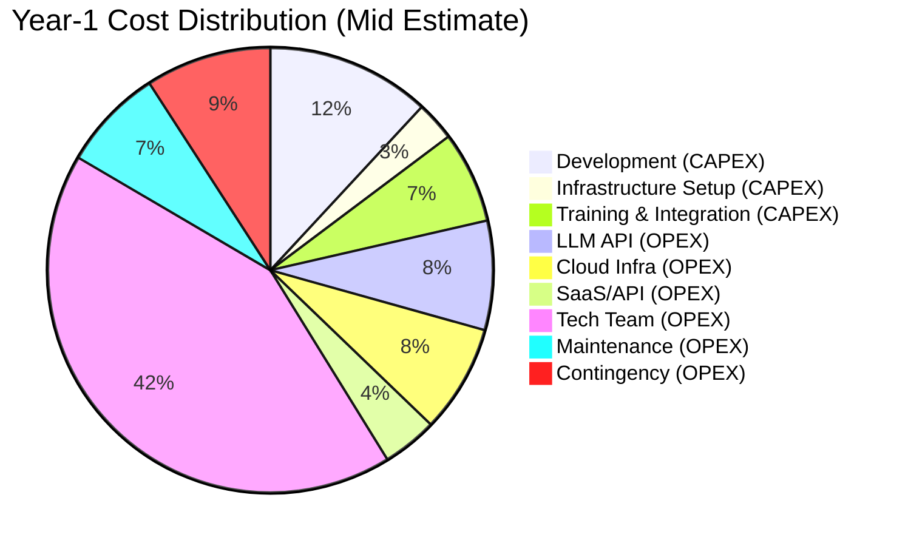

# Analisa Biaya Operasional — CAPEX & OPEX
## Multi-Agentic AI Enterprise Operating System

**Tanggal**: 11 Februari 2026  
**Scope**: Full cost analysis — 63 agents, 7 departments, 31 humans  
**Mata Uang**: USD (kurs estimasi: 1 USD = Rp 16.000)

---

## Executive Summary

| Kategori | Total (USD) | Total (IDR) |
|----------|------------|------------|
| 🔵 **CAPEX** (One-Time) | **$38,500 – $58,500** | **Rp 616 jt – 936 jt** |
| 🟢 **OPEX** (Monthly) | **$21,764 – $28,714/mo** | **Rp 348 jt – 459 jt/bln** |
| 🟢 **OPEX** (Yearly) | **$261,168 – $344,568/yr** | **Rp 4.17 M – 5.51 M/thn** |
| 💰 **Total Year-1** | **$299,668 – $403,068** | **Rp 4.79 M – 6.45 M** |

> **Catatan**: Estimasi berdasarkan cloud-native deployment dengan managed services. Self-hosted bisa lebih murah tapi butuh tambahan DevOps engineer.

---

## 1. CAPEX — Capital Expenditure (Biaya Satu Kali)

### 1.1 Pengembangan Software

| Item | Estimasi | Keterangan |
|------|---------|------------|
| **Full-Stack Development** (6 bulan) | $15,000 – $25,000 | 2-3 developer × 6 bulan |
| **UI/UX Design** | $2,000 – $4,000 | Dashboard, Human Interface, Admin Panel |
| **System Architecture & Planning** | $1,500 – $3,000 | Technical docs, security audit design |
| **Subtotal Development** | **$18,500 – $32,000** | |

> **Asumsi**: In-house team dengan rate Indonesia. Jika outsource ke luar: 2-3× lipat.  
> Development mencakup 8 phase sesuai [TECHNICAL_ARCHITECTURE.md](file:///c:/Users/sarif/Documents/project_antigravity/company_AI/TECHNICAL_ARCHITECTURE.md) roadmap (24 minggu).

### 1.2 Infrastructure Setup

| Item | Estimasi | Keterangan |
|------|---------|------------|
| **Cloud Account Setup** | $0 | AWS/GCP free tier for initial setup |
| **Domain & SSL** | $50 – $100 | Domain + wildcard SSL certificate |
| **CI/CD Pipeline Setup** | $500 – $1,000 | GitHub Actions config, Docker registry |
| **Kubernetes Cluster Setup** | $1,000 – $2,000 | Initial K8s config + Helm charts |
| **Database Schema & Migration** | $500 – $1,000 | PostgreSQL + pgvector + RLS setup |
| **Security Hardening** | $1,000 – $2,000 | Vault setup, RBAC, PII masking, pentest |
| **Subtotal Infrastructure** | **$3,050 – $6,100** | |

### 1.3 Integrasi & API Setup

| Item | Estimasi | Keterangan |
|------|---------|------------|
| **WhatsApp Business API Setup** | $1,000 – $2,000 | Meta verification + Twilio setup |
| **Email Integration** (Gmail/Outlook) | $500 – $1,000 | OAuth2, IMAP/SMTP config |
| **Calendar & Meeting APIs** | $500 – $1,000 | Google Calendar + Zoom API |
| **LLM Provider Onboarding** | $200 – $400 | OpenAI, Anthropic, DeepSeek accounts |
| **CRM / HRIS / Accounting APIs** | $1,000 – $2,000 | Integration with existing tools |
| **Subtotal Integration** | **$3,200 – $6,400** | |

### 1.4 Training & Onboarding

| Item | Estimasi | Keterangan |
|------|---------|------------|
| **Staff Training Program** | $2,000 – $4,000 | Training 31 humans untuk pakai sistem |
| **Documentation & SOPs** | $750 – $1,000 | User guides, runbooks, video tutorials |
| **Pilot/UAT Testing** | $1,000 – $2,000 | 4-week pilot dengan 1 department |
| **Subtotal Training** | **$3,750 – $7,000** | |

### 1.5 Hardware & Perangkat

| Item | Estimasi | Keterangan |
|------|---------|------------|
| **Development Machines** | $5,000 – $5,000 | Sudah ada (existing laptops) |
| **Monitoring Displays** | $500 – $1,000 | 1-2 dashboard monitors untuk NOC |
| **Network Upgrades** | $500 – $1,000 | Dedicated internet, VPN setup |
| **Subtotal Hardware** | **$6,000 – $7,000** | |

---

### 📊 Total CAPEX

```
┌─────────────────────────────────┬──────────────────┐
│ Kategori                        │ Estimasi (USD)   │
├─────────────────────────────────┼──────────────────┤
│ Software Development            │ $18,500 – 32,000 │
│ Infrastructure Setup            │ $3,050 – 6,100   │
│ Integrasi & API Setup           │ $3,200 – 6,400   │
│ Training & Onboarding           │ $3,750 – 7,000   │
│ Hardware & Perangkat            │ $6,000 – 7,000   │
├─────────────────────────────────┼──────────────────┤
│ TOTAL CAPEX                     │ $34,500 – 58,500 │
│                                 │ Rp 552jt – 936jt │
└─────────────────────────────────┴──────────────────┘
```

---

## 2. OPEX — Operating Expenditure (Biaya Bulanan)

### 2.1 LLM API Costs (AI Model)

Berdasarkan [MODEL_TIER_CLASSIFICATION.md](file:///c:/Users/sarif/Documents/project_antigravity/company_AI/MODEL_TIER_CLASSIFICATION.md):

| Tier | Agents | Model | Monthly Cost |
|------|--------|-------|-------------|
| 💚 Nano | 9 | GPT-4o-mini / Gemini Flash / Haiku | **$20** |
| 💛 Standard | 33 | GPT-4o / Claude Sonnet / Gemini Pro | **$693** |
| 🟠 Advanced | 15 | Claude Opus / GPT-o3 / Gemini Ultra | **$540** |
| 🔴 Specialist | 3 | DeepSeek Coder / GPT-4V | **$135** |
| 🧩 Embedding | — | text-embedding-3-small | **$1** |
| **Subtotal LLM** | **63** | | **$1,389/mo** |

> **Catatan**: Biaya bisa naik 20-50% saat peak usage (end-of-month finance closing, audit season, campaign launches).

### 2.2 Cloud Infrastructure

| Service | Provider | Spec | Monthly Cost |
|---------|----------|------|-------------|
| **Compute — App Servers** | AWS ECS / GCP Cloud Run | 2× c5.xlarge (4 vCPU, 8GB) | $300 – $400 |
| **Compute — Worker Nodes** | AWS ECS / K8s | 2× c5.large (Celery workers) | $150 – $200 |
| **PostgreSQL** (Managed) | AWS RDS / Cloud SQL | db.r5.large, 100GB, Multi-AZ | $200 – $350 |
| **Redis** (Managed) | AWS ElastiCache | cache.r5.large, 2 replicas | $100 – $150 |
| **Object Storage** (S3/MinIO) | AWS S3 | ~500GB artifacts/month | $15 – $25 |
| **Load Balancer** | AWS ALB | Application Load Balancer | $25 – $40 |
| **Kubernetes** (if used) | AWS EKS / GKE | Control plane + node groups | $200 – $400 |
| **Networking** | VPC, NAT, DNS | Data transfer, Route53 | $50 – $100 |
| **CDN** | CloudFront / Cloudflare | Dashboard static assets | $10 – $20 |
| **Subtotal Cloud** | | | **$1,050 – $1,685/mo** |

> **Cost Saving Option**: Gunakan **Reserved Instances** (1 year) → hemat 30-40%. Atau **Spot Instances** untuk worker nodes → hemat 60-70% untuk non-critical workloads.

### 2.3 Third-Party SaaS & API Subscriptions

| Service | Provider | Purpose | Monthly Cost |
|---------|----------|---------|-------------|
| **WhatsApp Business API** | Meta / Twilio | Human-Agent messaging | $100 – $200 |
| **Email Service** | SendGrid / SES | Notifications, reports | $20 – $50 |
| **Monitoring** | Grafana Cloud / Datadog | System metrics, alerts | $50 – $100 |
| **LLM Tracing** | LangSmith / Langfuse | Agent debugging & tracing | $50 – $100 |
| **Secrets Manager** | HashiCorp Vault (Cloud) | API keys, credentials | $50 – $100 |
| **GitHub** | GitHub Team | Code repository, CI/CD | $20 – $40 |
| **Calendar API** | Google Workspace | Calendar + Meet/Zoom | $30 – $50 |
| **CRM Subscription** | HubSpot / Salesforce | Sales data source | $50 – $150 |
| **HRIS Subscription** | BambooHR / Talenta | HR data source | $30 – $80 |
| **Accounting Software** | Xero / Jurnal | Finance data source | $30 – $60 |
| **SSL / Domain** | Cloudflare | Domain management | $5 – $10 |
| **Subtotal SaaS** | | | **$435 – $940/mo** |

### 2.4 Human Resources (Gaji Tim Operasional)

Fokus pada tim **teknis** yang menjalankan & maintain sistem (bukan 31 end-users):

| Role | Jumlah | Gaji/Bulan (USD) | Total |
|------|--------|-----------------|-------|
| **Lead Engineer / Tech Lead** | 1 | $1,500 – $2,500 | $1,500 – $2,500 |
| **Backend Developer** | 1-2 | $1,000 – $1,800 | $1,000 – $3,600 |
| **DevOps / SRE Engineer** | 1 | $1,200 – $2,000 | $1,200 – $2,000 |
| **AI/ML Engineer** (Part-time) | 0.5 | $1,500 – $2,500 | $750 – $1,250 |
| **QA / Tester** | 0.5 | $800 – $1,200 | $400 – $600 |
| **Subtotal HR (Tech Team)** | **4-5** | | **$4,850 – $9,950/mo** |

> **Catatan**: Gaji berdasarkan rate Indonesia untuk mid-senior level. Not termasuk 31 end-users (mereka existing employees yang shift sebagian tugasnya ke agents).

### 2.5 Maintenance & Support

| Item | Monthly Cost | Keterangan |
|------|-------------|------------|
| **Security Patches & Updates** | $200 – $400 | Dependency updates, CVE patching |
| **Database Maintenance** | $100 – $200 | Backup, vacuum, index optimization |
| **LLM Prompt Tuning** | $200 – $400 | Fine-tuning prompts, model upgrades |
| **Bug Fixes & Enhancements** | $300 – $500 | Ongoing improvement sprints |
| **Documentation Updates** | $100 – $200 | SOPs, changelogs, user guides |
| **Subtotal Maintenance** | **$900 – $1,700/mo** | |

### 2.6 Miscellaneous & Contingency

| Item | Monthly Cost |
|------|-------------|
| **Training & Knowledge Sharing** | $100 – $200 |
| **Incident Response / On-call** | $200 – $400 |
| **Contingency Buffer** (10%) | ~$850 – $1,450 |
| **Subtotal Misc** | **$1,150 – $2,050/mo** |

---

### 📊 Total OPEX (Monthly)

```
┌─────────────────────────────────┬───────────────────┐
│ Kategori                        │ Estimasi (USD/mo) │
├─────────────────────────────────┼───────────────────┤
│ 🤖 LLM API Costs               │ $1,389            │
│ ☁️  Cloud Infrastructure        │ $1,050 – 1,685    │
│ 🔌 SaaS & API Subscriptions    │ $435 – 940        │
│ 👥 Human Resources (Tech Team) │ $4,850 – 9,950    │
│ 🔧 Maintenance & Support       │ $900 – 1,700      │
│ 📋 Miscellaneous & Contingency │ $1,150 – 2,050    │
├─────────────────────────────────┼───────────────────┤
│ TOTAL OPEX (Monthly)            │ $9,774 – 17,714   │
│                                 │ Rp 156jt – 283jt  │
├─────────────────────────────────┼───────────────────┤
│ TOTAL OPEX (Yearly)             │ $117,288 – 212,568│
│                                 │ Rp 1.87M – 3.40M  │
└─────────────────────────────────┴───────────────────┘
```

---

## 3. Total Cost of Ownership (TCO) — Year 1



| Komponen | Year 1 | % Total |
|----------|--------|---------|
| **CAPEX** (One-Time) | $34,500 – $58,500 | 16-23% |
| **OPEX** (12 months) | $117,288 – $212,568 | 77-84% |
| **Total Year 1** | **$151,788 – $271,068** | **100%** |
| | **Rp 2.43 M – Rp 4.34 M** | |

---

## 4. Cost Optimization Strategies

### 🟢 Quick Wins (Immediate Savings)

| Strategy | Estimated Savings | Impact |
|----------|------------------|--------|
| **Reserved Instances** (1yr) | 30-40% cloud cost → ~$350/mo | ☁️ Infra |
| **Spot Instances** untuk workers | 60-70% worker cost → ~$100/mo | ☁️ Infra |
| **LLM Caching** (Redis) | 15-25% LLM cost → ~$250/mo | 🤖 LLM |
| **Prompt Compression** | 10-15% token reduction → ~$150/mo | 🤖 LLM |
| **Open-Source Alternatives** | Langfuse vs LangSmith, MinIO vs S3 | 🔌 SaaS |

### 🟡 Medium-Term (3-6 months)

| Strategy | Estimated Savings |
|----------|------------------|
| **Fine-tuned small models** untuk Nano tier | 50-70% Nano cost |
| **Self-hosted LLM** (Ollama) untuk non-critical tasks | ~$200/mo savings |
| **Auto-scaling** K8s nodes by time-of-day | 20-30% compute |
| **Batch processing** non-urgent agent tasks (off-peak) | 15-20% overall LLM |

### 🔴 Long-Term (6-12 months)

| Strategy | Estimated Savings |
|----------|------------------|
| Move to **self-hosted models** (Llama 3, Mistral) | 40-60% LLM cost |
| Build **internal fine-tuned models** per department | Better quality + lower cost |
| **Multi-region deployment** for redundancy + latency | Better uptime |

---

## 5. ROI Analysis

### Productivity Gains (Estimated)

| Area | Manual (Current) | With AI Agents | Savings |
|------|-----------------|---------------|---------|
| **Document processing** | 4 hrs/day | 30 min/day | 87% time |
| **Report generation** | 2 hrs/report | 15 min/report | 88% time |
| **Contract review** | 3 hrs/contract | 30 min/contract | 83% time |
| **Lead scoring** | 1 hr/batch | Real-time | 95% time |
| **Compliance checks** | Full-day audit | Continuous | 90% time |
| **Recruitment screening** | 30 min/CV | 2 min/CV | 93% time |
| **Market research** | 5 hrs/report | 45 min/report | 85% time |

### Break-Even Estimation

| Metric | Value |
|--------|-------|
| **Monthly OPEX** | ~$13,000 (midpoint) |
| **Estimated productivity savings** | 3-5 FTE equivalent ($4,500 – $7,500/mo at Indo rates) |
| **Error reduction value** | ~$1,000 – $2,000/mo (fewer manual mistakes) |
| **Speed-to-market value** | ~$2,000 – $4,000/mo (faster decisions) |
| **Total monthly value** | ~$7,500 – $13,500/mo |
| **Break-even** | **12-18 months** (including CAPEX payback) |

---

## 6. Scenario Comparison

| Scenario | CAPEX | OPEX/mo | Year 1 Total |
|----------|-------|---------|-------------|
| 🟢 **Minimal** (shared hosting, 2 devs) | $25,000 | $8,000 | $121,000 |
| 🟡 **Recommended** (managed cloud, 4 devs) | $45,000 | $13,000 | $201,000 |
| 🔴 **Enterprise** (K8s, HA, 6 devs) | $65,000 | $20,000 | $305,000 |

> **Rekomendasi**: Mulai dengan **Recommended** scenario, scale up ke Enterprise setelah 6 bulan beroperasi dan sudah proven ROI.

---

## 7. Cost Monitoring Dashboard

Sistem monitoring biaya terintegrasi (via Admin Dashboard):

```
┌─────────────────────────────────────────────────────────────┐
│              💰 Cost Monitoring Dashboard                     │
├─────────────────────────────────────────────────────────────┤
│                                                              │
│  [Real-Time LLM Spend]        [Cloud Infra Cost]            │
│  Today: $46.30                 MTD: $1,205                  │
│  MTD: $1,102 / $1,389 budget   Forecast: $1,340             │
│  ████████████░░ 79%            ██████████░░░ 80%             │
│                                                              │
│  [By Department]              [By Tier]                      │
│  Tech:     $350 ████████      Nano:     $20  █              │
│  Finance:  $220 ██████        Standard: $693 ████████████   │
│  HR:       $100 ███           Advanced: $540 █████████      │
│  Sales:    $85  ██            Specialist:$135 ████          │
│  Marketing:$170 █████                                       │
│  Legal:    $145 ████          [SaaS Subscriptions]          │
│  BizDev:   $140 ████          Active: 12 services           │
│                                MTD: $687 / $940 budget      │
│  [Alerts]                                                    │
│  ⚠️ Finance dept at 85% budget                              │
│  ✅ All other depts within budget                            │
│                                                              │
└─────────────────────────────────────────────────────────────┘
```

---

## 8. Rekomendasi Akhir

1. **Start Lean**: Mulai dengan Minimal scenario, invest di CAPEX $25K-35K
2. **Cloud-Native First**: Jangan beli server fisik — gunakan managed services
3. **Monitor Religiously**: Track LLM cost per-agent dari hari pertama
4. **Negotiate API Rates**: Negosiasi volume discount dengan OpenAI/Anthropic setelah 3 bulan
5. **Review Monthly**: Evaluasi ROI setiap bulan, adjust model tiers berdasarkan actual usage
6. **Reserve Budget**: Simpan 10-15% contingency untuk unexpected spikes

> **Bottom Line**: Dengan investasi Year-1 sebesar **~Rp 2.4-4.3 Miliar**, sistem bisa menghasilkan efisiensi setara **3-5 FTE** dan break-even dalam **12-18 bulan**. Ini adalah investasi yang reasonable untuk company-wide AI automation.
