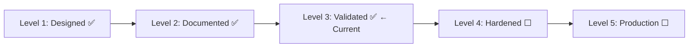
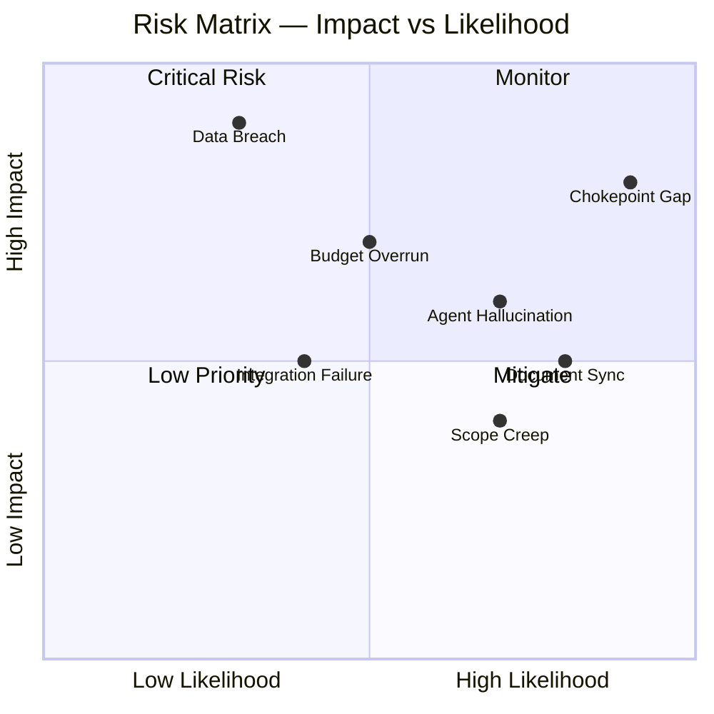
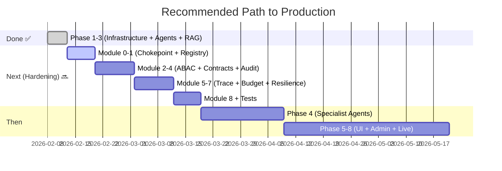

# Professional System Analysis Report (v2)
## Multi-Agentic AI Enterprise Operating System

**Analyst**: System Analyst (Professional Review)  
**Date**: 12 February 2026  
**Scope**: Full system review — design docs, running codebase, hardening plan  
**Previous Review**: v1, 11 February 2026 (score: 7.4/10)  
**Classification**: Internal — Strategic Planning

---

## 1. Executive Summary

Since the v1 review (11 Feb), the project has **transitioned from documentation-only to a working system**. Phase 1-3 are implemented with all 5 Docker containers running, 20 API endpoints live, and E2E tests passing. A comprehensive architecture hardening plan (Single Chokepoint principle) has been approved, addressing all critical gaps identified in v1.

### Overall Assessment

| Aspect | v1 Score | v2 Score | Δ | Rating |
|--------|----------|----------|---|--------|
| Architecture Design | 8.5/10 | 9.0/10 | +0.5 | ✅ Excellent |
| Security & Compliance | 8/10 | 8.5/10 | +0.5 | ✅ Strong (hardening planned) |
| Scalability Design | 7.5/10 | 8.0/10 | +0.5 | ✅ Good |
| Operational Readiness | 5/10 | 7.0/10 | +2.0 | ✅ Significantly Improved |
| Document Consistency | 6/10 | 7.0/10 | +1.0 | ✅ Improved |
| Cost Strategy | 8/10 | 8.0/10 | — | ✅ Well Planned |
| Human Interface Design | 8.5/10 | 8.5/10 | — | ✅ Excellent |
| Implementation Progress | N/A | 7.5/10 | NEW | ✅ Phase 1-3 Complete |
| **Overall** | **7.4/10** | **7.9/10** | **+0.5** | **✅ Strong Foundation** |

> **Verdict**: The system has moved from Level 2 (Documented) to **Level 3 (Validated)** with working code, passing E2E tests, and a production-grade hardening plan. The approved Single Chokepoint architecture will bring the security model to enterprise-production standards when implemented.

---

## 2. What Changed Since v1

### 2.1 New Implementation (Phase 1-3)

| Component | v1 Status | v2 Status |
|-----------|-----------|-----------|
| Docker stack (5 containers) | ❌ Design only | ✅ Running (db, redis, litellm, app, worker) |
| PostgreSQL + pgvector | ❌ Specified | ✅ Healthy, tables created |
| Redis session store | ❌ Specified | ✅ Healthy |
| LiteLLM proxy | ❌ Specified | ✅ Running, model routing active |
| FastAPI application | ❌ Specified | ✅ 20 endpoints live |
| Celery worker | ❌ Specified | ✅ Async task processing |
| JWT authentication | ❌ Designed | ✅ Register + Login working |
| Agent runtime (LangGraph) | ❌ Designed | ✅ BaseAgent, Supervisor, State |
| RAG pipeline | ❌ Designed | ✅ Ingest → embed → search working |
| Agent memory | ❌ Designed | ✅ Session (Redis) + Long-term (pgvector) |
| E2E tests | ❌ None | ✅ 10/10 passing |

### 2.2 Codebase Metrics

| Metric | v1 | v2 |
|--------|----|----|
| Python source files | 0 | 39 |
| Lines of code (est.) | 0 | ~4,500 |
| API endpoints | 4 mentioned | 20 live |
| Database models | 0 | 5 (User, Agent, Task, AuditLog, KnowledgeDocument) |
| Service classes | 0 | 4 (AgentExecutor, AuditService, KnowledgeService, MemoryService) |
| Docker services | 0 defined | 5 running |
| Test coverage | 0 | E2E 10/10 |

### 2.3 Architecture Hardening Plan (Approved)

A **9-module production hardening plan** has been approved, based on the Single Chokepoint principle:

| Module | Purpose | Impact |
|--------|---------|--------|
| 0. Single Chokepoint | LLMClient + ToolBroker + DAL gateways | Eliminates all bypass paths |
| 1. Tool Registry | Static allowlist, sandbox, egress control | Prevents unauthorized tool use |
| 2. ABAC Policy Engine | Context-aware access control | PII protection, approval chains |
| 3. Agent Contracts | Rigid I/O schemas, approval gate, idempotency | Auditability, no duplicate side-effects |
| 4. Audit Hash Chain | Tamper-evident event log, SHA-256 chain | Compliance, forensics |
| 5. Observability | Trace IDs, metrics, admin dashboard | Debugging, cost visibility |
| 6. Atomic Budget | Redis Lua reservation, concurrency-safe | No overspend |
| 7. Resilience | Retry taxonomy, DLQ, circuit breaker | Graceful degradation |
| 8. Reference Workflow | Finance invoice E2E | Validates all controls |

---

## 3. Updated Strengths Analysis

### ✅ 3.1 Architecture — Enterprise-Grade (9.0/10)

**Improved from v1**: Now validated with working code.

- 5-layer architecture (Control → Orchestration → Intelligence → Execution → Data) is **implemented, not just designed**
- LangGraph supervisor pattern (Global → Department → Agent) is coded and functional
- LiteLLM proxy configured with model routing and fallback
- Docker Compose with health checks and dependency ordering

### ✅ 3.2 Security — Hardening Path Defined (8.5/10)

**Improved from v1**: JWT auth implemented + hardening plan approved.

Current state:
- ✅ JWT + OAuth2 authentication (working)
- ✅ Password hashing (bcrypt via passlib)
- ✅ Immutable audit logs (working)
- ⬜ → Planned: ABAC policy engine (YAML rules)
- ⬜ → Planned: Tool sandbox + egress control
- ⬜ → Planned: PII masking via DAL obligations
- ⬜ → Planned: Tamper-evident hash chain

### ✅ 3.3 Implementation Progress — Level 3 (7.5/10)

**New category**: The project is no longer docs-only.

| Component | v1 Level | v2 Level |
|-----------|----------|----------|
| Agent Architecture | L2 Documented | **L3 Validated** (BaseAgent, Supervisor coded) |
| Auth & Security | L2 Documented | **L3 Validated** (JWT working, RBAC planned) |
| RAG Pipeline | L2 Documented | **L3 Validated** (ingest, embed, search working) |
| Cost Strategy | L2 Documented | L2 Documented (tiers defined, monitoring planned) |
| Admin Governance | L2 Documented | L2 Documented (dashboard endpoints planned) |
| Cross-Dept Integration | L1 Designed | L1 Designed (still needs work) |
| Testing & QA | L1 Designed | **L3 Validated** (E2E 10/10) |
| Deployment & DevOps | L1 Designed | **L3 Validated** (Docker Compose running) |

### ✅ 3.4 Other Strengths (Unchanged)

- **Human-in-the-Loop**: Multi-channel design (WhatsApp, Email, Dashboard) — 8.5/10
- **Cost Strategy**: 4-tier model, ~$1,468/mo estimated (58% savings) — 8/10
- **Governance**: Admin override, dynamic tier switching, budget caps — 8/10

---

## 4. Updated Weakness Analysis

### Status of v1 Weaknesses

| v1 Issue | v1 Priority | v2 Status |
|----------|-------------|-----------|
| 🔴 Document sync debt (29/48/63 mismatch) | P0 | 🔶 Partially fixed (roadmap updated, some docs still stale) |
| 🟠 Missing cross-department protocols | P1 | ⬜ Still open |
| 🟠 RBAC inconsistency across departments | P1 | 🔶 ABAC plan approved (will supersede) |
| 🟠 Implementation roadmap gap (4 of 7 depts) | P1 | ✅ Fixed (Phase 4a+4b in roadmap) |
| 🟡 No disaster recovery plan | P2 | ⬜ Still open |
| 🟡 No API specification | P2 | ✅ Fixed (20 endpoints live, Swagger available) |
| 🟡 Agent naming inconsistency | P2 | ⬜ Still open |

### 4.1 Remaining Critical Issues

#### 🔴 4.1.1 Single Chokepoint Not Yet Implemented

**Status**: Plan approved, code not written.

**Current risk**: `BaseAgent.call_llm()` directly calls LiteLLM. Agents can theoretically import any library and make direct HTTP/DB calls. No ToolBroker, no DAL, no budget enforcement at runtime.

**Impact**: Until Module 0 is implemented, the security model is **permissive by default**.

**Priority**: 🔴 P0 — Must implement before adding specialist agents.

---

#### 🟠 4.1.2 Document Synchronization Still Incomplete

**Improved but not resolved**. Key stale documents:

| Document | Issue |
|----------|-------|
| `HUMAN_AGENT_SYSTEM.md` line 7 | Still references "29 agents" |
| `HUMAN_AGENT_MAPPING.md` | Still lists 46 agents, 24 humans |
| `MODEL_TIER_CLASSIFICATION.md` | Still covers only 48 agents |
| `SYSTEM_GAP_ANALYSIS.md` | References 4 departments |
| `AGENT_GAP_REVIEW.md` | References 39 agents |

**Priority**: 🟠 P1 — Should fix before stakeholder review.

---

#### 🟠 4.1.3 No Unit/Integration Test Suite

**Problem**: Only E2E test script exists (`test_e2e.py`). No:
- Unit tests for services (AuditService, KnowledgeService)
- Integration tests for supervisor pipeline
- Policy/contract validation tests

**Priority**: 🟠 P1 — Hardening plan includes comprehensive test strategy.

---

#### 🟡 4.1.4 Cross-Department Integration Still Undefined

**Unchanged from v1**: Legal and BizDev agents serve all departments but lack defined routing rules. No agent can currently trigger another department's workflow.

**Priority**: 🟡 P2 — Address alongside Phase 4 specialist agents.

---

## 5. Risk Assessment (Updated)

| # | Risk | v1 | v2 | Change | Mitigation |
|---|------|----|----|--------|------------|
| R1 | Security bypass (no chokepoint) | N/A | 🔴 High/High | NEW | Implement Module 0 first |
| R2 | Document sync drift | 🔴 High/High | 🟠 High/Med | ↓ Improved | Update remaining stale docs |
| R3 | Agent hallucination (Legal/Finance) | 🔴 High/High | 🟠 High/High | — | LLM-as-Judge + approval gates planned |
| R4 | LLM cost overrun | 🟠 Med/High | 🟡 Med/High | — | Budget reservation planned (Module 6) |
| R5 | Data breach via cross-dept | 🟡 Low/Critical | 🟡 Low/Critical | — | DAL + ABAC planned (Module 2) |
| R6 | Scope creep | 🟠 High/Med | 🟡 High/Med | ↓ Slightly | Hardening prioritized over feature expansion |
| R7 | Integration complexity | 🟠 Med/High | 🟡 Med/Med | ↓ Reduced | Docker Compose working, phased rollout |

---

## 6. Recommended Actions (Updated)

### 🔴 P0 — Must Do Next

| # | Action | Effort | Impact |
|---|--------|--------|--------|
| 1 | **Implement Module 0: Single Chokepoint** (LLMClient, ToolBroker, DAL) | 1 week | Closes the #1 security gap |
| 2 | **Implement Module 1: Tool Registry** (static allowlist) | 3 days | Prevents unauthorized tool execution |
| 3 | **Add CI lint gate** banning direct imports in `agents/` | 1 hour | Prevents bypassing chokepoints |

### 🟠 P1 — Before Specialist Agents

| # | Action | Effort | Impact |
|---|--------|--------|--------|
| 4 | **Implement Module 2: ABAC Policy Engine** | 1 week | PII protection, approval enforcement |
| 5 | **Implement Module 4: Audit Hash Chain** | 3 days | Tamper-evident compliance |
| 6 | **Implement Module 6: Atomic Budget** | 3 days | Prevent cost overrun |
| 7 | **Sync stale documents** (HUMAN_AGENT_SYSTEM, MAPPING, GAP, MODEL_TIER) | 3 hours | Document consistency |

### 🟡 P2 — Quality Improvement

| # | Action | Effort | Impact |
|---|--------|--------|--------|
| 8 | **Implement Modules 3,5,7** (contracts, tracing, resilience) | 2 weeks | Full hardening |
| 9 | **Create AGENT_REGISTRY.md** with canonical names | 1 hour | Naming consistency |
| 10 | **Define cross-department routing** | 2 hours | Enable multi-dept workflows |
| 11 | **Add disaster recovery plan** | 1 hour | Operational readiness |

---

## 7. Implementation Timeline Assessment

| Milestone | Target | Confidence |
|-----------|--------|------------|
| Hardening complete (all 9 modules) | Mar 2026 | 🟡 Medium (depends on scope) |
| First 4 dept agents operational | Apr 2026 | 🟢 High |
| All 7 dept agents operational | May 2026 | 🟡 Medium |
| Dashboard UI live | Jun 2026 | 🟡 Medium |
| Production-ready | Jul 2026 | 🟡 Medium |

---

## 8. Revised Cost Projection

| Tier | Count | Monthly Cost | Notes |
|------|-------|-------------|-------|
| 💚 Nano | ~9 | ~$22 | Monitoring, logging agents |
| 💛 Standard | ~35 | ~$735 | Bulk of operations |
| 🟠 Advanced | ~16 | ~$576 | Complex reasoning agents |
| 🔴 Specialist | ~3 | ~$135 | Vision, code generation |
| **Total** | **63** | **~$1,468/mo** | **58% savings vs all-Advanced** |

Infrastructure costs (additional):
| Item | Monthly Cost |
|------|-------------|
| Cloud hosting (DB + Redis + App) | ~$100-300 |
| LiteLLM proxy | $0 (self-hosted) |
| Monitoring/logging | ~$50-100 |
| **Total estimated** | **~$1,618-1,868/mo** |

---

## 9. Final Verdict

### Progress Since v1
- **Moved from Level 2 → Level 3**: Working code, passing tests, Docker running
- **Operational Readiness score jumped +2.0**: From design-only to running system
- **Security plan comprehensive**: Single Chokepoint architecture addresses all v1 gaps
- **API specification resolved**: 20 endpoints live with Swagger docs

### Remaining Priorities
1. **Implement Single Chokepoint (P0)** — Current security is permissive
2. **Sync stale documents (P1)** — 5 docs still reference old agent counts
3. **Build test suite (P1)** — Only E2E exists, need unit + policy + chaos tests
4. **Cross-department routing (P2)** — Legal/BizDev integration undefined

### Bottom Line

> **The system has successfully transitioned from "well-designed documentation" to a "validated working prototype."** The approved Single Chokepoint hardening plan is architecturally sound and, when implemented, will make this a production-grade enterprise AI platform. The critical path is clear: implement the 3 gateway chokepoints (Module 0) before adding any specialist agents. Score improved from **7.4 → 7.9/10** with clear path to **8.5+** after hardening completion.
