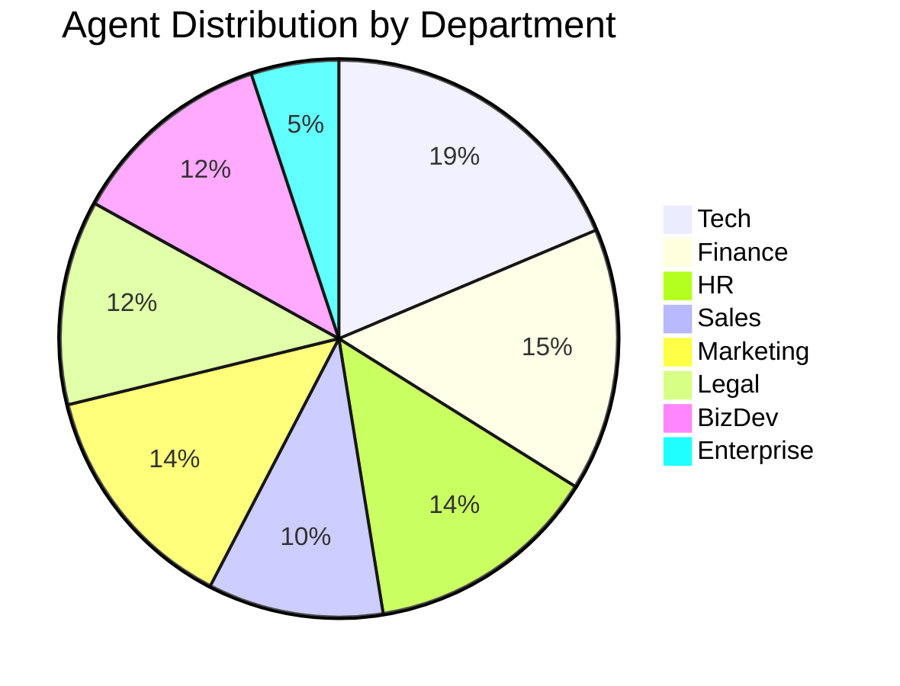
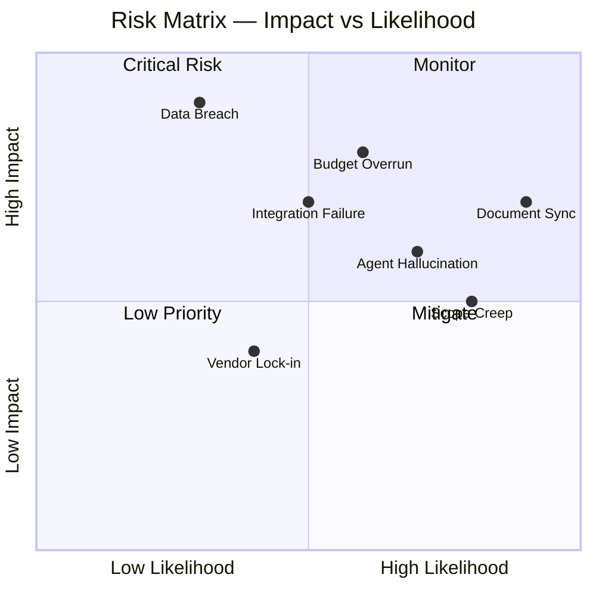
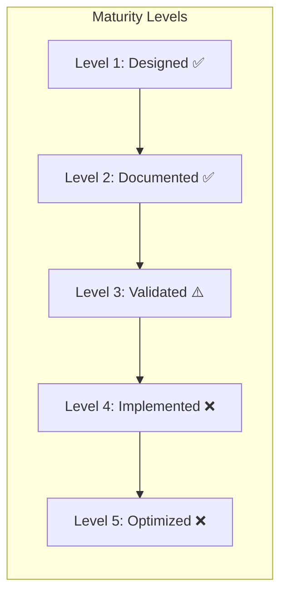

# Professional System Analysis Report
## Multi-Agentic AI Enterprise Operating System

**Analyst**: System Analyst (Professional Review)  
**Date**: 11 February 2026  
**Scope**: Full system review — 7 departments, 63 agents, 17 documents  
**Classification**: Internal — Strategic Planning

---

## 1. Executive Summary

The Multi-Agentic AI Enterprise Operating System is an **ambitious and well-structured** enterprise framework designed to automate business operations across 7 departments using 63 AI agents supervised by human employees.

### Overall Assessment

| Aspect | Score | Rating |
|--------|-------|--------|
| Architecture Design | 8.5/10 | ✅ Excellent |
| Security & Compliance | 8/10 | ✅ Strong |
| Scalability Design | 7.5/10 | ✅ Good |
| Operational Readiness | 5/10 | ⚠️ Needs Work |
| Document Consistency | 6/10 | ⚠️ Moderate |
| Cost Strategy | 8/10 | ✅ Well Planned |
| Human Interface Design | 8.5/10 | ✅ Excellent |
| **Overall** | **7.4/10** | **✅ Solid Foundation** |

> **Verdict**: The system is architecturally sound with strong governance. Key risks are in operational readiness (deployment gap between design and implementation) and document synchronization. With the improvements recommended below, this system is production-viable.

---

## 2. System Composition

### 2.1 Document Inventory

| # | Document | Size | Purpose | Status |
|---|----------|------|---------|--------|
| 1 | `TECHNICAL_ARCHITECTURE.md` | 331 lines | Tech stack, system diagram, implementation roadmap | ✅ Complete |
| 2 | `ENTERPRISE_AGENTS_MANUAL.md` | ~290 lines | Cross-dept governance, Plan JSON, RBAC | ✅ Complete |
| 3 | `ADMIN_GOVERNANCE_DESIGN.md` | ~200 lines | Model routing, cost control, policy engine | ✅ Complete |
| 4 | `HUMAN_AGENT_SYSTEM.md` | 405 lines | Human-agent pairing, communication channels | ✅ Complete |
| 5 | `HUMAN_AGENT_MAPPING.md` | ~200 lines | Org chart, agent-to-human assignment | ⚠️ Outdated* |
| 6 | `HUMAN_INTERFACE_DESIGN.md` | ~106 lines | Dashboard "Claw" wireframe | ✅ Complete |
| 7 | `MODEL_TIER_CLASSIFICATION.md` | 307 lines | 4-tier model cost strategy | ✅ Complete |
| 8 | `AGENT_WORKFLOWS.md` | 152 lines | Dept-specific sequence diagrams | ⚠️ Incomplete* |
| 9 | `SYSTEM_GAP_ANALYSIS.md` | 211 lines | 10 identified gaps | ⚠️ Outdated* |
| 10 | `AGENT_GAP_REVIEW.md` | ~150 lines | Agent gap recommendations | ⚠️ Outdated* |
| 11 | `Development/AGENTS_Tech.md` | 250 lines | Tech dept agents | ✅ Complete |
| 12 | `Finance/AGENTS_FINANCE.md` | 244 lines | Finance dept agents | ✅ Complete |
| 13 | `HR/AGENTS_HR.md` | ~196 lines | HR dept agents | ✅ Complete |
| 14 | `Sales/AGENTS_SALES.md` | ~190 lines | Sales dept agents | ✅ Complete |
| 15 | `Marketing/AGENTS_MARKETING.md` | ~256 lines | Digital marketing agents | ✅ Complete |
| 16 | `Legal/AGENTS_LEGAL.md` | ~210 lines | Legal dept agents | ✅ Complete |
| 17 | `BusinessDev/AGENTS_BIZDEV.md` | ~210 lines | Strategy & BizDev agents | ✅ Complete |

> *\*Outdated documents reference 29 or 48 agents instead of current 63. See Section 6.*

### 2.2 Agent Distribution



| Department | Agents | Supervisor | Specialists | Human Min |
|-----------|--------|-----------|------------|-----------|
| Enterprise | 3 | Global Supervisor | Scheduling, Communication | 1 |
| Tech | 11 | Tech Supervisor | 10 specialists | 8 |
| Finance | 9 | Finance Supervisor | 8 specialists | 3 |
| HR | 8 | HR Supervisor | 7 specialists | 3 |
| Sales | 6 | Sales Supervisor | 5 specialists | 1 |
| Marketing | 8 | Marketing Supervisor | 7 specialists | 7 |
| Legal | 7 | Legal Supervisor | 6 specialists | 4 |
| BizDev | 7 | BizDev Supervisor | 6 specialists | 5 |
| **Total** | **63** | **8** | **55** | **32** |

---

## 3. Strengths Analysis

### ✅ 3.1 Architecture — Well Layered
The 5-layer architecture (Control Plane → Orchestration → Intelligence → Execution → Data) provides excellent separation of concerns. The use of LangGraph for stateful orchestration and LiteLLM for model routing is industry-appropriate.

### ✅ 3.2 Security Model — Defense in Depth
- Row-Level Security (RLS) per department
- Schema-based data isolation
- Tool sandboxing (E2B / Docker)
- PII masking middleware
- Secrets management via Vault
- Immutable audit logs

This is enterprise-grade security design.

### ✅ 3.3 Human-in-the-Loop — Comprehensive
The Human-Agent Pairing System is the strongest component:
- Multi-channel (WhatsApp, Email, Dashboard)
- Natural language intent parsing (Bahasa Indonesia + English)
- Tiered escalation (10min → 30min → 2hr → 4hr based on risk)
- Meeting scheduling with cross-agent coordination
- Human profile & preference registry

### ✅ 3.4 Cost Strategy — 67% Savings
The 4-tier model classification is well-designed:
- Nano (15% of fleet) → $16/mo
- Standard (52%) → $525/mo
- Advanced (27%) → $468/mo
- Specialist (6%) → $135/mo
- **Total: ~$1,145/mo** vs $3,456/mo all-Advanced

### ✅ 3.5 Governance — Strong Controls
- Admin override per agent/department
- Dynamic tier switching (auto-upgrade/downgrade)
- Configuration versioning with rollback
- Budget caps per department AND per tier
- LLM-as-Judge evaluation

---

## 4. Weakness Analysis

### 🔴 4.1 Critical: Document Synchronization Debt

**Problem**: Multiple documents contain contradictory numbers due to iterative expansion.

| Document | States | Actual |
|----------|--------|--------|
| `HUMAN_AGENT_SYSTEM.md` line 7 | "29 agents" | **63 agents** |
| `HUMAN_AGENT_MAPPING.md` | 46 agents, 24 humans | **63 agents, 32 humans** |
| `SYSTEM_GAP_ANALYSIS.md` | 4 departments | **7 departments** |
| `AGENT_GAP_REVIEW.md` | 39 agents | **63 agents** |
| `MODEL_TIER_CLASSIFICATION.md` | 48 agents | **63 agents** |
| `ADMIN_GOVERNANCE_DESIGN.md` | 48 agents, $1,145/mo | **63 agents** |
| `AGENT_WORKFLOWS.md` | 4 department workflows | Missing: Marketing, Legal, BizDev |
| `TECHNICAL_ARCHITECTURE.md` roadmap | Only 4 department modules | Missing: Marketing, Legal, BizDev |

**Impact**: Any stakeholder reading different docs will get contradictory information. This undermines trust and creates planning errors.

**Priority**: 🔴 P0 — Must fix before any stakeholder presentation.

---

### 🟠 4.2 High: Missing Cross-Department Integration Protocols

**Problem**: Legal and BizDev agents serve ALL departments but lack defined integration points.

| Example | Current State | Should Be |
|---------|---------------|-----------|
| HR hires employee | HR Onboarding Agent drafts contract | Should route to Legal Contract Drafting for review |
| Sales closes deal | Contract Review Agent checks terms | Should sync with Legal + Finance automatically |
| BizDev finds partnership | Partnership Evaluation Agent scores | Should trigger Legal due diligence + Finance budget check |
| Marketing runs campaign | Campaign Analytics tracks ROI | Should feed data to BizDev Market Research |

**Recommendation**: Define explicit inter-department routing rules in `ENTERPRISE_AGENTS_MANUAL.md`.

---

### 🟠 4.3 High: RBAC Inconsistency Across Departments

**Problem**: RBAC matrices use different formats and permission models:

| Department | Format | Columns | Consistency |
|-----------|--------|---------|-------------|
| Tech | Table | Code Repo, CI/CD, Infra, Secrets | ✅ Clear |
| Finance | Table | Ledger R, Ledger W, Treasury, Approvals | ✅ Clear |
| HR | Table | Employee DB, Payroll, Compliance, Approvals | ✅ Clear |
| Sales | Table | CRM Read, CRM Write, Pricing Edit, Approvals | ✅ Clear |
| Marketing | Text table | CMS, Social API, Analytics, Budget, Publish | ⚠️ Different format |
| Legal | Text table | Contract DB, Regulatory, Case Files, Sign/Execute | ⚠️ Different format |
| BizDev | Text table | Market Data, CRM Access, Financial, Presentations | ⚠️ Different format |

**Recommendation**: Standardize all RBAC matrices to same table format. Consider a unified RBAC administration in `ADMIN_GOVERNANCE_DESIGN.md`.

---

### 🟠 4.4 High: Implementation Roadmap Gap

**Problem**: `TECHNICAL_ARCHITECTURE.md` Phase 4 only covers 4 departments:
```
Phase 4: Department Modules (Weeks 7-10)
- Tech Module, Finance Module, HR Module, Sales Module
```

Missing: Marketing (8 agents), Legal (7 agents), BizDev (7 agents) = **22 unplanned agents**.

**Recommendation**: Extend roadmap to Phase 4a (Marketing), Phase 4b (Legal), Phase 4c (BizDev), adding ~6 weeks.

---

### 🟡 4.5 Medium: No Disaster Recovery Plan

**Problem**: No documentation on:
- Database backup strategy
- Service failover procedures
- Data recovery SLA
- Multi-region deployment
- Incident response playbook

**Recommendation**: Add DR section to `TECHNICAL_ARCHITECTURE.md`.

---

### 🟡 4.6 Medium: No API Specification

**Problem**: Only 4 endpoints briefly mentioned:
```
/api/v1/submit-request
/api/v1/status/{id}
/api/v1/feedback
/api/v1/approve/{thread_id}
```

63 agents across 7 departments will need significantly more endpoints.

**Recommendation**: Create an OpenAPI specification or at minimum document endpoints per department.

---

### 🟡 4.7 Medium: Agent Naming Convention Inconsistency

**Problem**: Agents lack consistent naming across docs:

| Same Agent | Called In Doc A | Called In Doc B |
|-----------|----------------|----------------|
| Coding agent | "Backend Engineer Agent" | "Coder Agent" |
| Financial prediction | "Forecasting Agent (Finance)" | "Forecasting Agent" |
| Customer service | "Customer Success Agent" | "Customer Relationship Agent" |

**Recommendation**: Create an `AGENT_REGISTRY.md` as single source of truth with canonical agent names.

---

## 5. Risk Assessment



| # | Risk | Likelihood | Impact | Mitigation |
|---|------|-----------|--------|-----------|
| R1 | Document synchronization drift | High | High | Automate doc generation from single source |
| R2 | LLM cost overrun (63 agents) | Medium | High | Budget caps + auto-downgrade already designed |
| R3 | Agent hallucination in Legal/Finance | High | High | LLM-as-Judge + mandatory human review gates |
| R4 | Data breach via cross-department access | Low | Critical | RLS + schema isolation already designed |
| R5 | Scope creep (adding more agents) | High | Medium | Define agent addition governance process |
| R6 | Vendor lock-in (OpenAI/Anthropic) | Medium | Medium | LiteLLM abstraction layer provides portability |
| R7 | Integration complexity (7 dept × APIs) | Medium | High | Phased rollout already planned |

---

## 6. Recommended Actions (Priority-Ordered)

### 🔴 P0 — Must Fix (Before Stakeholder Presentation)

| # | Action | Effort | Files Affected |
|---|--------|--------|---------------|
| 1 | **Sync all document numbers** to 63 agents / 7 departments | 2-3 hours | HUMAN_AGENT_SYSTEM, MAPPING, GAP docs, MODEL_TIER, ADMIN_GOVERNANCE |
| 2 | **Update MODEL_TIER_CLASSIFICATION** for 15 new agents (Legal + BizDev) | 1 hour | MODEL_TIER_CLASSIFICATION |
| 3 | **Update HUMAN_AGENT_MAPPING** with Legal + BizDev humans | 1 hour | HUMAN_AGENT_MAPPING |

### 🟠 P1 — Should Fix (Before Implementation)

| # | Action | Effort | Files Affected |
|---|--------|--------|---------------|
| 4 | **Extend implementation roadmap** for Marketing/Legal/BizDev modules | 1 hour | TECHNICAL_ARCHITECTURE |
| 5 | **Define cross-department integration protocols** | 2 hours | ENTERPRISE_AGENTS_MANUAL |
| 6 | **Create AGENT_REGISTRY.md** with canonical names + IDs | 1 hour | New file |
| 7 | **Standardize RBAC format** across all 7 departments | 2 hours | Marketing, Legal, BizDev docs |

### 🟡 P2 — Nice to Have (Improve Quality)

| # | Action | Effort | Files Affected |
|---|--------|--------|---------------|
| 8 | **Add 3 missing workflow diagrams** (Marketing, Legal, BizDev) | 1 hour | AGENT_WORKFLOWS |
| 9 | **Add Disaster Recovery section** | 1 hour | TECHNICAL_ARCHITECTURE |
| 10 | **Add API specification** (at least endpoint list) | 2 hours | TECHNICAL_ARCHITECTURE or new file |
| 11 | **Archive outdated gap analysis docs** or merge into this report | 30 min | AGENT_GAP_REVIEW, SYSTEM_GAP_ANALYSIS |

---

## 7. Revised Cost Projection

The MODEL_TIER_CLASSIFICATION needs updating for 63 agents (currently covers 48):

| Tier | Old Count | New Count (est.) | Monthly Cost (est.) |
|------|-----------|-----------------|-------------------|
| 💚 Nano | 7 | 9 | ~$22 |
| 💛 Standard | 25 | 35 | ~$735 |
| 🟠 Advanced | 13 | 16 | ~$576 |
| 🔴 Specialist | 3 | 3 | ~$135 |
| **Total** | **48** | **63** | **~$1,468/mo** |

> Still **58% cheaper** than running all on Advanced (~$3,500/mo).

---

## 8. Architecture Maturity Assessment



| Component | Level | Notes |
|-----------|-------|-------|
| Agent Architecture | L2 ✅ | Fully documented, well-designed |
| RBAC & Security | L2 ✅ | Designed but not validated against real scenarios |
| Human-Agent Pairing | L2 ✅ | Excellent design, not yet implemented |
| Cost Strategy | L2 ✅ | Model tiers defined, needs update for 63 agents |
| Admin Governance | L2 ✅ | Dashboard wireframe + policy rules designed |
| Cross-Dept Integration | L1 ⚠️ | Designed at high level, details missing |
| Testing & QA | L1 ⚠️ | Staging env described but no test cases |
| Deployment & DevOps | L1 ⚠️ | Docker/K8s mentioned, no configs exist |

---

## 9. Final Verdict

### What's Working Well
1. **Architecture is enterprise-grade** — Correct patterns (LangGraph, LiteLLM, RLS, RAG)
2. **Human oversight is first-class** — Multi-channel, escalation, approval gates
3. **Cost optimization is smart** — 4-tier model saves 58-67%
4. **Security model is strong** — Defense in depth at every layer
5. **Department structure is comprehensive** — 7 departments with full agent rosters

### What Needs Immediate Attention
1. **Document sync** — Numbers don't match across files (29 vs 48 vs 63)
2. **Cross-department protocols** — Legal/BizDev integration points undefined
3. **Implementation roadmap** — Only covers 4 of 7 departments
4. **Model tier update** — 15 new agents unclassified

### Bottom Line

> **This system is a well-architected Level 2 (Documented) enterprise AI framework.** The core design decisions are sound. The primary risk is not technical — it's operational: keeping documentation synchronized as the system evolves, and bridging the gap between design and implementation. Addressing the P0 items above will bring the system to Level 3 (Validated) and ready for phased implementation.
