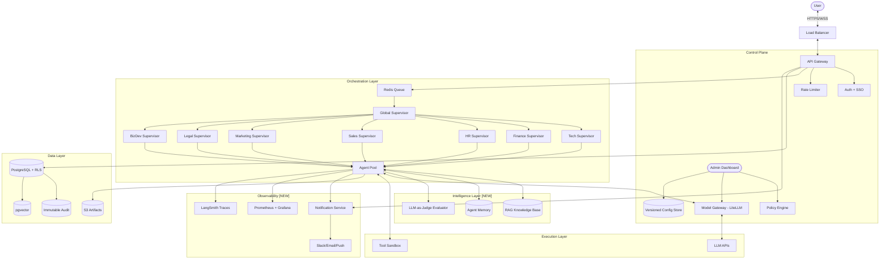

# System Gap Analysis & Recommendations

## Documents Reviewed
| # | Document | Lines | Focus |
|---|----------|-------|-------|
| 1 | `Development/AGENTS_Tech.md` | 250 | Tech Dev agents & RBAC |
| 2 | `Finance/AGENTS_FINANCE.md` | 244 | Finance agents & compliance |
| 3 | `HR/AGENTS_HR.md` | ~196 | HR agents & privacy |
| 4 | `Sales/AGENTS_SALES.md` | ~190 | Sales agents & revenue |
| 5 | `Marketing/AGENTS_MARKETING.md` | ~256 | Digital marketing agents |
| 6 | `Legal/AGENTS_LEGAL.md` | ~210 | Legal dept agents |
| 7 | `BusinessDev/AGENTS_BIZDEV.md` | ~210 | Strategy & BizDev agents |
| 8 | `ENTERPRISE_AGENTS_MANUAL.md` | ~290 | Cross-dept governance |
| 9 | `TECHNICAL_ARCHITECTURE.md` | 331 | Stack & implementation |
| 10 | `HUMAN_INTERFACE_DESIGN.md` | 106 | Dashboard & approval |
| 11 | `ADMIN_GOVERNANCE_DESIGN.md` | 240 | Cost & policy control |
| 12 | `MODEL_TIER_CLASSIFICATION.md` | ~310 | 4-tier model strategy |

---

## Gap Analysis: 10 Critical Weaknesses Found

> **Status Update (Feb 2026)**: Gaps 1, 4, 5, 6, 7, 8, 10 have been addressed in `TECHNICAL_ARCHITECTURE.md` and related docs. Gaps 2, 3, 9 are partially addressed. See individual gap status below.

### ✅ GAP 1: No Agent Memory / Knowledge Base (RAG) — RESOLVED
**Problem**: Agents are stateless. Each task starts from zero context. No mechanism for agents to "remember" past decisions, company documents, or learn from previous tasks.

**Status**: ✅ Resolved in `TECHNICAL_ARCHITECTURE.md` Section 4 — RAG with pgvector + MemorySaver.

---

### ❌ GAP 2: No Error Recovery & Retry Strategy
**Problem**: Documents mention "Dead-letter queue" and "Retry & fallback logic" but provide zero implementation detail. What happens when an agent fails mid-task? What if an LLM returns garbage?

**Impact**: System will silently fail or hang indefinitely in production.

**Recommendation**:
- Implement **Exponential Backoff** for LLM API failures (built into LiteLLM).
- Add a **Circuit Breaker** pattern: after 3 consecutive failures, route to fallback model.
- Create a **Dead Letter Queue (DLQ)** in Redis: failed tasks are stored with full context for manual review.
- Add **Max Retry Count** per task in Plan JSON: `"max_retries": 3`.

---

### ❌ GAP 3: No Agent Evaluation / Quality Scoring
**Problem**: No mechanism to measure whether an agent's output is actually good. The system has "Quality Gates" but no metrics for agent performance.

**Impact**: Cannot identify underperforming agents, hallucinations, or degrading output quality over time.

**Recommendation**:
- Add **LLM-as-Judge**: Use a separate LLM to score agent outputs (accuracy, completeness, safety).
- Track **Agent KPIs**: success rate, average task time, human override rate, hallucination rate.
- Implement **A/B Testing** for prompt variations to continuously improve agent quality.

---

### ❌ GAP 4: No Notification / Alerting System
**Problem**: The Human Approval Queue requires someone to actively watch the dashboard. No push notifications when urgent approvals are needed.

**Impact**: Critical tasks (e.g., production deployment, financial transfers) could be blocked for hours waiting for human approval.

**Recommendation**:
- Integrate **Email / Slack / Teams notifications** when a task enters the Approval Queue.
- Add **Escalation Timer**: If not approved within X minutes, escalate to next-level approver.
- Implement **Mobile Push Notifications** for high-risk approvals.

---

### ❌ GAP 5: No Multi-Tenancy / Department Data Isolation
**Problem**: Architecture describes a single PostgreSQL database. No clear mechanism to prevent the Tech department's agents from accessing Finance data or HR employee records.

**Impact**: Severe privacy and compliance violation risk. A coding agent could accidentally query employee salary data.

**Recommendation**:
- Implement **Row-Level Security (RLS)** in PostgreSQL per department.
- Use **Schema-based isolation**: each department gets its own DB schema (`finance.*`, `hr.*`).
- Create **Department-scoped API keys** so agents can only access their assigned schema.

---

### ❌ GAP 6: No Versioning / Rollback for Agent Configurations
**Problem**: Policy changes, prompt updates, and model routing rules have no version control. If an admin changes the system prompt and agents start behaving badly, there's no way to revert.

**Impact**: Configuration drift, no accountability for changes, and no way to debug "what changed?"

**Recommendation**:
- Store all configurations (system prompts, model routes, policies) in a **Git-like versioned store** or PostgreSQL with `version` column.
- Add a **"Rollback to Previous Version"** button in Admin Dashboard.
- Log every config change with `who`, `when`, `old_value`, `new_value`.

---

### ❌ GAP 7: No Rate Limiting / Abuse Prevention for Agents
**Problem**: No mechanism to prevent a runaway agent from making unlimited API calls, spawning infinite sub-tasks, or entering an infinite loop.

**Impact**: A single malfunctioning agent could consume the entire monthly LLM budget in minutes.

**Recommendation**:
- Set **Max Tool Calls per Task** (e.g., 50 tool calls max).
- Set **Max Execution Time** per task (e.g., 10 minutes timeout).
- Implement **Token Budget per Task**: Kill task if it exceeds allocated token budget.
- Add **Loop Detection**: If an agent calls the same tool 5+ times with similar input, auto-pause and alert.

---

### ❌ GAP 8: No Testing / Simulation Environment
**Problem**: No sandbox or staging environment defined for testing agent behavior before deploying to production.

**Impact**: New agent configurations, prompt changes, or model updates will be tested directly on live data.

**Recommendation**:
- Create a **Staging Environment** with mock data for each department.
- Implement **Dry Run Mode**: Agents execute but don't actually call external tools (log what they *would* do).
- Add an **Agent Playground** page in the dashboard for testing prompts interactively.

---

### ❌ GAP 9: No Cross-Department Conflict Resolution
**Problem**: `ENTERPRISE_AGENTS_MANUAL.md` defines inter-department workflows (e.g., Sales → Finance) but has no mechanism for resolving conflicts (e.g., Sales requests a budget that Finance rejects).

**Impact**: Deadlocks between departments. No escalation path defined.

**Recommendation**:
- Define a **Conflict Resolution Protocol**: If two department supervisors disagree, auto-escalate to Global Supervisor.
- Add **Priority Levels** to cross-department requests: `P0` (urgent) → `P3` (low).
- Implement **SLA Timers**: If a cross-department request isn't resolved in X hours, auto-escalate to Executive level.

---

### ❌ GAP 10: Inconsistent Depth Across Department Documents
**Problem**: Tech (250 lines) and Finance (244 lines) documents are detailed, but HR (154 lines) and Sales (151 lines) are significantly less thorough; they lack Quality Gates, Deployment Roadmaps, and Audit Ledger structures.

**Impact**: HR and Sales departments will be treated as second-class citizens in the system.

**Recommendation**:
- Standardize all department documents to include the same 10 sections.
- Add **Quality/Compliance Gates** to HR and Sales documents.
- Add **Audit Ledger Structure** to HR and Sales documents.
- Create a **Department Document Template** for consistency.

---

## Recommended Enhanced Architecture

---

## Priority Action Plan

| Priority | Gap | Effort | Impact |
|----------|-----|--------|--------|
| 🔴 P0 | GAP 7: Rate Limiting / Abuse Prevention | Low | Critical |
| 🔴 P0 | GAP 2: Error Recovery & Retry | Medium | Critical |
| 🟠 P1 | GAP 5: Data Isolation (RLS) | Medium | High |
| 🟠 P1 | GAP 1: RAG / Knowledge Base | Medium | High |
| 🟡 P2 | GAP 4: Notifications / Alerting | Low | High |
| 🟡 P2 | GAP 8: Testing / Simulation | Medium | Medium |
| 🟡 P2 | GAP 6: Config Versioning | Low | Medium |
| 🔵 P3 | GAP 3: Agent Evaluation | Medium | Medium |
| 🔵 P3 | GAP 9: Conflict Resolution | Low | Medium |
| 🔵 P3 | GAP 10: Document Standardization | Low | Low |
