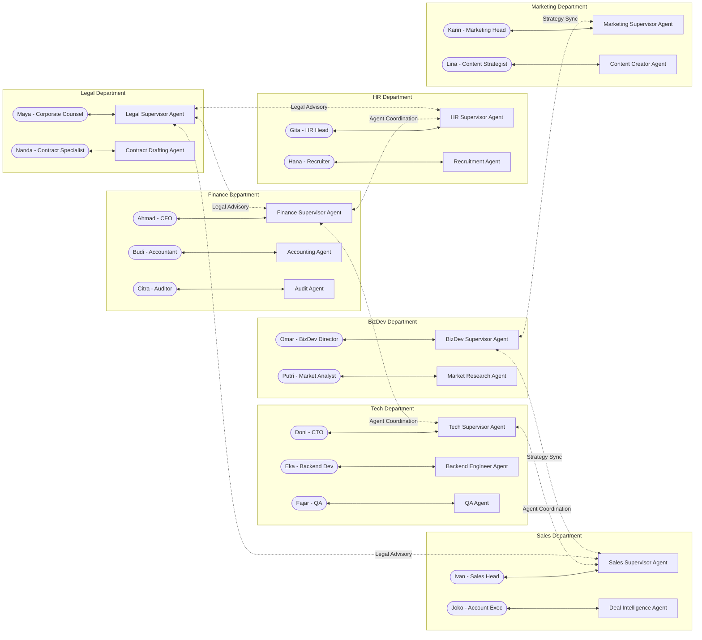
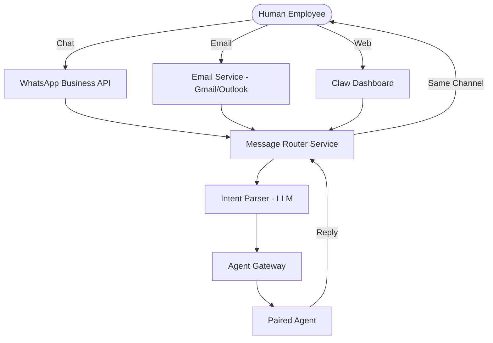
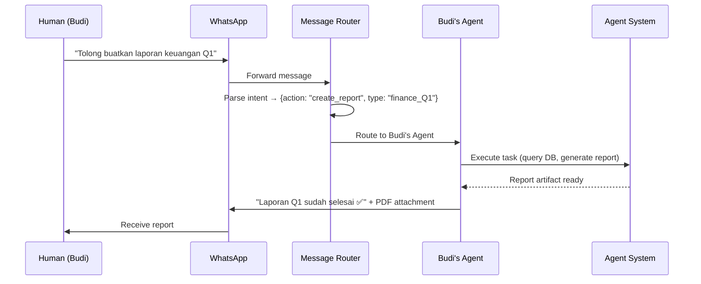
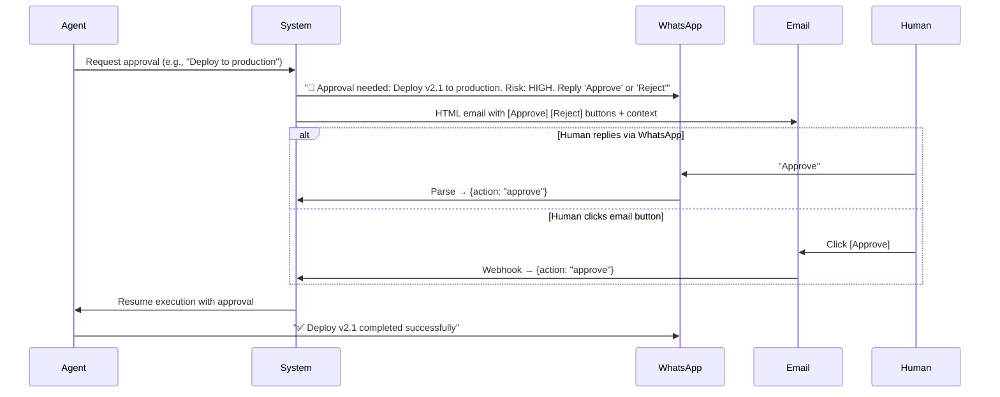
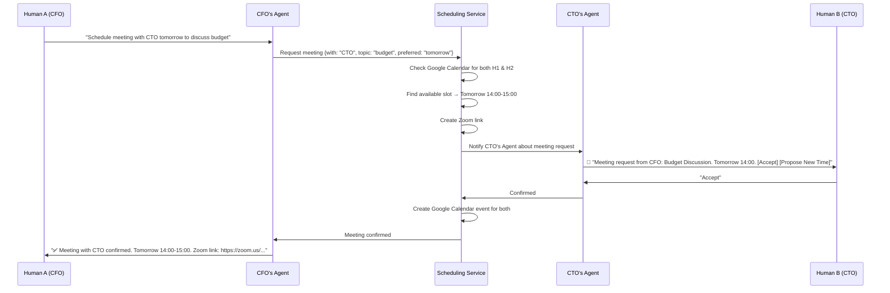
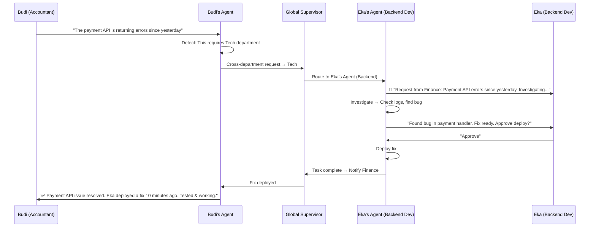
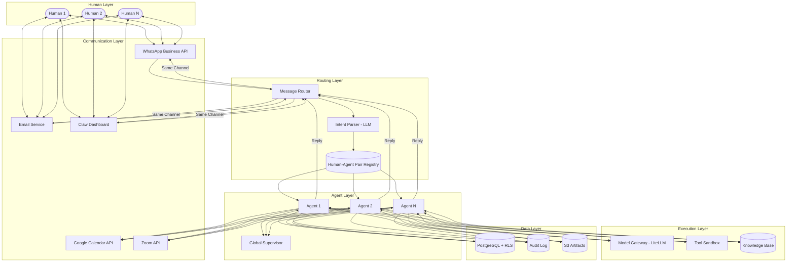

# Human-Agent Pairing System — Recommendation Design

## 1. Core Concept: 1 Agent ↔ 1 Human

Every AI Agent is a **personal assistant** to a specific human employee. The human is always the **supervisor** — agents propose, humans approve. Agents handle execution, coordination, and reporting while humans maintain full control.

> **Minimum 32 humans** are needed to supervise all 63 agents across 7 departments + enterprise. See [HUMAN_AGENT_MAPPING.md](file:///c:/Users/sarif/Documents/project_antigravity/company_AI/HUMAN_AGENT_MAPPING.md) for the full org chart and staffing plan.



---

## 2. Multi-Channel Communication

Humans interact with their agent through **WhatsApp, Email, or Dashboard** — whichever is most convenient.

### **2.1 Channel Architecture**



### **2.2 Supported Interactions per Channel**

| Action | WhatsApp | Email | Dashboard |
|--------|----------|-------|-----------|
| Ask a task | ✅ Chat | ✅ Email subject | ✅ Form |
| Get status update | ✅ "Status?" | ✅ Auto digest | ✅ Real-time |
| Receive report | ✅ PDF attachment | ✅ PDF + inline | ✅ Artifact browser |
| Approve / Reject | ✅ Reply "Approve" / "Reject" | ✅ Click button in email | ✅ Approve Queue |
| Schedule meeting | ✅ "Schedule meeting with CTO" | ✅ Email request | ✅ Calendar widget |
| Urgent alert | ✅ Push message | ✅ Flagged email | ✅ Toast notification |

### **2.3 Technology Stack**

| Component | Technology |
|-----------|------------|
| WhatsApp | **WhatsApp Business API** (via Twilio or Meta Cloud API) |
| Email | **Gmail API** / **Microsoft Graph API** + **Nodemailer** |
| Intent Parsing | **LLM** (parse natural language → structured action) |
| Message Queue | **Redis Pub/Sub** (route messages to correct agent) |

---

## 3. Task Request Flow

A human can ask their agent to do tasks at any time via any channel.

### **3.1 Flow Diagram**



### **3.2 Intent Parser Examples**

| Human Message (Any Language) | Parsed Intent |
|------------------------------|---------------|
| "Buatkan laporan penjualan bulan ini" | `{action: "create_report", type: "sales_monthly"}` |
| "Status task deploy kemarin?" | `{action: "check_status", task_ref: "latest_deploy"}` |
| "Approve" | `{action: "approve", context: "pending_approval"}` |
| "Schedule meeting with HR head tomorrow 2pm" | `{action: "schedule_meeting", with: "HR_head", time: "tomorrow 14:00"}` |
| "Reject, need more data" | `{action: "reject", feedback: "need more data"}` |

---

## 4. Report Delivery System

Agents proactively send reports or respond to report requests via the human's preferred channel.

### **4.1 Report Types**

| Report | Trigger | Format |
|--------|---------|--------|
| Daily Digest | Automated (every morning) | WhatsApp summary + Email PDF |
| Task Completion | On task finish | WhatsApp notification + Email full report |
| Weekly Summary | Automated (every Monday) | Email PDF with charts |
| Ad-hoc Report | Human request | Reply on same channel |
| Budget Alert | Threshold exceeded | WhatsApp urgent + Email |

### **4.2 Report Template**

```
📊 Daily Report — Finance Department
Date: 2026-02-12

✅ Completed Tasks (3):
  1. Reconciliation Q1 → Done
  2. Invoice processing → 47 invoices processed
  3. Budget variance analysis → Report attached

⏳ In Progress (1):
  1. Annual audit preparation → 60% complete

⚠️ Needs Your Approval (1):
  1. Transfer $15,000 to vendor → [Approve] [Reject]

💰 Budget Usage: $340 / $500 (68%)
```

---

## 5. Approval System (Multi-Channel)

Humans approve or reject agent actions through whichever channel they prefer.

### **5.1 Approval Flow**



### **5.2 Escalation Rules**

| Risk Level | Wait Time | Escalation |
|------------|-----------|------------|
| Low | 4 hours | Remind human via WhatsApp |
| Medium | 2 hours | Remind + CC Department Head |
| High | 30 minutes | Remind + Escalate to Executive |
| Critical | 10 minutes | Phone call + All channels |

---

## 6. Meeting Scheduling System

Humans can ask their agent to schedule meetings. The agent coordinates with other agents to find availability and creates calendar events.

### **6.1 Scheduling Flow**



### **6.2 Technology Integration**

| Service | API | Purpose |
|---------|-----|---------|
| Google Calendar | **Google Calendar API v3** | Check availability, create events |
| Zoom | **Zoom API** | Generate meeting links |
| Microsoft Teams | **Microsoft Graph API** (optional) | Alternative to Zoom |
| WhatsApp | **WhatsApp Business API** | Send invitations & reminders |
| Email | **Gmail / SMTP** | Send calendar invites (.ics) |

### **6.3 Smart Scheduling Features**

- **Auto-detect timezone**: Based on human's profile.
- **Conflict resolution**: If no slot available, propose 3 alternatives.
- **Recurring meetings**: "Schedule weekly standup every Monday 9am".
- **Reminder**: Send WhatsApp reminder 15 minutes before meeting.
- **Meeting prep**: Agent prepares agenda and relevant documents before the meeting.

---

## 7. Agent-to-Agent Coordination

When a task requires cross-department cooperation, agents coordinate automatically and keep their humans informed.

### **7.1 Coordination Flow**



### **7.2 Coordination Rules**

| Scenario | Agent Behavior |
|----------|---------------|
| Simple info request | Agent-to-Agent direct. No human approval needed. |
| Task execution | Agent asks its human for approval before acting. |
| Cross-department task | Route via Global Supervisor. Both humans are informed. |
| Meeting scheduling | Agent-to-Agent coordination. Both humans confirm. |
| Conflicting priorities | Escalate to department heads via their agents. |

---

## 8. Human Profile & Preferences Registry

Each human has a profile that their paired agent uses to personalize interactions.

```json
{
  "human_id": "budi_001",
  "name": "Budi Santoso",
  "role": "Senior Accountant",
  "department": "finance",
  "paired_agent": "accounting_agent_01",
  "communication": {
    "preferred_channel": "whatsapp",
    "whatsapp_number": "+62812XXXXXXX",
    "email": "budi@company.com",
    "language": "id",
    "timezone": "Asia/Jakarta",
    "quiet_hours": {"start": "21:00", "end": "07:00"}
  },
  "notifications": {
    "daily_digest": true,
    "digest_time": "08:00",
    "urgent_override_quiet": true,
    "approval_reminder_minutes": 30
  },
  "calendar": {
    "google_calendar_id": "budi@company.com",
    "default_meeting_duration": 30,
    "preferred_meeting_hours": {"start": "09:00", "end": "17:00"}
  },
  "permissions": {
    "auto_approve_below_usd": 100,
    "max_task_budget_usd": 50
  }
}
```

---

## 9. Complete System Architecture



---

## 10. Implementation Roadmap

| Phase | Weeks | Deliverables |
|-------|-------|-------------|
| **Phase 1**: Core Pairing | 1-2 | Human-Agent Registry, Message Router, Dashboard chat |
| **Phase 2**: WhatsApp Integration | 3-4 | WhatsApp Business API, Intent Parser, 2-way messaging |
| **Phase 3**: Email Integration | 5-6 | Gmail/Outlook API, Report delivery, Email approval buttons |
| **Phase 4**: Calendar & Meetings | 7-8 | Google Calendar API, Zoom API, Cross-agent scheduling |
| **Phase 5**: Agent Coordination | 9-10 | Cross-department routing, Agent-to-Agent protocol |
| **Phase 6**: Intelligence | 11-12 | Smart scheduling, Meeting prep, Proactive insights |

---

## 11. Recommendation Summary

1. **WhatsApp First**: Most Indonesians are on WhatsApp. Make it the primary channel for quick tasks and approvals.
2. **Email for Records**: Use email for formal reports, audit trails, and official approvals.
3. **Dashboard for Power Users**: The Claw Dashboard is for admins and users who need deep visibility.
4. **Smart Intent Parsing**: Use LLM to parse natural language in any language (Bahasa Indonesia, English) into structured actions.
5. **Respect Human Time**: Quiet hours, timezone awareness, and smart notification batching to avoid alert fatigue.
6. **Agent Coordinates, Human Decides**: Agents handle all the back-and-forth coordination. Humans only see the final result or approval request.
7. **Calendar Intelligence**: Auto-detect conflicts, suggest times, and prepare meeting agenda automatically.
