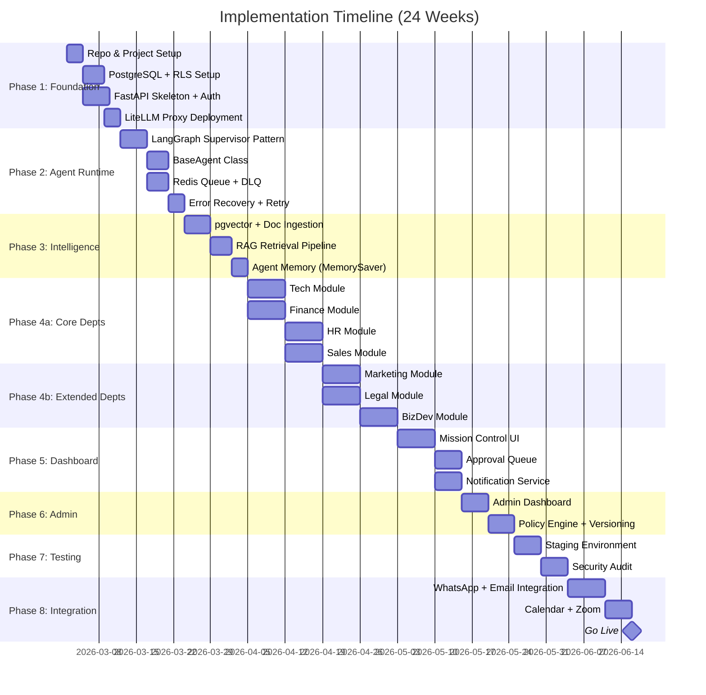

# Implementation Roadmap & To-Do List
## Multi-Agentic AI Enterprise Operating System

**Start Date**: Target Maret 2026  
**Duration**: 24 Minggu (~6 Bulan)  
**Team**: 4-5 Engineers  
**Total Tasks**: 120+ deliverables

---

## 📋 Document Readiness Assessment

### ✅ Semua Design Documents Sudah Lengkap

| # | Document | Status | Lokasi |
|---|----------|--------|--------|
| 1 | Enterprise Governance Manual | ✅ Complete | [ENTERPRISE_AGENTS_MANUAL.md](file:///c:/Users/sarif/Documents/project_antigravity/company_AI/ENTERPRISE_AGENTS_MANUAL.md) |
| 2 | Technical Architecture | ✅ Complete | [TECHNICAL_ARCHITECTURE.md](file:///c:/Users/sarif/Documents/project_antigravity/company_AI/TECHNICAL_ARCHITECTURE.md) |
| 3 | Human-Agent Pairing System | ✅ Complete | [HUMAN_AGENT_SYSTEM.md](file:///c:/Users/sarif/Documents/project_antigravity/company_AI/HUMAN_AGENT_SYSTEM.md) |
| 4 | Human-Agent Mapping | ✅ Complete | [HUMAN_AGENT_MAPPING.md](file:///c:/Users/sarif/Documents/project_antigravity/company_AI/HUMAN_AGENT_MAPPING.md) |
| 5 | Human Interface Design | ✅ Complete | [HUMAN_INTERFACE_DESIGN.md](file:///c:/Users/sarif/Documents/project_antigravity/company_AI/HUMAN_INTERFACE_DESIGN.md) |
| 6 | Admin Governance Design | ✅ Complete | [ADMIN_GOVERNANCE_DESIGN.md](file:///c:/Users/sarif/Documents/project_antigravity/company_AI/ADMIN_GOVERNANCE_DESIGN.md) |
| 7 | Model Tier Classification | ✅ Complete | [MODEL_TIER_CLASSIFICATION.md](file:///c:/Users/sarif/Documents/project_antigravity/company_AI/MODEL_TIER_CLASSIFICATION.md) |
| 8 | Agent Workflows | ✅ Complete | [AGENT_WORKFLOWS.md](file:///c:/Users/sarif/Documents/project_antigravity/company_AI/AGENT_WORKFLOWS.md) |
| 9 | Tech Department Agents | ✅ Complete | `Development/AGENTS_Tech.md` |
| 10 | Finance Department Agents | ✅ Complete | `Finance/AGENTS_FINANCE.md` |
| 11 | HR Department Agents | ✅ Complete | `HR/AGENTS_HR.md` |
| 12 | Sales Department Agents | ✅ Complete | `Sales/AGENTS_SALES.md` |
| 13 | Marketing Department Agents | ✅ Complete | `Marketing/AGENTS_MARKETING.md` |
| 14 | Legal Department Agents | ✅ Complete | `Legal/AGENTS_LEGAL.md` |
| 15 | BizDev Department Agents | ✅ Complete | `BusinessDev/AGENTS_BIZDEV.md` |
| 16 | Cost Analysis (CAPEX/OPEX) | ✅ Complete | `Evaluasi/COST_ANALYSIS_CAPEX_OPEX.md` |
| 17 | Professional System Analysis | ✅ Complete | `Evaluasi/PROFESSIONAL_SYSTEM_ANALYSIS.md` |
| 18 | System Gap Analysis | ✅ Complete | `Evaluasi/SYSTEM_GAP_ANALYSIS.md` |
| 19 | Agent Gap Review | ✅ Complete | `Evaluasi/AGENT_GAP_REVIEW.md` |

> **Kesimpulan**: Tidak ada dokumen desain yang perlu ditambah. Semua sudah siap untuk implementasi.

---

## 🗺️ Implementation Roadmap



---

## ✅ Detailed To-Do List

### Phase 1: Core Infrastructure (Minggu 1-2)

**Goal**: Fondasi backend siap, database running, auth working.

- [ ] **1.1 Project Setup**
  - [ ] Buat monorepo: `/backend`, `/frontend`, `/infrastructure`, `/docs`
  - [ ] Setup Python 3.11+ virtual environment
  - [ ] Setup `pyproject.toml` dengan dependencies:
    - `fastapi`, `uvicorn`, `langchain`, `langgraph`, `litellm`
    - `sqlalchemy`, `alembic`, `asyncpg`, `redis`, `celery`
  - [ ] Setup `.env` template dengan semua API keys
  - [ ] Setup `docker-compose.yml` (PostgreSQL, Redis, LiteLLM, App)
  - [ ] Setup GitHub repo + branch protection + CI/CD (GitHub Actions)

- [ ] **1.2 Database Setup**
  - [ ] Install PostgreSQL 16 + pgvector extension
  - [ ] Design base schema:
    ```
    schemas: enterprise, tech, finance, hr, sales, marketing, legal, bizdev
    ```
  - [ ] Implement Row-Level Security (RLS) policies per department
  - [ ] Create core tables:
    - `agents` — agent registry (id, name, department, tier, status)
    - `humans` — human profiles (id, name, role, department)
    - `agent_human_pairs` — mapping table
    - `tasks` — task queue (plan JSON storage)
    - `artifacts` — output storage references
    - `audit_log` — immutable action log
    - `config_versions` — policy/config versioning
  - [ ] Setup Alembic migrations

- [ ] **1.3 FastAPI Skeleton**
  - [ ] Create project structure:
    ```
    backend/
    ├── app/
    │   ├── main.py
    │   ├── core/ (config, security, deps)
    │   ├── api/ (routers)
    │   ├── models/ (SQLAlchemy)
    │   ├── schemas/ (Pydantic)
    │   ├── services/ (business logic)
    │   └── agents/ (LangGraph agents)
    ```
  - [ ] Implement OAuth2 + JWT authentication
  - [ ] Implement rate limiting middleware
  - [ ] Setup CORS, logging, error handling
  - [ ] Health check endpoint (`/health`)
  - [ ] API versioning (`/api/v1/`)

- [ ] **1.4 LiteLLM Proxy**
  - [ ] Deploy LiteLLM proxy container
  - [ ] Configure `litellm_config.yaml` (dari MODEL_TIER_CLASSIFICATION.md)
  - [ ] Setup model routing: nano, standard, advanced, code, vision, embedding
  - [ ] Configure fallback chains (advanced → standard → nano)
  - [ ] Test semua model connections (OpenAI, Anthropic, DeepSeek)
  - [ ] Setup budget alerts per department

---

### Phase 2: Base Agent Runner (Minggu 3-4)

**Goal**: Bisa run 1 agent end-to-end (input → process → output → audit).

- [ ] **2.1 LangGraph Supervisor Pattern**
  - [ ] Implement `GlobalSupervisor` graph:
    - Parse incoming Plan JSON
    - Route to correct department supervisor
    - Handle cross-department coordination
  - [ ] Implement `DepartmentSupervisor` base class:
    - Task decomposition
    - Agent selection
    - Quality gate enforcement
  - [ ] Setup LangGraph checkpointing (PostgreSQL backend)
  - [ ] Implement state persistence across sessions

- [ ] **2.2 BaseAgent Class**
  - [ ] Create abstract `BaseAgent`:
    ```python
    class BaseAgent:
        agent_id: str
        department: str
        tier: ModelTier  # nano/standard/advanced/specialist
        tools: list[Tool]
        human_pair: HumanProfile
        
        async def execute(self, task: Task) -> Artifact
        async def request_approval(self, action: Action) -> bool
        async def log_action(self, action: AuditEntry)
    ```
  - [ ] Implement tool sandboxing (restrict per agent RBAC)
  - [ ] Implement token budget per task (kill if exceeded)
  - [ ] Implement loop detection (auto-pause after 5 same-tool calls)
  - [ ] Implement max execution time (10 min default)

- [ ] **2.3 Task Queue (Redis + Celery)**
  - [ ] Setup Celery workers dengan Redis broker
  - [ ] Implement task priority queue (P0-P3)
  - [ ] Setup Dead Letter Queue (DLQ) for failed tasks
  - [ ] Implement retry logic (3 retries with exponential backoff)
  - [ ] Worker health monitoring

- [ ] **2.4 Audit System**
  - [ ] Create immutable audit logger
  - [ ] Log: timestamp, department, agent, action, resource, approval_chain, cost, risk_score
  - [ ] Setup PostgreSQL audit table (append-only, no UPDATE/DELETE)

---

### Phase 3: Knowledge & Intelligence (Minggu 5-6)

**Goal**: Agents punya memory dan bisa query company knowledge.

- [ ] **3.1 Vector Database (pgvector)**
  - [ ] Create `knowledge_base` table dengan vector column
  - [ ] Build document ingestion pipeline:
    - PDF → text → chunk → embed → store
    - Markdown, DOCX, CSV support
  - [ ] Implement department-scoped access (agent hanya query dokumen dept-nya)
  - [ ] Batch ingestion script untuk initial company documents

- [ ] **3.2 RAG Pipeline**
  - [ ] Implement retrieval chain:
    - Query → embedding → similarity search → rerank → inject context
  - [ ] Setup `text-embedding-3-small` via LiteLLM
  - [ ] Implement reranker (`bge-reranker-v2`) for quality
  - [ ] Add source citation in agent responses
  - [ ] Implement relevance threshold (skip RAG if no relevant docs)

- [ ] **3.3 Agent Memory**
  - [ ] Implement LangGraph `MemorySaver` with PostgreSQL backend
  - [ ] Short-term memory: current task context
  - [ ] Long-term memory: past decisions, learned preferences
  - [ ] Memory scoping: agents share dept memory, isolated cross-dept

---

### Phase 4a: Department Modules — Core (Minggu 7-10)

**Goal**: 4 core departments operational.

- [ ] **4a.1 Tech Department (11 agents)**
  - [ ] Tech Supervisor Agent (plan decomposition)
  - [ ] Product Analyst (PRD generation → acceptance criteria)
  - [ ] Architect Agent (HLD/LLD, API contracts)
  - [ ] Backend Engineer (code generation via DeepSeek)
  - [ ] Frontend Engineer (code generation)
  - [ ] QA Agent (test plan generation, test execution)
  - [ ] DevOps Agent (CI config, deployment prep)
  - [ ] SRE Agent (monitoring rules, incident postmortem)
  - [ ] Security Agent (CVE scan, dependency audit)
  - [ ] Data Engineer (ETL pipeline design)
  - [ ] Technical Writer (API docs, changelogs)
  - [ ] Tools: Git API, Docker SDK, CI/CD webhooks, Jira API

- [ ] **4a.2 Finance Department (9 agents)**
  - [ ] Finance Supervisor
  - [ ] Accounting Agent (ledger reconciliation)
  - [ ] Budget Planning Agent (budget proposals)
  - [ ] Forecasting Agent (cashflow projection)
  - [ ] Audit Agent (internal audit simulation)
  - [ ] Risk & Compliance Agent (regulatory checks)
  - [ ] Treasury Agent (cash position monitoring)
  - [ ] Invoicing Agent (invoice generation, AR/AP)
  - [ ] Tax Agent (tax calculation, filing prep)
  - [ ] Tools: Excel/CSV parser, accounting API, bank API

- [ ] **4a.3 HR Department (8 agents)**
  - [ ] HR Supervisor
  - [ ] Recruitment Agent (CV screening, ranking)
  - [ ] Onboarding Agent (checklist, contract drafts)
  - [ ] Payroll Validation Agent (anomaly detection)
  - [ ] Performance Analytics Agent (KPI aggregation)
  - [ ] HR Compliance Agent (labor law checks)
  - [ ] Training & Development Agent (skill gap analysis)
  - [ ] Benefits Administration Agent (eligibility lookup)
  - [ ] Tools: HRIS API, PII masking middleware

- [ ] **4a.4 Sales Department (6 agents)**
  - [ ] Sales Supervisor
  - [ ] Lead Scoring Agent (CRM score calculation)
  - [ ] Deal Intelligence Agent (pipeline monitoring)
  - [ ] Forecasting Agent (revenue forecast)
  - [ ] Pricing Optimization Agent (margin analysis)
  - [ ] Contract Review Agent (clause validation)
  - [ ] Tools: CRM API (HubSpot/Salesforce), proposal templates

---

### Phase 4b: Department Modules — Extended (Minggu 11-13)

**Goal**: 3 new departments operational.

- [ ] **4b.1 Digital Marketing Department (8 agents)**
  - [ ] Marketing Supervisor
  - [ ] Content Creator Agent (blog, ad copy)
  - [ ] Content Maker & Editing Agent (visual content, DALL-E)
  - [ ] Social Media Agent (post scheduling)
  - [ ] Customer Relationship Agent (email campaigns)
  - [ ] Customer Success Agent (renewal tracking, NPS)
  - [ ] Campaign Analytics Agent (ROI calculation)
  - [ ] SEO & SEM Agent (keyword research, bid optimization)
  - [ ] Tools: Social Media APIs, CMS API, analytics APIs

- [ ] **4b.2 Legal Department (7 agents)**
  - [ ] Legal Supervisor
  - [ ] Contract Drafting Agent (NDA/SLA/MSA templates)
  - [ ] Contract Review Agent (clause risk analysis)
  - [ ] Regulatory Compliance Agent (OJK/BKPM monitoring)
  - [ ] Data Protection Agent (GDPR/UU PDP compliance)
  - [ ] IP Management Agent (trademark tracking)
  - [ ] Litigation Support Agent (case summary, evidence indexing)
  - [ ] Tools: Legal research DB, contract management system, regulatory feeds

- [ ] **4b.3 BizDev Department (7 agents)**
  - [ ] BizDev Supervisor
  - [ ] Market Research Agent (TAM/SAM/SOM analysis)
  - [ ] Competitive Intelligence Agent (competitor monitoring)
  - [ ] Partnership Evaluation Agent (due diligence)
  - [ ] Go-to-Market Agent (GTM strategy)
  - [ ] Business Modeling Agent (BMC, financial scenarios)
  - [ ] Strategic Planning Agent (OKR, roadmaps, board decks)
  - [ ] Tools: Market data APIs (Crunchbase, Statista), financial modeling

---

### Phase 5: Human Interface & Dashboard (Minggu 14-16)

**Goal**: End-users bisa berinteraksi dengan agents via UI.

- [ ] **5.1 Frontend Setup**
  - [ ] Initialize Next.js 14 project
  - [ ] Setup Tailwind CSS + Shadcn/UI
  - [ ] Implement authentication pages (login, SSO)
  - [ ] Setup WebSocket/SSE for real-time updates
  - [ ] Setup Zustand/React Query for state management

- [ ] **5.2 Mission Control Dashboard**
  - [ ] Task overview (active, pending, completed)
  - [ ] Live agent activity feed (streaming thoughts)
  - [ ] Department-wise task distribution view
  - [ ] Agent status indicators (idle, working, waiting approval)
  - [ ] Search & filter tasks by department, agent, status, date

- [ ] **5.3 Human Approval Queue**
  - [ ] Approval request cards with context
  - [ ] One-click approve/reject/request-changes
  - [ ] Escalation timer (visual countdown)
  - [ ] Batch approval for low-risk items
  - [ ] Mobile-responsive approval view

- [ ] **5.4 Artifact Browser**
  - [ ] View generated reports, documents, code
  - [ ] Version history per artifact
  - [ ] Download / share functionality
  - [ ] Preview for PDF, Markdown, CSV, images

- [ ] **5.5 Notification Service**
  - [ ] Email notifications (Nodemailer / SES)
  - [ ] Slack integration (webhook + SDK)
  - [ ] In-app notifications (WebSocket)
  - [ ] Notification preferences per user

---

### Phase 6: Admin Governance (Minggu 17-18)

**Goal**: Admin punya full control atas system.

- [ ] **6.1 Admin Dashboard**
  - [ ] Cost analytics (per department, per agent, per tier)
  - [ ] Token usage charts (daily, weekly, monthly)
  - [ ] Budget bars with threshold alerts
  - [ ] Agent performance scores (success rate, speed)

- [ ] **6.2 Model Routing Controls**
  - [ ] UI to change agent model tier (drag-drop)
  - [ ] Override model per-agent
  - [ ] A/B testing toggle (compare tiers)
  - [ ] Model fallback chain configuration

- [ ] **6.3 Policy Engine**
  - [ ] RBAC management UI
  - [ ] Policy rule editor (JSON/YAML)
  - [ ] Config versioning with rollback
  - [ ] Change approval workflow for policy updates

- [ ] **6.4 Connection Registry**
  - [ ] Vault integration for secrets
  - [ ] API key rotation UI
  - [ ] Connection health monitoring
  - [ ] Per-agent tool access control

---

### Phase 7: Testing & Hardening (Minggu 19-20)

**Goal**: System teruji dan aman untuk production.

- [ ] **7.1 Staging Environment**
  - [ ] Deploy staging cluster (mirror of production)
  - [ ] Generate mock data per department
  - [ ] Mock external APIs (CRM, HRIS, Bank, etc.)
  - [ ] Dry Run mode: agents execute tanpa side-effects

- [ ] **7.2 Testing**
  - [ ] Unit tests per agent (input → expected output)
  - [ ] Integration tests (cross-agent workflows)
  - [ ] Load testing (simulate 63 agents concurrent)
  - [ ] Chaos testing (kill agents, DB failover)
  - [ ] Agent Playground UI (interactive prompt testing)

- [ ] **7.3 Security Audit**
  - [ ] Penetration testing
  - [ ] RBAC permission matrix validation
  - [ ] PII masking verification (HR & Finance data)
  - [ ] API key rotation test
  - [ ] Dependency vulnerability scan (Snyk / Trivy)

- [ ] **7.4 Documentation**
  - [ ] API documentation (auto-generated from FastAPI)
  - [ ] User guide untuk 31 humans
  - [ ] Admin runbook
  - [ ] Incident response playbook
  - [ ] Architecture Decision Records (ADRs)

---

### Phase 8: Human-Agent Pairing & Go Live (Minggu 21-24)

**Goal**: Humans paired dengan agents, multi-channel komunikasi aktif.

- [ ] **8.1 Human-Agent Registry**
  - [ ] Build pairing system (31 humans ↔ 63 agents)
  - [ ] Human profile pages (name, role, agents, preferences)
  - [ ] Agent profile pages (capabilities, tier, paired human)
  - [ ] Pairing management UI (reassign agents)

- [ ] **8.2 WhatsApp Business Integration**
  - [ ] Meta Business verification
  - [ ] Twilio / Meta Cloud API setup
  - [ ] Message templates (approval requests, reports, alerts)
  - [ ] Two-way conversation flow
  - [ ] Voice message processing (Whisper STT)

- [ ] **8.3 Email Integration**
  - [ ] Gmail / Outlook OAuth2 setup
  - [ ] Inbound email parsing (intent detection)
  - [ ] Outbound email formatting (reports, artifacts)
  - [ ] Email thread tracking

- [ ] **8.4 Calendar & Meeting**
  - [ ] Google Calendar API v3 integration
  - [ ] Zoom API integration (auto-generate links)
  - [ ] Availability checking across participants
  - [ ] Meeting scheduling via natural language
  - [ ] .ics file generation and delivery

- [ ] **8.5 Pilot & Rollout**
  - [ ] Week 21-22: Pilot with **1 department** (Tech recommended)
  - [ ] Week 22-23: Fix issues, expand to **Finance + HR**
  - [ ] Week 23-24: Full rollout **all 7 departments**
  - [ ] Collect feedback, optimize prompts
  - [ ] Monitor costs vs budget
  - [ ] **Go Live** 🚀

---

## 📊 Milestone Summary

| Phase | Minggu | Deliverable | Success Criteria |
|-------|--------|------------|-----------------|
| 1 | 1-2 | Infrastructure running | Docker compose up, DB connected, auth working |
| 2 | 3-4 | 1 agent end-to-end | Submit task → agent processes → output + audit log |
| 3 | 5-6 | RAG operational | Agent queries knowledge base, gets relevant context |
| 4a | 7-10 | 4 departments live | Tech, Finance, HR, Sales agents all functional |
| 4b | 11-13 | 7 departments live | Marketing, Legal, BizDev added |
| 5 | 14-16 | Dashboard usable | Humans can approve, view tasks, browse artifacts |
| 6 | 17-18 | Admin controls | Cost tracking, model routing, policy management |
| 7 | 19-20 | Testing passed | Staging validated, security audited |
| 8 | 21-24 | **Go Live** 🚀 | All 63 agents paired with 31 humans, multi-channel |

---

## ⚡ Quick Start: Week 1 Checklist

Ini yang harus dikerjakan **hari pertama** implementasi:

```
Day 1:
  □ Create GitHub repo (private)
  □ Initialize monorepo structure
  □ Setup Python 3.11 environment
  □ Install core dependencies
  □ Write docker-compose.yml

Day 2-3:
  □ PostgreSQL + pgvector running in Docker
  □ Create database schemas (per department)
  □ First Alembic migration
  □ Basic RLS policies

Day 4-5:
  □ FastAPI skeleton up and running
  □ JWT auth endpoint working
  □ Health check endpoint responding
  □ LiteLLM proxy connected to OpenAI

Weekend Review:
  □ Can I call GPT-4o-mini through LiteLLM? ✓
  □ Can I store data in PostgreSQL with RLS? ✓
  □ Is my API authenticated? ✓
  □ → Ready for Phase 2!
```

---

## 🔧 Recommended Team Structure

| Role | Count | Responsibility | Phase Focus |
|------|-------|---------------|------------|
| **Tech Lead** | 1 | Architecture, code review, agent design | All phases |
| **Backend Dev** | 1-2 | FastAPI, DB, LangGraph, integrations | Phase 1-4 |
| **Frontend Dev** | 1 | Next.js dashboard, approval UI | Phase 5-8 |
| **DevOps** | 1 | Docker, K8s, CI/CD, monitoring | Phase 1, 7 |
| **AI/ML Engineer** | 0.5 | Prompt engineering, RAG tuning, model eval | Phase 2-4 |

> **Total**: 4-5 full-time engineers for 6 months.
