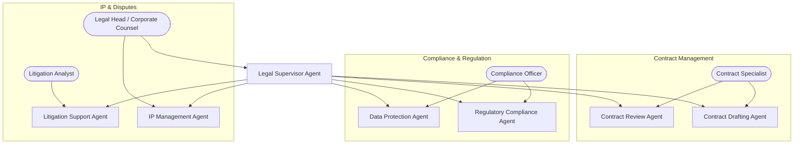

# Multi-Agentic AI Framework — Legal Department

## Unified AI-Assisted Legal Operations Workflow

### Department Overview

The Legal Department leverages AI Agents to handle contract management, regulatory compliance, intellectual property, litigation support, and cross-department legal advisory — ensuring the company operates within all applicable laws and minimizes legal risk.

------------------------------------------------------------------------

# 1. Executive Summary

This framework defines the Multi-Agent AI system for Legal operations. Each agent assists a legal professional in contract lifecycle management, compliance monitoring, IP protection, and dispute resolution while maintaining strict confidentiality and human oversight on all binding decisions.

------------------------------------------------------------------------

# 2. Architecture Overview

## 2.1 High-Level Flow

```
Legal Request → Legal Supervisor Agent → Specialist Agent(s) → Tool Sandbox → Artifact Store → Human Review → Final Approval
```

## 2.2 Core Components

### Orchestration
-   Legal Supervisor Agent (department-level coordinator)
-   Plan JSON (structured task definition)
-   Mandatory Approval Gate (all legal outputs require human sign-off)

### Tools
-   Contract management system (DocuSign API, PandaDoc)
-   Legal research database (Westlaw / local legal DB)
-   Regulatory feed (government gazette API, regulatory RSS)
-   Document comparison engine (diff / redline tools)
-   IP registry (trademark & patent databases)
-   Compliance checklist engine

### Storage
-   Contract repository (S3/MinIO — encrypted at rest)
-   Legal case database (PostgreSQL — isolated schema)
-   Audit trail (immutable log)

------------------------------------------------------------------------

# 3. Department Agent Map



------------------------------------------------------------------------

# 4. Plan JSON Contract

``` json
{
  "goal": "Legal objective",
  "department_id": "legal",
  "constraints": {
    "jurisdiction": "Indonesia",
    "confidentiality": "high",
    "deadline": "ISO date",
    "compliance_mode": "strict"
  },
  "tasks": [
    {
      "id": "L1",
      "owner_agent": "AgentName",
      "input": "document reference or legal query",
      "tools_allowed": [],
      "output_artifact": "artifact name",
      "definition_of_done": "legal review criteria"
    }
  ],
  "risk": [],
  "approval_required": ["all"]
}
```

------------------------------------------------------------------------

# 5. Legal Agent Roles

## Legal Supervisor Agent

-   Triage incoming legal requests across departments
-   Generate Plan JSON for legal workflows
-   Assign specialist agents based on request type
-   Ensure all outputs pass mandatory human review
-   No direct legal advice or document signing

## Contract Drafting Agent

-   Generate contract drafts from templates (NDA, SLA, MSA, employment, vendor)
-   Auto-populate terms from company standard clauses library
-   Multi-language support (Bahasa Indonesia & English)
-   Version tracking and redline generation
-   Clause recommendation based on deal type and risk level

## Contract Review Agent

-   Analyze incoming third-party contracts
-   Flag non-standard, risky, or missing clauses
-   Compare against company's approved terms library
-   Generate risk summary report with recommendations
-   Track contract expiry dates and renewal deadlines

## Regulatory Compliance Agent

-   Monitor regulatory changes (OJK, BKPM, labor law, tax law)
-   Generate compliance impact analysis for new regulations
-   Maintain compliance checklist per department
-   Auto-alert when company practices may violate new regulations
-   Prepare compliance reports for auditors

## Data Protection Agent

-   GDPR / UU PDP (Indonesia data protection) compliance monitoring
-   Data processing agreement (DPA) drafting and review
-   Privacy impact assessment (PIA) generation
-   Data breach notification template preparation
-   Cross-border data transfer compliance checks

## IP Management Agent

-   Track trademark registration status and renewal dates
-   Monitor for potential IP infringement (brand name, logo, content)
-   Patent filing preparation and prior art search
-   License agreement management
-   Domain name portfolio monitoring

## Litigation Support Agent

-   Case summary and timeline generation
-   Evidence organization and document indexing
-   Settlement analysis and recommendation
-   Litigation risk scoring
-   Court filing deadline tracking and reminders

------------------------------------------------------------------------

# 6. Legal RBAC Matrix

  -----------------------------------------------------------------------
  Role              Contract DB   Regulatory   Case Files   Sign/Execute
  ----------------- ------------- ------------ ------------ -------------
  Supervisor        Full Read     Full Read    Full Read    No

  Contract Draft    Templates     No           No           No (Draft Only)

  Contract Review   Full Read     Limited      No           No

  Reg. Compliance   No            Full Read    No           No

  Data Protection   PII Config    Full Read    No           No

  IP Management     No            Limited      No           No

  Litigation        No            No           Full Read    No
  -----------------------------------------------------------------------

**All legal documents require human sign-off before execution.**

------------------------------------------------------------------------

# 7. Quality & Compliance Gates

1.  **Mandatory Human Review Gate** — ALL legal outputs require human review before delivery
2.  **Confidentiality Gate** — Documents classified and access-controlled before storage
3.  **Conflict of Interest Gate** — Auto-check if legal request involves conflicting parties
4.  **Jurisdiction Validation Gate** — Ensure applicable law is correctly identified
5.  **Attorney-Client Privilege Gate** — Mark privileged communications and prevent disclosure

------------------------------------------------------------------------

# 8. Audit Log Structure

``` json
{
  "event_id": "uuid",
  "timestamp": "ISO 8601",
  "agent": "contract_drafting_agent",
  "action": "draft_contract",
  "contract_type": "NDA",
  "input": "template_ref + deal_terms",
  "output": "draft_contract_v1.docx",
  "status": "pending_human_review",
  "reviewed_by": "human_id | null",
  "confidentiality_level": "high",
  "department": "legal"
}
```

------------------------------------------------------------------------

# 9. Deployment Roadmap

| Phase | Weeks | Deliverables |
|-------|-------|-------------|
| **Phase 1** | 1-2 | Legal Supervisor + Contract Drafting Agent |
| **Phase 2** | 3-4 | Contract Review Agent + clause library |
| **Phase 3** | 5-6 | Regulatory Compliance + Data Protection Agents |
| **Phase 4** | 7-8 | IP Management + Litigation Support Agents |

------------------------------------------------------------------------

# 10. Operating Principles

1.  **Human Signs, Agent Drafts** — Agents never execute or sign legal documents. All outputs are drafts requiring human authorization.
2.  **Confidentiality First** — All legal data is encrypted at rest and in transit. Access is strictly role-based.
3.  **No Legal Advice** — Agents assist with research, drafting, and analysis but do not provide legal advice. Final legal judgment is always human.
4.  **Audit Everything** — Every document access, draft, review, and change is logged immutably.
5.  **Cross-Department Service** — Legal agents serve all departments but maintain data isolation between cases.
6.  **Jurisdiction Awareness** — Agents always identify and apply the correct jurisdiction (Indonesia, international) before processing.
