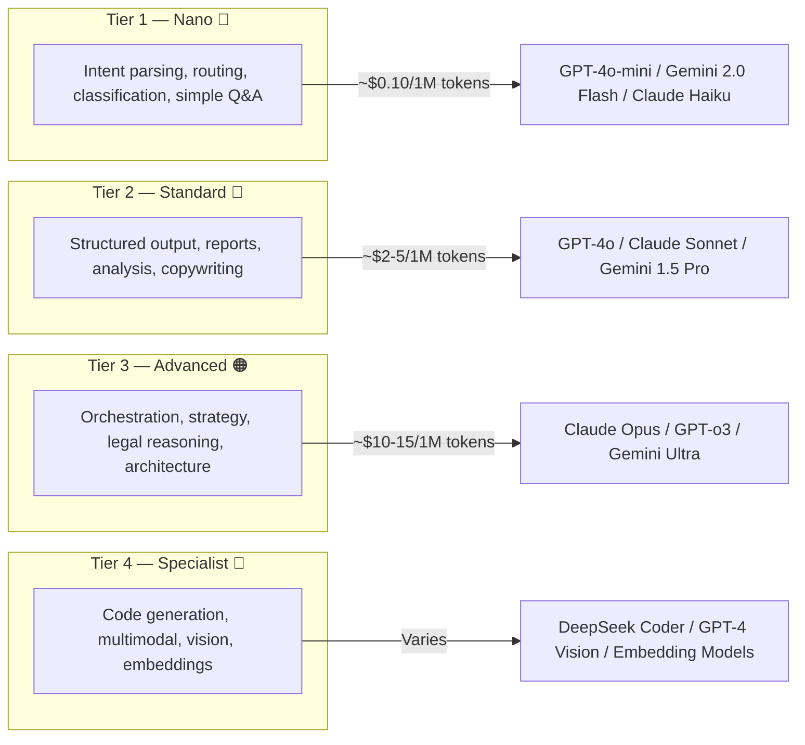

# Model Tier Classification — Cost-Efficient Multi-Model Strategy

## Overview

63 agents don't all need the same model. By classifying tasks into **4 tiers**, we can reduce LLM costs by **58-67%** while maintaining quality where it matters.

> **Router**: LiteLLM Proxy handles dynamic model routing per agent based on this classification.

---

## Model Tiers



---

## Tier 1 — 💚 Nano (Low Cost)

**Model**: GPT-4o-mini / Gemini 2.0 Flash / Claude 3.5 Haiku  
**Cost**: ~$0.10–0.25 / 1M tokens  
**Use**: Simple classification, routing, parsing, FAQ, status checks  

| # | Agent | Department | Task Type |
|---|-------|-----------|-----------| 
| 1 | Communication Agent | Enterprise | Intent parsing, message routing, channel mapping |
| 2 | Scheduling Agent | Enterprise | Calendar slot matching, reminder triggers |
| 3 | Payroll Validation Agent | HR | Anomaly detection on structured payroll data |
| 4 | Benefits Administration Agent | HR | FAQ queries, eligibility lookups |
| 5 | Lead Scoring Agent | Sales | Score calculation from CRM data |
| 6 | Social Media Agent | Marketing | Post scheduling, hashtag lookup, auto-reply FAQ |
| 7 | Content Maker & Editing Agent | Marketing | Prompt generation for image AI, resize commands |
| 8 | IP Management Agent | Legal | Trademark renewal date tracking, domain monitoring |
| 9 | Competitive Intelligence Agent | BizDev | Competitor news monitoring, alert triggers |

**Total: 9 agents (14% of fleet)**

---

## Tier 2 — 💛 Standard (Mid Cost)

**Model**: GPT-4o / Claude 3.5 Sonnet / Gemini 1.5 Pro  
**Cost**: ~$2–5 / 1M tokens  
**Use**: Report generation, structured analysis, content writing, moderate reasoning  

| # | Agent | Department | Task Type |
|---|-------|-----------|-----------| 
| 10 | Accounting Agent | Finance | Ledger reconciliation, transaction reports |
| 11 | Budget Planning Agent | Finance | Budget proposals, variance analysis |
| 12 | Forecasting Agent (Finance) | Finance | Cashflow projection, revenue modeling |
| 13 | Treasury Agent | Finance | Cash position monitoring, liquidity reports |
| 14 | Invoicing Agent | Finance | Invoice generation, AR/AP tracking |
| 15 | Recruitment Agent | HR | CV screening, candidate ranking |
| 16 | Onboarding Agent | HR | Checklist generation, contract drafts |
| 17 | Performance Analytics Agent | HR | KPI aggregation, evaluation summaries |
| 18 | Training & Development Agent | HR | Skill gap analysis, learning recommendations |
| 19 | HR Compliance Agent | HR | Policy enforcement, labor law checks |
| 20 | Deal Intelligence Agent | Sales | Pipeline monitoring, stalled deal detection |
| 21 | Forecasting Agent (Sales) | Sales | Revenue forecast, trend analysis |
| 22 | Pricing Optimization Agent | Sales | Margin analysis, discount risk scoring |
| 23 | Contract Review Agent (Sales) | Sales | Clause validation, compliance check |
| 24 | Content Creator Agent | Marketing | Captions, blog posts, ad copy, A/B copy |
| 25 | Customer Relationship Agent | Marketing | Email campaigns, audience segmentation |
| 26 | Customer Success Agent | Marketing | Renewal tracking, NPS/CSAT scoring |
| 27 | Campaign Analytics Agent | Marketing | ROI calculation, attribution, dashboards |
| 28 | SEO & SEM Agent | Marketing | Keyword research, ranking, bid optimization |
| 29 | Contract Drafting Agent | Legal | NDA/SLA/MSA template-based drafting |
| 30 | Contract Review Agent (Legal) | Legal | Clause risk analysis, term comparison |
| 31 | Data Protection Agent | Legal | GDPR/UU PDP compliance, privacy assessments |
| 32 | Litigation Support Agent | Legal | Case summary, evidence indexing, deadline tracking |
| 33 | Market Research Agent | BizDev | TAM/SAM/SOM analysis, industry trend reports |
| 34 | Partnership Evaluation Agent | BizDev | Due diligence, synergy scoring, ROI projection |
| 35 | Go-to-Market Agent | BizDev | GTM strategy, launch plans, pricing analysis |
| 36 | Business Modeling Agent | BizDev | BMC, financial scenarios, unit economics |
| 37 | Product Analyst Agent | Tech | PRD generation, acceptance criteria |
| 38 | QA Agent | Tech | Test plans, acceptance validation |
| 39 | Technical Writer Agent | Tech | API docs, changelogs, ADRs |
| 40 | Data Engineer Agent | Tech | ETL pipeline design, data quality reports |
| 41 | SRE Agent | Tech | Monitoring summaries, incident postmortems |
| 42 | DevOps Agent | Tech | CI config, deployment prep, rollback plans |

**Total: 33 agents (52% of fleet)**

---

## Tier 3 — 🟠 Advanced (High Cost)

**Model**: Claude 3.5 Opus / GPT-o3 / Gemini Ultra  
**Cost**: ~$10–15 / 1M tokens  
**Use**: Complex multi-step reasoning, orchestration, strategy, legal analysis  

| # | Agent | Department | Task Type |
|---|-------|-----------|-----------| 
| 43 | Global Supervisor | Enterprise | Cross-dept orchestration, escalation, SLA enforcement |
| 44 | Tech Supervisor | Tech | Plan decomposition, risk management, agent coordination |
| 45 | Architect Agent | Tech | HLD/LLD, API contracts, threat modeling |
| 46 | Security Agent | Tech | CVE triage, dependency audit, threat analysis |
| 47 | Finance Supervisor | Finance | Plan JSON generation, compliance gates |
| 48 | Audit Agent | Finance | Internal audit simulation, control gap analysis |
| 49 | Risk & Compliance Agent | Finance | Regulatory checks, fraud risk scoring |
| 50 | Tax Agent | Finance | Tax calculation, filing prep, regulatory mapping |
| 51 | HR Supervisor | HR | Workflow decomposition, labor compliance |
| 52 | Sales Supervisor | Sales | Revenue strategy decomposition, target alignment |
| 53 | Marketing Supervisor | Marketing | Campaign orchestration, brand compliance |
| 54 | Legal Supervisor | Legal | Triage legal requests, assign specialists, mandatory review |
| 55 | Regulatory Compliance Agent | Legal | Monitor OJK/BKPM/labor law, compliance impact analysis |
| 56 | BizDev Supervisor | BizDev | Decompose strategic initiatives, coordinate cross-dept |
| 57 | Strategic Planning Agent | BizDev | OKR cascading, roadmaps, board deck preparation |

**Total: 15 agents (24% of fleet)**

---

## Tier 4 — 🔴 Specialist (Domain-Specific)

**Mixed models** optimized for specific capabilities:

| # | Agent | Department | Model Type | Recommended |
|---|-------|-----------|-----------|-------------|
| 58 | Backend Engineer Agent | Tech | **Code Generation** | DeepSeek Coder V2 / Claude Sonnet (code) |
| 59 | Frontend Engineer Agent | Tech | **Code Generation** | DeepSeek Coder V2 / Claude Sonnet (code) |
| 60 | Content Maker & Editing Agent | Marketing | **Vision / Image** | GPT-4 Vision + DALL-E 3 / Midjourney |

**Supporting Models (no agent, used by infrastructure):**

| Model Type | Use Case | Recommended |
|-----------|----------|-------------|
| **Embedding Model** | RAG knowledge base, semantic search | `text-embedding-3-small` / `nomic-embed-text` |
| **Reranker Model** | RAG result quality improvement | `bge-reranker-v2` / Cohere Rerank |
| **Speech-to-Text** | Voice message processing (WhatsApp) | Whisper / Deepgram |

**Total: 3 agents (5%) + 3 infrastructure models**

> **Note**: Content Maker & Editing Agent appears in both Nano (text commands) and Specialist (vision/image tasks). LiteLLM dynamically routes based on input type.

---

## Cost Estimation (Monthly)

| Tier | Agents | Avg Tokens/Agent/Day | Cost/1M Tokens | Monthly Cost |
|------|--------|---------------------|---------------|-------------|
| 💚 Nano | 9 | ~500K | $0.15 | **~$20** |
| 💛 Standard | 33 | ~200K | $3.50 | **~$693** |
| 🟠 Advanced | 15 | ~100K | $12.00 | **~$540** |
| 🔴 Specialist | 3 | ~300K | $5.00 | **~$135** |
| Embedding | — | ~2M (total) | $0.02 | **~$1** |
| **Total** | **63** | | | **~$1,389/mo** |

> **vs All-Advanced**: Using Tier 3 for everything = ~$4,536/mo → **69% savings** with tiered approach.

---

## LiteLLM Routing Configuration

```yaml
# litellm_config.yaml
model_list:
  # Tier 1 — Nano
  - model_name: nano
    litellm_params:
      model: openai/gpt-4o-mini
      api_key: os.environ/OPENAI_API_KEY
    model_info:
      tier: 1
      max_tokens: 16384

  # Tier 2 — Standard
  - model_name: standard
    litellm_params:
      model: anthropic/claude-3-5-sonnet-20241022
      api_key: os.environ/ANTHROPIC_API_KEY
    model_info:
      tier: 2
      max_tokens: 8192

  # Tier 3 — Advanced (with fallback)
  - model_name: advanced
    litellm_params:
      model: anthropic/claude-3-opus-20240229
      api_key: os.environ/ANTHROPIC_API_KEY
    model_info:
      tier: 3
      max_tokens: 4096
  - model_name: advanced
    litellm_params:
      model: openai/o3-mini
      api_key: os.environ/OPENAI_API_KEY
    model_info:
      tier: 3
      max_tokens: 4096

  # Tier 4 — Code
  - model_name: code
    litellm_params:
      model: deepseek/deepseek-coder
      api_key: os.environ/DEEPSEEK_API_KEY
    model_info:
      tier: 4
      max_tokens: 16384

  # Tier 4 — Vision
  - model_name: vision
    litellm_params:
      model: openai/gpt-4o
      api_key: os.environ/OPENAI_API_KEY
    model_info:
      tier: 4
      max_tokens: 4096

  # Embedding
  - model_name: embedding
    litellm_params:
      model: openai/text-embedding-3-small
      api_key: os.environ/OPENAI_API_KEY

# Router settings
router_settings:
  routing_strategy: cost-based  # minimize cost
  num_retries: 2
  fallbacks:
    - advanced: [standard]      # if advanced fails, try standard
    - standard: [nano]          # if standard fails, try nano
```

---

## Agent-to-Model Mapping Table

```yaml
# agent_model_map.yaml
agent_models:
  # Enterprise (3 agents)
  global_supervisor:        advanced
  scheduling_agent:         nano
  communication_agent:      nano

  # Tech (11 agents)
  tech_supervisor:          advanced
  product_analyst:          standard
  architect:                advanced
  backend_engineer:         code
  frontend_engineer:        code
  qa_agent:                 standard
  devops_agent:             standard
  sre_agent:                standard
  security_agent:           advanced
  data_engineer:            standard
  technical_writer:         standard

  # Finance (9 agents)
  finance_supervisor:       advanced
  budget_planning:          standard
  accounting:               standard
  forecasting_fin:          standard
  audit:                    advanced
  risk_compliance:          advanced
  treasury:                 standard
  invoicing:                standard
  tax:                      advanced

  # HR (8 agents)
  hr_supervisor:            advanced
  recruitment:              standard
  onboarding:               standard
  payroll_validation:       nano
  performance_analytics:    standard
  hr_compliance:            standard
  training_development:     standard
  benefits_admin:           nano

  # Sales (6 agents)
  sales_supervisor:         advanced
  lead_scoring:             nano
  deal_intelligence:        standard
  forecasting_sales:        standard
  pricing_optimization:     standard
  contract_review_sales:    standard

  # Marketing (8 agents)
  marketing_supervisor:     advanced
  content_creator:          standard
  content_maker_editing:    vision
  social_media:             nano
  customer_relationship:    standard
  customer_success:         standard
  campaign_analytics:       standard
  seo_sem:                  standard

  # Legal (7 agents)
  legal_supervisor:         advanced
  contract_drafting:        standard
  contract_review_legal:    standard
  regulatory_compliance:    advanced
  data_protection:          standard
  ip_management:            nano
  litigation_support:       standard

  # BizDev (7 agents)
  bizdev_supervisor:        advanced
  market_research:          standard
  competitive_intelligence: nano
  partnership_evaluation:   standard
  go_to_market:             standard
  business_modeling:        standard
  strategic_planning:       advanced
```

---

## Summary

| Tier | Models | Agents | % Fleet | Cost Share |
|------|--------|--------|---------|-----------| 
| 💚 Nano | GPT-4o-mini, Gemini Flash, Haiku | 9 | 14% | ~1% |
| 💛 Standard | GPT-4o, Claude Sonnet, Gemini Pro | 33 | 52% | ~50% |
| 🟠 Advanced | Claude Opus, GPT-o3, Gemini Ultra | 15 | 24% | ~39% |
| 🔴 Specialist | DeepSeek Coder, GPT-4V, DALL-E 3 | 3 | 5% | ~10% |
| **Total** | **4 tiers + 3 infra models** | **63** | **100%** | **~$1,389/mo** |
