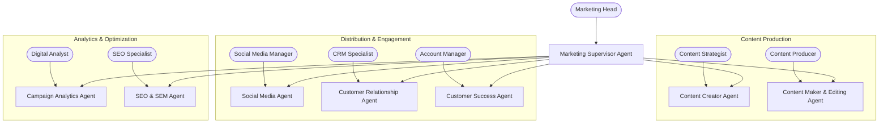

# Multi-Agentic AI Framework — Digital Marketing Department

## Unified AI-Assisted Digital Marketing Workflow

### Department Overview

The Digital Marketing Department leverages AI Agents to manage brand presence, content production, audience engagement, and customer relationships across all digital channels.

------------------------------------------------------------------------

# 1. Executive Summary

This framework defines the Multi-Agent AI system for Digital Marketing operations. Each agent assists one human marketer, handling content creation, social media management, audience analytics, customer engagement, and campaign optimization while the human retains full creative and strategic control.

------------------------------------------------------------------------

# 2. Architecture Overview

## 2.1 High-Level Flow

```
User Request → Marketing Supervisor Agent → Specialist Agent(s) → Tool Sandbox → Artifact Store → Human Review
```

## 2.2 Core Components

### Orchestration
-   Marketing Supervisor Agent (department-level coordinator)
-   Plan JSON (structured task definition)
-   Approval Gate (human review before publishing)

### Tools
-   Social media APIs (Instagram, TikTok, X, LinkedIn, Facebook)
-   Content management system (WordPress, Webflow)
-   Canva API / Figma API (design assets)
-   Video editing tools (CapCut API, FFmpeg)
-   Analytics platforms (Google Analytics, Meta Business Suite)
-   CRM system (HubSpot, Salesforce)
-   Email marketing (Mailchimp, SendGrid)
-   SEO tools (Ahrefs, SEMrush API)

### Storage
-   Content asset library (S3/MinIO)
-   Campaign database (PostgreSQL)
-   Analytics data warehouse

------------------------------------------------------------------------

# 3. Department Agent Map



------------------------------------------------------------------------

# 4. Plan JSON Contract

``` json
{
  "goal": "Marketing objective",
  "department_id": "marketing",
  "constraints": {
    "campaign": "campaign_name",
    "platform": ["instagram", "tiktok", "linkedin"],
    "budget_limit": 0,
    "brand_guidelines": "reference_doc",
    "compliance": "standard"
  },
  "tasks": [
    {
      "id": "M1",
      "owner_agent": "AgentName",
      "input": "artifact reference or brief",
      "tools_allowed": [],
      "output_artifact": "artifact name",
      "definition_of_done": "measurable marketing outcome"
    }
  ],
  "risk": [],
  "approval_required": []
}
```

------------------------------------------------------------------------

# 5. Marketing Agent Roles

## Marketing Supervisor Agent

-   Break down marketing campaigns into agent tasks
-   Generate Plan JSON
-   Assign agents based on channel & expertise
-   Ensure brand guideline compliance
-   No direct content publishing

## Content Creator Agent

-   Generate content ideas based on trends & audience data
-   Write captions, blog posts, newsletter copy, ad copy
-   Create content calendars (weekly/monthly)
-   A/B test copy variations
-   Adapt content per platform (Instagram vs LinkedIn vs TikTok)

## Content Maker & Editing Agent

-   Generate image assets using AI (DALL-E, Midjourney prompts)
-   Edit and resize visuals for each platform format
-   Basic video editing (trim, subtitle, transitions via CapCut/FFmpeg)
-   Create carousel designs and infographics
-   Apply brand kit (fonts, colors, logo placement)
-   Export in correct format per platform (1080x1080, 9:16, 16:9)

## Social Media Agent

-   Schedule posts across all platforms (Instagram, TikTok, X, LinkedIn, Facebook)
-   Monitor mentions, comments, DMs across channels
-   Generate engagement reports (reach, impressions, likes, shares)
-   Identify trending hashtags & optimal posting times
-   Flag negative sentiment or PR risks for human review
-   Auto-respond to common queries (FAQ-based)

## Customer Relationship Agent

-   Manage customer interactions across email, chat, social DM
-   Track customer journey touchpoints
-   Segment audiences by behavior, purchase history, engagement
-   Trigger personalized email campaigns (welcome, re-engagement, birthday)
-   Monitor NPS/CSAT scores and flag declining satisfaction
-   Coordinate with Sales for lead handoff

## Campaign Analytics Agent *(Recommended)*

-   Track campaign performance across all channels in real-time
-   ROI calculation per campaign & per channel
-   Attribution modeling (first-touch, last-touch, multi-touch)
-   Competitor analysis & benchmarking
-   Generate weekly performance dashboards
-   Budget pacing alerts (spend vs target)

## SEO & SEM Agent *(Recommended)*

-   Keyword research & ranking tracking
-   On-page SEO audit (meta tags, headings, alt text)
-   Backlink monitoring & outreach recommendations
-   Google Ads campaign management & bid optimization
-   Search console data analysis
-   Content gap analysis (what competitors rank for)

## Customer Success Agent

-   Post-sale customer onboarding support
-   Renewal tracking & churn prediction
-   Customer satisfaction scoring (NPS/CSAT)
-   Upsell / cross-sell opportunity detection
-   Coordinate with Sales for revenue-impacting accounts

------------------------------------------------------------------------

# 6. Marketing RBAC Matrix

  -----------------------------------------------------------------------
  Role              CMS Access   Social API   Analytics   Budget   Publish
  ----------------- ------------ ------------ ----------- -------- ---------
  Supervisor        Yes          No           Yes         View     No

  Content Creator   Yes          No           Limited     No       Draft Only

  Content Maker     Assets Only  No           No          No       No

  Social Media      No           Yes          Yes         No       With Gate

  Customer Rel.     CRM Only     DM Only      Limited     No       No

  Campaign Anal.    No           No           Full        View     No

  SEO & SEM         Yes          No           Full        Limited  No

  Customer Succ.    CRM Only     No           Limited     No       No
  -----------------------------------------------------------------------

All content publishing requires human approval gate.

------------------------------------------------------------------------

# 7. Quality & Compliance Gates

1.  **Brand Review Gate** — All content checked against brand guidelines before publishing
2.  **Legal Compliance Gate** — Ad copy reviewed for regulatory compliance (FTC, local advertising laws)
3.  **PII Protection Gate** — Customer data anonymized before analytics processing
4.  **Budget Approval Gate** — Any paid campaign > threshold requires CFO/Marketing Head approval
5.  **Sentiment Risk Gate** — Negative sentiment alerts trigger immediate human review

------------------------------------------------------------------------

# 8. Audit Log Structure

``` json
{
  "event_id": "uuid",
  "timestamp": "ISO 8601",
  "agent": "social_media_agent",
  "action": "schedule_post",
  "platform": "instagram",
  "input": "content_calendar_ref",
  "output": "scheduled_post_id",
  "status": "pending_approval | published | rejected",
  "approved_by": "human_id | null",
  "cost": 0.00,
  "department": "marketing"
}
```

------------------------------------------------------------------------

# 9. Deployment Roadmap

| Phase | Weeks | Deliverables |
|-------|-------|-------------|
| **Phase 1** | 1-2 | Marketing Supervisor + Content Creator Agent |
| **Phase 2** | 3-4 | Social Media Agent + platform API integrations |
| **Phase 3** | 5-6 | Content Maker & Editing Agent + asset pipeline |
| **Phase 4** | 7-8 | Customer Relationship Agent + CRM integration |
| **Phase 5** | 9-10 | Campaign Analytics + SEO/SEM Agents |

------------------------------------------------------------------------

# 10. Operating Principles

1.  **Human Publishes, Agent Drafts** — Agents never publish content directly. All content enters an approval queue for human review.
2.  **Brand First** — Every asset must pass brand guideline validation before reaching approval queue.
3.  **Data Privacy** — PII is masked in all analytics. Customer data is accessed via CRM API only, never stored locally by agents.
4.  **Platform Compliance** — Agents enforce platform-specific rules (character limits, aspect ratios, ad policies).
5.  **Audit Everything** — Every post, edit, campaign change, and customer interaction is logged to the immutable audit ledger.
6.  **Human-in-the-Loop for Sensitive Topics** — Any content involving crisis management, legal claims, or competitor mentions requires mandatory human approval regardless of risk level.
7.  **Budget Awareness** — Agents track ad spend in real-time and auto-pause campaigns if budget threshold is reached.
