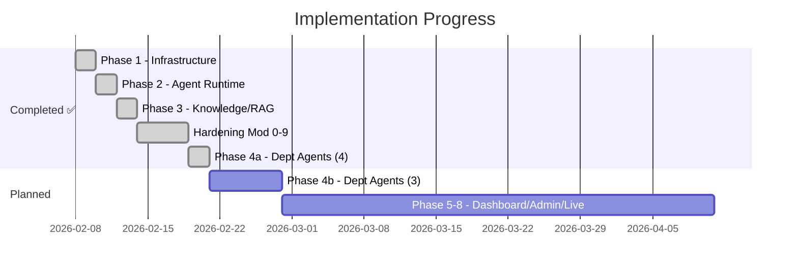
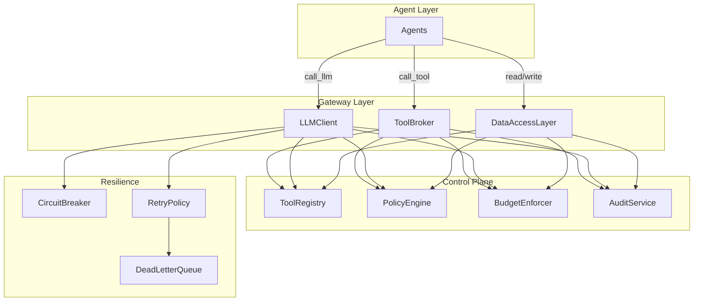

# 📊 Project Progress Report
## Multi-Agentic AI Enterprise OS

**Last Updated**: 12 Feb 2026  
**Status**: Phase 1-3 ✅ | Hardening 100% ✅ | Phase 4a Department Agents ✅ (34 agents, 25 tools)

---

## 🏗️ Overall Progress



| Phase | Status | Scope |
|-------|--------|-------|
| **Phase 1** | ✅ Done | Infrastructure, Auth, DB, API skeleton |
| **Phase 2** | ✅ Done | Agent runtime, LangGraph supervisor, audit |
| **Phase 3** | ✅ Done | RAG pipeline, pgvector, agent memory |
| **Hardening 0-9** | ✅ Done | Chokepoint, ABAC, Contracts, Audit, Tracing, Budget, Resilience, Workflow, Tests |
| **Phase 4a** | ✅ Done | 4 departments: Tech (11), Finance (9), HR (8), Sales (6) — 34 agents, 25 tools |
| **Phase 4b** | ⬜ | 3 departments: Operations, Legal, Marketing |
| **Phase 5-8** | ⬜ | Dashboard, Admin, Testing, Go Live |

---

## ✅ Phase 1: Core Infrastructure

### Docker Stack (5 Containers)
| Service | Image | Port | Status |
|---------|-------|------|--------|
| PostgreSQL + pgvector | `pgvector/pgvector:pg16` | 5432 | ✅ Healthy |
| Redis | `redis:7-alpine` | 6379 | ✅ Healthy |
| LiteLLM Proxy | `litellm:main-latest` | 4000 | ✅ Running |
| FastAPI App | `company_ai-app` | 8000 | ✅ Running |
| Celery Worker | `company_ai-worker` | — | ✅ Running |

### Authentication & Security
- JWT + OAuth2 (register, login)
- Role-based access (admin, contributor)
- Password hashing (bcrypt via passlib)

### Database (5 tables)
| Table | Purpose |
|-------|---------|
| `users` | User accounts + departments |
| `agents` | Agent registry (name, tier, department) |
| `tasks` | Task queue with priority + status |
| `audit_log` | Immutable action log + cost tracking |
| `knowledge_documents` | RAG document chunks + pgvector embeddings |

### API Endpoints (20 live)
- 🔐 **Auth** (2) — register, login
- 🤖 **Agents** (5) — CRUD + stats
- 📋 **Tasks** (4) — CRUD + status update
- ⚡ **Execution** (5) — execute, chat, audit, costs
- 📚 **Knowledge** (4) — ingest, search, list, delete
- ❤️ **Health** (1) — system check

---

## ✅ Phase 2: Agent Runtime

- **LangGraph Supervisor** — Global → Department → Agent routing
- **BaseAgent** — LiteLLM model selection, rate limiting, loop detection, token budget
- **Audit Service** — Immutable logging, cost tracking, department/agent filtering
- **Agent Executor** — Graph invocation, RAG injection, memory persistence

---

## ✅ Phase 3: Knowledge & RAG

- **Document Ingestion** — Text → chunk (500 tokens) → embed (OpenAI) → pgvector
- **Semantic Search** — Cosine similarity, department-scoped, configurable top-k
- **Agent Memory** — Session (Redis 24h TTL) + Long-term (pgvector permanent)
- **Pipeline Integration** — RAG context auto-injected before agent execution

---

## ✅ Architecture Hardening — Phase 3.5 (All 10 Modules Complete)

> Production-grade security built on **Single Chokepoint** principle. **+2,579 lines of control plane code across 11 files.**

### Architecture



### Module Completion Status

> Modules 0-9 below correspond to **Phase 3.5.0–3.5.9** in [IMPLEMENTATION_ROADMAP.md](file:///c:/Users/sarif/Documents/project_antigravity/company_AI/IMPLEMENTATION_ROADMAP.md).

| # | Module | Status | Key Files |
|---|--------|--------|-----------|
| 0 | **Single Chokepoint** | ✅ Done | `core/llm_client.py`, `core/tool_broker.py`, `core/data_access.py` |
| 1 | **Tool Registry** | ✅ Done | `core/tool_registry.py`, `core/sandbox.py` |
| 2 | **ABAC Policy Engine** | ✅ Done | `core/policy_engine.py`, `core/resource_classification.py`, `policies/default.yaml` |
| 3 | **Agent Contracts** | ✅ Done | `agents/contracts.py`, `core/approval_gate.py` |
| 4 | **Audit Hash Chain** | ✅ Done | `models/audit.py` (+12 cols), `services/audit_service.py` |
| 5 | **Observability** | ✅ Done | `core/tracing.py`, `core/metrics.py` |
| 6 | **Atomic Budget** | ✅ Done | `core/budget.py` (Redis Lua scripts) |
| 7 | **Resilience** | ✅ Done | `core/resilience.py` |
| 8 | **Reference Workflow** | ✅ Done | `agents/workflows/finance_invoice.py`, `api/v1/workflows.py` |
| 9 | **Test Suite** | ✅ Done | `tests/test_golden_tasks.py`, `test_policies.py`, `test_pii.py`, `test_chaos.py`, `test_static.py` |

---

## ✅ Phase 4a: Department Agents (34 Agents, 25 Tools)

| Department | Agents | Tools | Key Capabilities |
|-----------|--------|-------|-------------------|
| **Tech** | 11 | 10 | PRD, HLD/LLD, code gen, CI/CD, monitoring, security scan |
| **Finance** | 9 | 5 | Accounting, budget, forecasting, audit, tax (PPh/PPN) |
| **HR** | 8 | 5 | Recruitment, payroll, compliance (UU Ketenagakerjaan), BPJS |
| **Sales** | 6 | 5 | Lead scoring, deal intel, pricing, contract review |

```
backend/app/agents/departments/
├── tech/       (supervisor, product_analyst, architect, backend_engineer,
│               frontend_engineer, qa, devops, sre, security,
│               data_engineer, technical_writer, tools)
├── finance/    (supervisor, accounting, budget_planning, forecasting,
│               audit, risk_compliance, treasury, invoicing, tax, tools)
├── hr/         (supervisor, recruitment, onboarding, payroll, performance,
│               compliance, training, benefits, tools)
└── sales/      (supervisor, lead_scoring, deal_intelligence,
                sales_forecasting, pricing, contract_review, tools)
```

---

## 📁 Current Codebase (~95 Python files)

```
backend/app/
├── main.py, worker.py, seed.py
├── core/     (16 files: config, deps, security, policy_engine, resource_classification,
│             approval_gate, tracing, metrics, budget, resilience,
│             llm_client, tool_broker, data_access, tool_registry, sandbox)
├── models/   (user, agent, task, audit (+12 hash chain cols), knowledge, base)
├── schemas/  (auth, agent, task, execution, knowledge)
├── api/v1/   (router, auth, agents, tasks, execution, knowledge, health, workflows)
├── agents/   (state, base_agent, supervisor, contracts, workflows/)
│   └── departments/  (43 files: tech/, finance/, hr/, sales/)
└── services/ (agent_executor, audit_service, knowledge_service, memory_service)
backend/policies/
└── default.yaml  (8 ABAC rules)
backend/tests/  (5 test files, ~65 tests)
```

---

## 🧪 E2E Test Results (10/10 ✅)

| Test | Status |
|------|--------|
| Health check (DB + Redis) | ✅ |
| User registration + JWT | ✅ |
| Create/List agents | ✅ |
| Create/List tasks | ✅ |
| Knowledge ingest (chunk + embed + pgvector) | ✅ |
| Semantic search | ✅ |
| Agent stats | ✅ |

---

## 🔗 Git History
| Commit | Description |
|--------|-------------|
| `945f239` | Phase 4a complete — all 4 departments in IMPLEMENTATION_ROADMAP |
| `98ee376` | Merge Sales Department (6 agents + 5 tools) |
| `564b688` | Merge HR Department (8 agents + 5 tools) |
| `b501300` | Merge Finance Department (9 agents + 5 tools) |
| `ba45278` | Merge Tech Department (11 agents + 10 tools) |
| `be3332d` | Architecture Hardening Modules 0-7 (+2,579 lines, 11 files) |
| `9fe47a8` | Add Project Progress Report |
| `8d7fec1` | Fix embedding model alias |
| `6397327` | Fix email-validator + knowledge DI |
