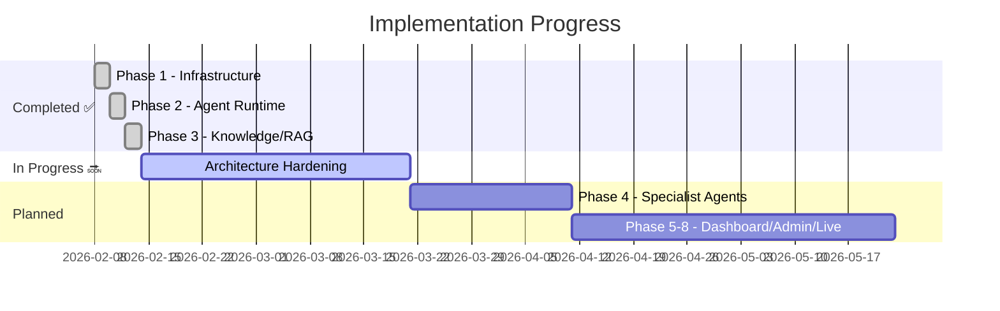
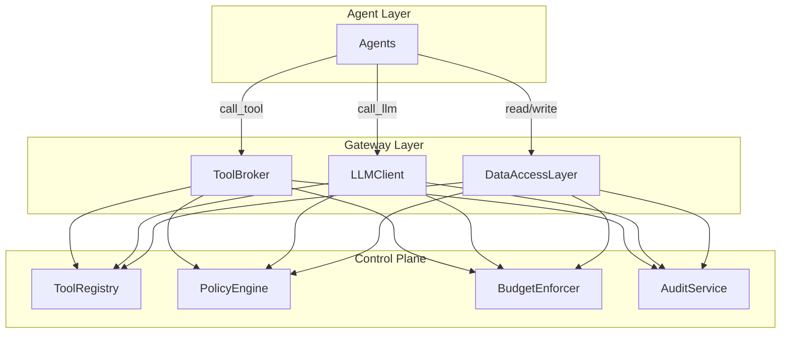

# 📊 Project Progress Report
## Multi-Agentic AI Enterprise OS

**Last Updated**: 12 Feb 2026  
**Status**: Phase 1-3 Complete ✅ | Architecture Hardening Planned 🔜

---

## 🏗️ Overall Progress



| Phase | Status | Scope |
|-------|--------|-------|
| **Phase 1** | ✅ Done | Infrastructure, Auth, DB, API skeleton |
| **Phase 2** | ✅ Done | Agent runtime, LangGraph supervisor, audit |
| **Phase 3** | ✅ Done | RAG pipeline, pgvector, agent memory |
| **Hardening** | 🔜 Next | Single Chokepoint, ABAC, Hash Chain Audit, Budget |
| **Phase 4** | ⬜ | 7 department specialist agents (63 total) |
| **Phase 5-8** | ⬜ | Dashboard, Admin, Testing, Go Live |

---

## ✅ Phase 1: Core Infrastructure

### Docker Stack (5 Containers)
| Service | Image | Port | Status |
|---------|-------|------|--------|
| PostgreSQL + pgvector | `pgvector/pgvector:pg16` | 5432 | ✅ Healthy |
| Redis | `redis:7-alpine` | 6379 | ✅ Healthy |
| LiteLLM Proxy | `litellm:main-latest` | 4000 | ✅ Running |
| FastAPI App | `company_ai-app` | 8000 | ✅ Running |
| Celery Worker | `company_ai-worker` | — | ✅ Running |

### Authentication & Security
- JWT + OAuth2 (register, login)
- Role-based access (admin, contributor)
- Password hashing (bcrypt via passlib)

### Database (5 tables)
| Table | Purpose |
|-------|---------|
| `users` | User accounts + departments |
| `agents` | Agent registry (name, tier, department) |
| `tasks` | Task queue with priority + status |
| `audit_log` | Immutable action log + cost tracking |
| `knowledge_documents` | RAG document chunks + pgvector embeddings |

### API Endpoints (20 live)
- 🔐 **Auth** (2) — register, login
- 🤖 **Agents** (5) — CRUD + stats
- 📋 **Tasks** (4) — CRUD + status update
- ⚡ **Execution** (5) — execute, chat, audit, costs
- 📚 **Knowledge** (4) — ingest, search, list, delete
- ❤️ **Health** (1) — system check

---

## ✅ Phase 2: Agent Runtime

- **LangGraph Supervisor** — Global → Department → Agent routing
- **BaseAgent** — LiteLLM model selection, rate limiting, loop detection, token budget
- **Audit Service** — Immutable logging, cost tracking, department/agent filtering
- **Agent Executor** — Graph invocation, RAG injection, memory persistence

---

## ✅ Phase 3: Knowledge & RAG

- **Document Ingestion** — Text → chunk (500 tokens) → embed (OpenAI) → pgvector
- **Semantic Search** — Cosine similarity, department-scoped, configurable top-k
- **Agent Memory** — Session (Redis 24h TTL) + Long-term (pgvector permanent)
- **Pipeline Integration** — RAG context auto-injected before agent execution

---

## 🔜 Architecture Hardening Plan

> Production-grade security built on **Single Chokepoint** principle.

### Architecture



### 9 Modules Planned (26 files)

| # | Module | Key Deliverables |
|---|--------|-----------------|
| 0 | **Single Chokepoint** | LLMClient, ToolBroker, DataAccessLayer — 3 mandatory gateways |
| 1 | **Tool Registry** | Static allowlist, sandbox, network egress control |
| 2 | **ABAC Policy Engine** | Policy rules (YAML), PII protection, field masking |
| 3 | **Agent Contracts** | AgentInputSchema, AgentOutputSchema, ApprovalGate, IdempotencyGuard |
| 4 | **Audit Hash Chain** | Event-sourcing, SHA-256 chain, tamper detection |
| 5 | **Observability** | Trace IDs (end-to-end), metrics, admin dashboard |
| 6 | **Atomic Budget** | Redis Lua reservation, concurrency-safe, soft/hard limits |
| 7 | **Resilience** | Retry taxonomy, DLQ, circuit breaker, idempotent side-effects |
| 8 | **Reference Workflow** | Finance invoice: draft → review → approval → finalize |

### Definition of Done
- ✅ All tool/LLM/DB calls through gateways only
- ✅ Unknown tools 100% denied + audited
- ✅ PII requires ticket + approval (enforced by DAL)
- ✅ Hash chain per trace verifiable
- ✅ `trace_id` in request, response, logs, audit, queue
- ✅ Budget atomic under concurrency (100 parallel test)
- ✅ Retry + DLQ + no duplicate side-effects
- ✅ No `import requests/httpx/psycopg` in `agents/` (CI enforced)

---

## 📁 Current Codebase (39 Python files)

```
backend/app/
├── main.py, worker.py, seed.py
├── core/     (config, deps, security)
├── models/   (user, agent, task, audit, knowledge, base)
├── schemas/  (auth, agent, task, execution, knowledge)
├── api/v1/   (router, auth, agents, tasks, execution, knowledge, health)
├── agents/   (state, base_agent, supervisor)
└── services/ (agent_executor, audit_service, knowledge_service, memory_service)
```

---

## 🧪 E2E Test Results (10/10 ✅)

| Test | Status |
|------|--------|
| Health check (DB + Redis) | ✅ |
| User registration + JWT | ✅ |
| Create/List agents | ✅ |
| Create/List tasks | ✅ |
| Knowledge ingest (chunk + embed + pgvector) | ✅ |
| Semantic search | ✅ |
| Agent stats | ✅ |

---

## 🔗 Git History
| Commit | Description |
|--------|-------------|
| `9fe47a8` | Add Project Progress Report |
| `8d7fec1` | Fix embedding model alias |
| `6397327` | Fix email-validator + knowledge DI |
