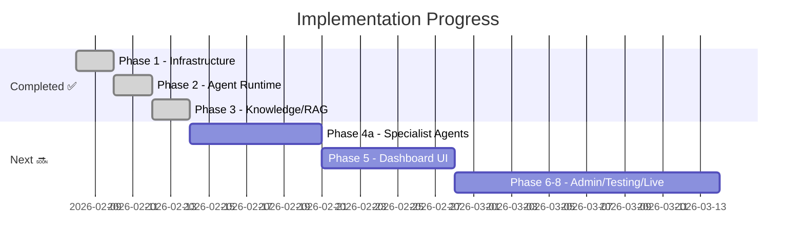

# 📊 Project Progress Report
## Multi-Agentic AI Enterprise OS

**Last Updated**: 12 Feb 2026  
**Status**: Phase 1-3 Complete ✅ | Phase 4 Next

---

## 🏗️ Overall Progress



| Phase | Status | Fitur |
|-------|--------|-------|
| **Phase 1** | ✅ Done | Infrastructure, Auth, DB, API skeleton |
| **Phase 2** | ✅ Done | Agent runtime, LangGraph supervisor, audit |
| **Phase 3** | ✅ Done | RAG pipeline, pgvector, agent memory |
| **Phase 4** | 🔜 Next | 7 department specialist agents (63 total) |
| **Phase 5** | ⬜ | Dashboard UI (Next.js) |
| **Phase 6** | ⬜ | Admin governance |
| **Phase 7** | ⬜ | Testing & security |
| **Phase 8** | ⬜ | WhatsApp/Email integration, Go Live |

---

## ✅ Phase 1: Core Infrastructure

### Docker Stack (5 Containers)
| Service | Image | Port |
|---------|-------|------|
| PostgreSQL + pgvector | `pgvector/pgvector:pg16` | 5432 |
| Redis | `redis:7-alpine` | 6379 |
| LiteLLM Proxy | `litellm:main-latest` | 4000 |
| FastAPI App | `company_ai-app` | 8000 |
| Celery Worker | `company_ai-worker` | — |

### Authentication System
- JWT + OAuth2 (register, login, token refresh)
- Role-based access (admin, contributor)
- Password hashing (bcrypt via passlib)

### Database Models (5 tables)
| Table | Purpose |
|-------|---------|
| `users` | User accounts + departments |
| `agents` | Agent registry (name, tier, department) |
| `tasks` | Task queue with priority + status |
| `audit_log` | Immutable action log + cost tracking |
| `knowledge_documents` | RAG document chunks + pgvector embeddings |

### API Endpoints (20 endpoints)

#### 🔐 Auth (`/api/v1/auth`)
| Method | Path | Description |
|--------|------|-------------|
| POST | `/register` | Register new user |
| POST | `/login` | Login, get JWT token |

#### 🤖 Agents (`/api/v1/agents`)
| Method | Path | Description |
|--------|------|-------------|
| GET | `/` | List all agents |
| POST | `/` | Create agent (auth required) |
| GET | `/{agent_id}` | Get agent details |
| PATCH | `/{agent_id}` | Update agent config |
| GET | `/stats/summary` | Agent stats by dept/tier |

#### 📋 Tasks (`/api/v1/tasks`)
| Method | Path | Description |
|--------|------|-------------|
| GET | `/` | List tasks (filter by dept/status) |
| POST | `/` | Submit new task |
| GET | `/{task_id}` | Get task details |
| PATCH | `/{task_id}/status` | Update task status |

#### ⚡ Execution (`/api/v1/execution`)
| Method | Path | Description |
|--------|------|-------------|
| POST | `/execute` | Execute task via LangGraph pipeline |
| POST | `/chat` | Chat with agent (session memory) |
| GET | `/audit/{agent}` | Agent audit trail |
| GET | `/audit/department/{dept}` | Department audit trail |
| GET | `/costs` | Cost summary |

#### 📚 Knowledge (`/api/v1/knowledge`) — Phase 3
| Method | Path | Description |
|--------|------|-------------|
| POST | `/ingest` | Ingest document → chunk → embed → store |
| POST | `/search` | Semantic search via pgvector |
| GET | `/documents` | List all documents |
| DELETE | `/{doc_id}` | Delete document + chunks |

---

## ✅ Phase 2: Agent Runtime

### LangGraph Supervisor Pattern
- **GlobalSupervisor**: Routes tasks to department supervisors
- **DepartmentSupervisor**: Assigns tasks to agents within department
- Two-tier orchestration: Global → Department → Agent

### BaseAgent Class
- LiteLLM model selection by tier (nano/standard/advanced)
- Rate limiting per agent
- Loop detection (auto-pause after 5 same-tool calls)
- Token budget enforcement
- Max execution time (10 min default)

### Audit Service
- Immutable logging (append-only)
- Cost tracking per action
- Department/agent filtering
- Cost summary aggregation

### Agent Executor
- LangGraph graph invocation
- RAG context injection before execution
- Long-term memory saving after completion
- Session memory for chat continuity

---

## ✅ Phase 3: Knowledge & RAG Pipeline

### Document Ingestion Flow
```
Document → Chunking (500 tokens, 50 overlap)
         → Embedding (OpenAI text-embedding-3-small via LiteLLM)
         → pgvector Storage (Vector 1536 dims)
```

### Semantic Search
- Cosine similarity via pgvector `<=>` operator
- Department-scoped filtering
- Document type filtering
- Configurable top-k results (default: 5)

### Agent Memory
| Type | Backend | TTL |
|------|---------|-----|
| Session memory | Redis | 24 hours |
| Long-term memory | pgvector | Permanent |

### Pipeline Integration
- `retrieve_context` node in LangGraph supervisor graph
- RAG context auto-injected before agent execution
- Key decisions saved to knowledge base after task completion

---

## 📁 Codebase Structure (39 Python files)

```
backend/
├── app/
│   ├── main.py                    # FastAPI app entry
│   ├── worker.py                  # Celery worker
│   ├── seed.py                    # DB seed script
│   ├── core/
│   │   ├── config.py              # Settings (Pydantic)
│   │   ├── deps.py                # DI (DB session, auth)
│   │   └── security.py            # JWT, password hashing
│   ├── models/
│   │   ├── user.py                # User model
│   │   ├── agent.py               # Agent model
│   │   ├── task.py                # Task model
│   │   ├── audit.py               # AuditLog model
│   │   ├── knowledge.py           # KnowledgeDocument + pgvector
│   │   └── base.py                # SQLAlchemy base
│   ├── schemas/
│   │   ├── auth.py                # Auth request/response
│   │   ├── agent.py               # Agent CRUD schemas
│   │   ├── task.py                # Task schemas
│   │   ├── execution.py           # Execution schemas
│   │   └── knowledge.py           # Knowledge API schemas
│   ├── api/v1/
│   │   ├── router.py              # V1 router aggregator
│   │   ├── auth.py                # Auth endpoints
│   │   ├── agents.py              # Agent CRUD endpoints
│   │   ├── tasks.py               # Task endpoints
│   │   ├── execution.py           # Execution endpoints
│   │   ├── knowledge.py           # Knowledge/RAG endpoints
│   │   └── health.py              # Health check
│   ├── agents/
│   │   ├── state.py               # AgentState TypedDict
│   │   ├── base_agent.py          # BaseAgent class
│   │   └── supervisor.py          # LangGraph supervisors
│   └── services/
│       ├── agent_executor.py      # Task execution orchestrator
│       ├── audit_service.py       # Audit logging
│       ├── knowledge_service.py   # RAG pipeline (278 lines)
│       └── memory_service.py      # Session + long-term memory
├── alembic/                       # DB migrations
├── Dockerfile
├── pyproject.toml                 # Dependencies
└── .env                           # Config
```

---

## 🧪 E2E Test Results (10/10 ✅)

| # | Test | Status |
|---|------|--------|
| 1 | Health check (DB + Redis) | ✅ |
| 2 | User registration + JWT | ✅ |
| 3 | Create agent | ✅ |
| 4 | Create task | ✅ |
| 5 | List agents | ✅ |
| 6 | List tasks | ✅ |
| 7 | Knowledge ingest (chunk + embed + store) | ✅ |
| 8 | Semantic search (pgvector cosine) | ✅ |
| 9 | Knowledge document listing | ✅ |
| 10 | Agent stats | ✅ |

---

## 🔜 What's Next: Phase 4 — Specialist Agents

63 agents across 7 departments:

| Department | Agents | Example Roles |
|------------|--------|---------------|
| Tech | 11 | Architect, Backend, Frontend, QA, DevOps |
| Finance | 9 | Accounting, Budget, Forecasting, Tax |
| HR | 8 | Recruitment, Payroll, Performance |
| Sales | 6 | Lead Scoring, Deal Intel, Pricing |
| Marketing | 8 | Content, Social Media, SEO, Analytics |
| Legal | 7 | Contract, Compliance, Data Protection |
| BizDev | 7 | Market Research, Partnership, Strategy |
