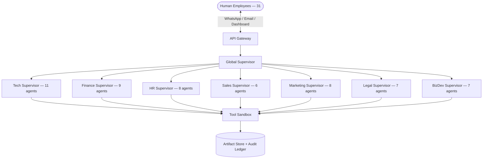

# 🤖 Multi-Agentic AI Enterprise Operating System

> A comprehensive AI-powered enterprise operating system that automates business operations across 7 departments using 63 AI agents supervised by 31+ human employees.


---

## 📋 Overview

This system establishes a **unified enterprise-grade AI operating model** with centralized governance, strict RBAC, auditability, compliance controls, and cross-department orchestration. Every AI agent is paired 1:1 with a human supervisor — agents propose, humans approve.



---

## 🏗️ Departments & Agents

| Department | Agents | Supervisor | Key Functions |
|-----------|--------|-----------|---------------|
| **🖥️ Tech** | 11 | Tech Supervisor | Architecture, coding, QA, DevOps, SRE, security |
| **💰 Finance** | 9 | Finance Supervisor | Accounting, budgeting, audit, tax, invoicing |
| **👥 HR** | 8 | HR Supervisor | Recruitment, onboarding, payroll, compliance |
| **📈 Sales** | 6 | Sales Supervisor | Lead scoring, deals, forecasting, pricing |
| **📣 Marketing** | 8 | Marketing Supervisor | Content, social media, SEO, campaigns, CRM |
| **⚖️ Legal** | 7 | Legal Supervisor | Contracts, compliance, IP, data protection |
| **🚀 BizDev** | 7 | BizDev Supervisor | Market research, partnerships, strategy |
| **🌐 Enterprise** | 3 | Global Supervisor | Scheduling, communication, orchestration |

**Total: 63 agents | 7 departments | 31 humans**

---

## 🧠 Technology Stack

| Layer | Technology |
|-------|-----------|
| **Backend** | Python 3.11+, FastAPI, LangGraph, LangChain |
| **Model Gateway** | LiteLLM Proxy (multi-model routing) |
| **Database** | PostgreSQL + pgvector (RLS + RAG) |
| **Cache/Queue** | Redis + Celery |
| **Storage** | AWS S3 / MinIO |
| **Frontend** | Next.js 14, Tailwind CSS, Shadcn/UI |
| **Messaging** | WhatsApp Business API, Email (Gmail/Outlook) |
| **Security** | Vault, PII Masking, Schema Isolation |
| **Monitoring** | Prometheus + Grafana, LangSmith |
| **CI/CD** | GitHub Actions, Docker, Kubernetes |

---

## 💸 4-Tier Model Strategy

Cost-efficient multi-model routing saves **69%** compared to running all agents on advanced models:

| Tier | Models | Agents | Monthly Cost |
|------|--------|--------|-------------|
| 💚 **Nano** | GPT-4o-mini, Gemini Flash, Haiku | 9 (14%) | ~$20 |
| 💛 **Standard** | GPT-4o, Claude Sonnet, Gemini Pro | 33 (52%) | ~$693 |
| 🟠 **Advanced** | Claude Opus, GPT-o3, Gemini Ultra | 15 (24%) | ~$540 |
| 🔴 **Specialist** | DeepSeek Coder, GPT-4V, DALL-E 3 | 3 (5%) | ~$135 |
| | **Total** | **63** | **~$1,389/mo** |

---

## 📁 Project Structure

```
company_AI/
├── README.md                         # This file
├── ENTERPRISE_AGENTS_MANUAL.md       # Unified governance framework
├── TECHNICAL_ARCHITECTURE.md         # Full tech stack & architecture
├── IMPLEMENTATION_ROADMAP.md         # 24-week implementation plan
├── MODEL_TIER_CLASSIFICATION.md      # 4-tier model cost strategy
├── ADMIN_GOVERNANCE_DESIGN.md        # Admin controls & cost monitoring
├── HUMAN_AGENT_SYSTEM.md             # Human-Agent pairing system
├── HUMAN_AGENT_MAPPING.md            # 31 humans ↔ 63 agents mapping
├── HUMAN_INTERFACE_DESIGN.md         # Dashboard & UI wireframes
├── AGENT_WORKFLOWS.md                # 8 workflow diagrams (Mermaid)
│
├── Development/
│   └── AGENTS_Tech.md                # Tech department (11 agents)
├── Finance/
│   └── AGENTS_FINANCE.md             # Finance department (9 agents)
├── HR/
│   └── AGENTS_HR.md                  # HR department (8 agents)
├── Sales/
│   └── AGENTS_SALES.md               # Sales department (6 agents)
├── Marketing/
│   └── AGENTS_MARKETING.md           # Marketing department (8 agents)
├── Legal/
│   └── AGENTS_LEGAL.md               # Legal department (7 agents)
├── BusinessDev/
│   └── AGENTS_BIZDEV.md              # BizDev department (7 agents)
│
└── Evaluasi/
    ├── PROFESSIONAL_SYSTEM_ANALYSIS.md   # System analysis (7.4/10)
    ├── SYSTEM_GAP_ANALYSIS.md            # 10 gaps identified
    ├── AGENT_GAP_REVIEW.md               # Gap resolution status
    └── COST_ANALYSIS_CAPEX_OPEX.md       # Full CAPEX/OPEX analysis
```

---

## 📊 Implementation Roadmap

| Phase | Weeks | Deliverable |
|-------|-------|------------|
| **1. Foundation** | 1-2 | PostgreSQL + FastAPI + LiteLLM + Auth |
| **2. Agent Runtime** | 3-4 | LangGraph supervisors + BaseAgent + task queue |
| **3. Intelligence** | 5-6 | RAG pipeline + agent memory (pgvector) |
| **4a. Core Depts** | 7-10 | Tech, Finance, HR, Sales modules |
| **4b. Extended Depts** | 11-13 | Marketing, Legal, BizDev modules |
| **5. Dashboard** | 14-16 | Mission Control + Approval Queue + Notifications |
| **6. Admin** | 17-18 | Cost analytics + policy engine + model routing |
| **7. Testing** | 19-20 | Staging + security audit + penetration testing |
| **8. Go Live** | 21-24 | WhatsApp/Email integration + pilot rollout 🚀 |

> Full details: [IMPLEMENTATION_ROADMAP.md](./IMPLEMENTATION_ROADMAP.md)

---

## 💰 Cost Estimate

| Category | Amount |
|----------|--------|
| **CAPEX** (one-time) | $34,500 – $58,500 |
| **OPEX** (monthly) | $9,774 – $17,714 |
| **Year 1 Total** | $151,788 – $271,068 |
| **Break-even** | 12-18 months |

> Full details: [COST_ANALYSIS_CAPEX_OPEX.md](./Evaluasi/COST_ANALYSIS_CAPEX_OPEX.md)

---

## 🔒 Security

- **Row-Level Security (RLS)** — Department data isolation
- **Schema Isolation** — Each department in its own DB schema
- **PII Masking** — Before any LLM submission (HR & Finance)
- **Vault Integration** — Secrets management (HashiCorp/AWS)
- **Immutable Audit Logs** — Every agent action is logged
- **Sandboxed Tools** — Agents can only access authorized tools
- **Human-in-the-Loop** — All high-risk actions require human approval

---

## 🤝 Core Principles

1. **Human-in-the-Loop** — Agents propose, humans approve
2. **Artifact-Driven** — Every output is a versioned artifact
3. **Department Isolation** — Data doesn't leak across departments
4. **Budget-Aware** — Model routing optimized for cost
5. **Immutable Audit** — Full traceability of all actions
6. **Privacy-First** — PII masking for employee and financial data

---

## 📚 Documentation Index

| Document | Description |
|----------|------------|
| [Enterprise Manual](./ENTERPRISE_AGENTS_MANUAL.md) | Governance, RBAC, compliance gates |
| [Technical Architecture](./TECHNICAL_ARCHITECTURE.md) | Stack, diagrams, security, deployment |
| [Implementation Roadmap](./IMPLEMENTATION_ROADMAP.md) | 24-week plan with 120+ tasks |
| [Model Tiers](./MODEL_TIER_CLASSIFICATION.md) | 4-tier cost strategy + LiteLLM config |
| [Admin Governance](./ADMIN_GOVERNANCE_DESIGN.md) | Budget control, policy engine |
| [Human-Agent System](./HUMAN_AGENT_SYSTEM.md) | Pairing model, communication flows |
| [Human Mapping](./HUMAN_AGENT_MAPPING.md) | 31 humans ↔ 63 agents org chart |
| [Interface Design](./HUMAN_INTERFACE_DESIGN.md) | Dashboard wireframes |
| [Workflows](./AGENT_WORKFLOWS.md) | 8 Mermaid sequence diagrams |
| [Cost Analysis](./Evaluasi/COST_ANALYSIS_CAPEX_OPEX.md) | CAPEX $35-58K, OPEX $10-18K/mo |
| [System Analysis](./Evaluasi/PROFESSIONAL_SYSTEM_ANALYSIS.md) | Score: 7.4/10 |

---

## 📄 License

This project is proprietary and confidential. All rights reserved.

---

<p align="center">
  <b>Built with 🧠 by Project Antigravity</b><br>
  <i>Automating enterprise operations, one agent at a time.</i>
</p>
