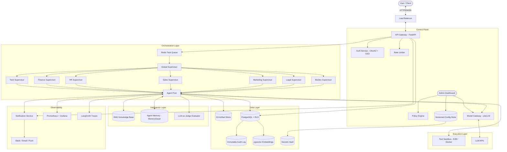

# Multi-Agentic AI Technical Architecture

## 1. Technology Stack Selection

### **Core Backend & Agent Runtime**
- **Language**: Python 3.11+ (Industry standard for AI/ML)
- **API Framework**: **FastAPI** (High performance, async support, auto-documentation)
- **Agent Orchestration**: **LangGraph** (Stateful multi-agent workflows, persistence built-in)
- **LLM Interface**: **LangChain** (Standardized LLM integration)
- **Model Gateway**: **LiteLLM Proxy** (Model routing, cost tracking, fallback logic)
- **Task Queue**: **Celery** with **Redis** (Async task distribution)

### **Data Layer**
- **Primary Database**: **PostgreSQL** with **Row-Level Security (RLS)** (Relational data + department isolation)
- **Vector Database**: **pgvector** (Postgres extension for RAG / semantic search)
- **Cache / Session Store**: **Redis** (Fast state retrieval, pub/sub for real-time updates)
- **Artifact Store**: **AWS S3** / **MinIO** (Object storage for Documents, Reports, Code)
- **Secrets Management**: **HashiCorp Vault** / **AWS Secrets Manager**

### **Frontend Interface**
- **Framework**: **Next.js 14** (React, Server Components)
- **Styling**: **Tailwind CSS** + **Shadcn/UI** (Modern, accessible components)
- **State Management**: **Zustand** or **React Query**
- **Real-time**: **WebSocket / SSE** (for streaming agent thoughts/updates)
- **Notifications**: **Slack SDK** / **Nodemailer** / **Web Push API**
- **Messaging**: **WhatsApp Business API** (Twilio / Meta Cloud API)
- **Calendar**: **Google Calendar API v3** / **Microsoft Graph API**
- **Meetings**: **Zoom API** (auto-generate meeting links)

### **Infrastructure & DevOps**
- **Containerization**: **Docker** & **Docker Compose**
- **Orchestration**: **Kubernetes (K8s)** (Production scaling)
- **CI/CD**: **GitHub Actions**
- **Monitoring**: **Prometheus** + **Grafana** (Metrics), **LangSmith** (LLM Tracing)

---

## 2. System Architecture Diagram



---

## 3. Detailed Component Breakdown

### 3.1 Agent Gateway (FastAPI)
- **Endpoints**: `/api/v1/submit-request`, `/api/v1/status/{id}`, `/api/v1/feedback`, `/api/v1/approve/{thread_id}`
- **Middleware**:
  - JWT Validation + SSO Integration
  - **TraceMiddleware** — auto `trace_id` + `span_id` per request (Implemented ✅)
  - Rate Limiting (per user & per department)
  - **ABAC PolicyEngine** — context-aware allow/deny/require_approval (Implemented ✅)
  - PII Redaction Layer (mask sensitive data before LLM)
  - Request Logging + **Hash Chain Audit** (Implemented ✅)

### 3.2 Workflow Orchestrator (LangGraph)
- **State Definition**:
  ```python
  class AgentState(TypedDict):
      messages: Annotated[list[AnyMessage], operator.add]
      current_task: str
      artifacts: list[str]
      errors: list[str]
      tool_call_count: int        # For rate limiting
      token_usage: int            # For budget tracking
      human_feedback: str | None  # For approval flow
  ```
- **Supervisor Node**:
  - Routes to specialist nodes based on Plan JSON.
  - Handles `human_approval` interrupts using LangGraph checkpoints.
  - Enforces max tool calls and execution timeout per task.

### 3.3 Specialist Agents

> **Note**: All agent access to tools, LLMs, and databases flows through the Chokepoint Gateways (§3.5). Agents never call external services directly.

- **Tech Agents**: Code execution via `ToolBroker` → sandboxed containers (E2B/Firecracker).
- **Finance Agents**: Read-only DB access via `DataAccessLayer` → restricted SQL user + RLS.
- **HR Agents**: HRIS API access via `ToolBroker` → PII masking enforced by `PolicyEngine`.
- **Sales Agents**: CRM API access via `ToolBroker` → territory-scoped by `DataAccessLayer`.

### 3.4 Security & Sandboxing
- **Code Execution**: **E2B** or **Firecracker MicroVMs** to prevent agents from accessing host system.
- **Network Policy**: `NetworkPolicy` class enforces domain-level egress allowlist per tool (Implemented ✅).
- **Data Isolation**: PostgreSQL **Row-Level Security (RLS)** per department + schema-based isolation.
- **Secrets**: Agent never receives raw credentials. Backend proxy fetches from Vault on behalf of agent.
- **Audit Logging**: `AuditService.emit()` writes to SHA-256 hash chain — tamper-evident, append-only (Implemented ✅).

### 3.5 Chokepoint Gateway Layer (Implemented ✅)

> **Principle**: All side-effects (LLM calls, tool execution, data access) flow through 3 mandatory gateways. Direct use of `requests`, `httpx`, `psycopg`, or `sqlalchemy` in agent code is banned.

| Gateway | File | Responsibilities |
|---------|------|------------------|
| **LLMClient** | `core/llm_client.py` | Model routing, prompt hashing, cost estimation, budget hooks, CircuitBreaker |
| **ToolBroker** | `core/tool_broker.py` | Tool resolution (via ToolRegistry), ABAC check, egress control, sandbox enforcement |
| **DataAccessLayer** | `core/data_access.py` | Department scoping, field masking, PII obligations, query auditing |

**Supporting components:**
- **ToolRegistry** (`core/tool_registry.py`) — Static tool registration with metadata (permissions, risk, egress domains)
- **TaskSandbox** (`core/sandbox.py`) — Per-task file system isolation + auto-cleanup
- **NetworkPolicy** (`core/sandbox.py`) — Domain-level egress control per tool

### 3.6 Control Plane Modules (Implemented ✅)

| Module | File(s) | Purpose |
|--------|---------|---------|
| **ABAC PolicyEngine** | `core/policy_engine.py`, `policies/default.yaml` | YAML rules → allow/deny/require_approval + obligations |
| **ResourceClassification** | `core/resource_classification.py` | 82 resources mapped to 4 sensitivity levels |
| **Agent Contracts** | `agents/contracts.py` | AgentInput/OutputSchema + server-derived RiskDeriver |
| **ApprovalGate** | `core/approval_gate.py` | State machine: PENDING → APPROVED/REJECTED |
| **IdempotencyGuard** | `core/approval_gate.py` | Prevent duplicate side-effects on retries |
| **AuditService** | `services/audit_service.py` | `emit()` with SHA-256 hash chain + `verify_chain_integrity()` |
| **TraceContext** | `core/tracing.py` | End-to-end `trace_id` + `span_id`, Celery propagation |
| **MetricsCollector** | `core/metrics.py` | Redis-backed cost/duration/success aggregation |
| **BudgetEnforcer** | `core/budget.py` | Atomic Redis Lua reserve/finalize/release (soft+hard limits) |
| **CircuitBreaker** | `core/resilience.py` | Half-open recovery, fallback support |
| **RetryPolicy** | `core/resilience.py` | Taxonomy-based retry (transient=retry, policy=no-retry) |
| **DeadLetterQueue** | `core/resilience.py` | Failed operations stored for manual replay |

---

## 4. Knowledge Base & Agent Memory (RAG)

Agents must have persistent context to avoid starting from zero on every task.

### **4.1 RAG Architecture**
- **Document Ingestion**: Company SOPs, past decisions, and domain docs are chunked, embedded, and stored in pgvector.
- **Retrieval**: Before each task, the agent queries the vector store for relevant context.
- **Scope**: Department-scoped by default. Cross-department access requires Global Supervisor approval.

### **4.2 Agent Memory**
- **Session Memory**: LangGraph `MemorySaver` persists conversation state across sessions.
- **Long-Term Memory**: Key decisions and outcomes are written back to the Knowledge Store for future retrieval.

---

## 5. Error Recovery & Retry Strategy (Implemented ✅)

### **5.1 LLM Failure Handling**
- **RetryPolicy** (`core/resilience.py`): Taxonomy-based retry — transient errors retry with exponential backoff, policy/budget/validation errors fail immediately.
- **CircuitBreaker** (`core/resilience.py`): After 5 consecutive failures on a provider, breaker opens. Requests fail fast or use fallback model. After 60s cooldown → half-open → test recovery.
- **Fallback Chain**: `GPT-4o` → `Claude 3.5` → `Llama 3` (configurable per department).

### **5.2 Task Failure Handling**
- **Max Retries**: Each task has configurable retry count via `RetryConfig` classes.
- **Dead Letter Queue**: Failed tasks after max retries stored in `DeadLetterQueue` with full context for manual replay via `dlq.replay(dlq_id, handler)`.
- **Idempotency**: `IdempotencyGuard` ensures side-effect tools execute at most once per `trace_id:step_id` key.
- **Partial Recovery**: If a multi-step task fails at step 3/5, resume from the last successful checkpoint.

---

## 6. Agent Rate Limiting & Abuse Prevention

| Control | Default | Configurable? |
|---------|---------|---------------|
| Max Tool Calls per Task | 50 | Yes |
| Max Execution Time | 10 min | Yes |
| Token Budget per Task | 100K tokens | Yes |
| Loop Detection Threshold | 5 similar calls | Yes |

- **Loop Detection**: If an agent calls the same tool 5+ times with similar input, auto-pause and alert Admin.
- **Runaway Agent Kill**: If any limit is exceeded, task is terminated and moved to DLQ.
- **Budget Gate**: Task is rejected at submission if estimated cost exceeds department remaining budget.

---

## 7. Data Isolation & Multi-Tenancy

### **7.1 PostgreSQL Row-Level Security**
```sql
-- Example: Finance agents can only see finance rows
CREATE POLICY finance_isolation ON transactions
  FOR SELECT
  USING (department = current_setting('app.department'));
```

### **7.2 Schema-Based Isolation**
- `public.*` — Shared tables (users, audit_log, config)
- `tech.*` — Tech department data
- `finance.*` — Financial ledger, budget
- `hr.*` — Employee records, payroll
- `sales.*` — CRM data, pipeline

### **7.3 API Key Scoping**
- Each department agent pool gets a scoped API key that maps to its schema.
- Cross-department queries require Global Supervisor token.

---

## 8. Human Interface Channel (The "Claw" Dashboard)

To ensure human-in-the-loop oversight, a "Mission Control" dashboard is integrated into the architecture.

### **8.1 Core Capabilities**
- **Task Launchpad**: Structured form input for submitting goals, which generates a Plan JSON for review.
- **Mission Monitor**: Real-time terminal-like stream of agent thoughts, tool calls, and status updates via WebSockets.
- **Approval Queue**: A dedicated view for tasks paused at **LangGraph Checkpoints**. Humans must explicitly "Approve" or "Reject" to resume execution.
- **Artifact Browser**: Read-only view of generated code, documents, and reports.
- **Notification Integration**: Slack/Email/Push alerts when approval is needed.
- **Escalation Timer**: If not approved within X minutes, auto-escalate to next-level approver.

### **8.2 Implementation Stack**
- **Frontend**: Next.js + Shadcn/UI (Dashboard, Forms, Terminal View).
- **Communication**: Server-Sent Events (SSE) or WebSockets for streaming agent events.
- **State Management**: React Query for polling active tasks and approval status.
- **Notifications**: Slack Webhook + Nodemailer for email alerts.

---

## 9. Admin Governance Layer

To manage models, costs, and policies, a centralized governance layer is added.

### **9.1 Model Gateway (LiteLLM)**
- Acts as a proxy to route tasks to the most efficient model.
- Supports fallback logic, budget tracking, and token counting out-of-the-box.

### **9.2 Cost Dashboard**
- Visualizes token usage and spend per department in real-time.
- Monthly budget caps with alerts at 80% and hard stops at 100%.

### **9.3 Policy Engine**
- Enforces global rules (e.g., "No PII", "No Internet for Finance Agents").
- Admin-editable system prompts and guardrails.

### **9.4 Connection Registry**
- Centralized management of database credentials and access roles.
- Credentials stored in Vault; agents only receive temporary tokens.

### **9.5 Configuration Versioning**
- All config changes (system prompts, model routes, policies) are versioned.
- **Rollback**: Admin can revert to any previous configuration version.
- **Change Log**: Every edit records `who`, `when`, `old_value`, `new_value`.

### **9.6 Agent Evaluation (LLM-as-Judge)**
- Separate evaluator LLM scores agent outputs on accuracy, completeness, and safety.
- Agent KPIs tracked: success rate, avg task time, human override rate.
- A/B testing support for prompt variations.

---

## 10. Testing & Simulation Environment

### **10.1 Staging Environment**
- Mirror of production with mock data for each department.
- All new agent configs must pass staging validation before production deploy.

### **10.2 Dry Run Mode**
- Agents execute logic but do not call external tools.
- Logs show exactly what *would* have happened.

### **10.3 Agent Playground**
- Interactive UI page for testing prompts and model routing.
- Supports single-step execution for debugging.

---

## 11. Implementation Roadmap

### Phase 1: Core Infrastructure (Weeks 1-2)
- [ ] Set up Repo (Monorepo: `/frontend`, `/backend`, `/infrastructure`)
- [ ] Initialize PostgreSQL with RBAC schema + RLS policies
- [ ] Setup FastAPI skeleton with Authentication + Rate Limiting
- [ ] Deploy LiteLLM Proxy for model routing

### Phase 2: Base Agent Runner (Weeks 3-4)
- [ ] Implement LangGraph Supervisor pattern with checkpoints
- [ ] Create abstract `BaseAgent` class with rate limiting
- [ ] Integrate Redis Queue for async processing + DLQ
- [ ] Implement error recovery & retry logic

### Phase 3: Knowledge & Intelligence (Weeks 5-6)
- [ ] Setup pgvector and document ingestion pipeline
- [ ] Implement RAG retrieval for agent context
- [ ] Add Agent Memory (MemorySaver) for session persistence

### Phase 4a: Department Modules — Core (Weeks 7-10)
- [ ] **Tech Module**: Git & Code Sandbox integration
- [ ] **Finance Module**: Excel/CSV processing & Ledger schema
- [ ] **HR Module**: HRIS API + PII masking
- [ ] **Sales Module**: CRM integration + territory RBAC

### Phase 4b: Department Modules — Extended (Weeks 11-13)
- [ ] **Marketing Module**: CMS, Social Media API, Campaign Analytics integration
- [ ] **Legal Module**: Contract management system, legal research DB, regulatory feed
- [ ] **BizDev Module**: Market data APIs, financial modeling tools, CRM pipeline

### Phase 5: Human Interface & Dashboard (Weeks 14-16)
- [ ] Mission Control Dashboard (Task tracking, Live feed)
- [ ] Human Approval Queue with Escalation Timer
- [ ] Notification Service (Slack, Email, Push)
- [ ] Artifact Browser

### Phase 6: Admin Governance (Weeks 17-18)
- [ ] Admin Dashboard with Cost Analytics
- [ ] Policy Engine + Config Versioning with Rollback
- [ ] Connection Registry + Vault integration
- [ ] Agent Evaluation (LLM-as-Judge)

### Phase 7: Testing & Hardening (Weeks 19-20)
- [ ] Staging environment with mock data
- [ ] Dry Run mode implementation
- [ ] Agent Playground
- [ ] Security audit & penetration testing

### Phase 8: Human-Agent Pairing (Weeks 21-24)
- [ ] Human-Agent Registry & Profile System
- [ ] WhatsApp Business API integration
- [ ] Email integration (Gmail / Outlook)
- [ ] Google Calendar + Zoom scheduling
- [ ] Cross-agent coordination protocol

---

## 12. Human-Agent Pairing System

Every agent is paired 1:1 with a human employee. Humans supervise; agents execute. Communication flows through WhatsApp, Email, or Dashboard. Full details in **[HUMAN_AGENT_SYSTEM.md](file:///c:/Users/sarif/Documents/project_antigravity/company_AI/HUMAN_AGENT_SYSTEM.md)**.

This architecture ensures scalability, security, cost efficiency, and a clear separation of concerns required for an enterprise-grade Multi-Agent System.
